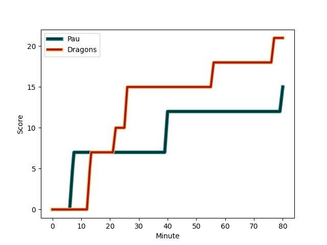
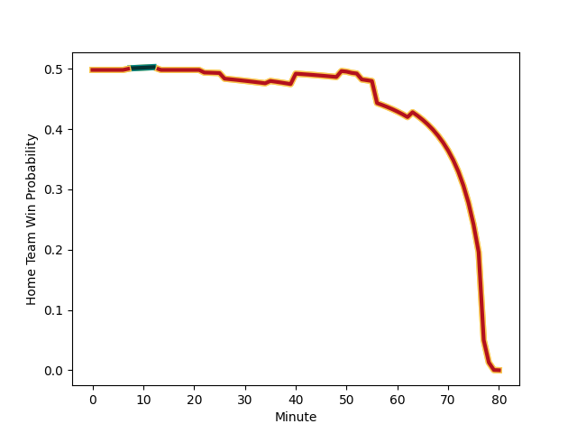

---  
layout: page  
title: Dragons at Pau; 21-15  
date: 2023-01-13 21:00:00 18:00:00 -0500  
categories: match review  
---
# Dragons (1461.04) at Pau (1457.81); 21-15

# Prediction: Pau by 3.7

Dragons by 0.3 on a neutral field
## Scores over Time

## Win Probability over Time

# Pre-Match Prediction: Dragons by 5.2

Pau by 1.2 on a neutral pitch

|   Away Minutes | Away Player                                                     |   Away elo |   Away Percentile |   Number |   Home Percentile |   Home elo | Home Player                                                           |   Home Minutes |
|---------------:|:----------------------------------------------------------------|-----------:|------------------:|---------:|------------------:|-----------:|:----------------------------------------------------------------------|---------------:|
|             63 | [Rob Evans](..//playerfiles//RobEvans_cleaned.md)               |     116.83 |                92 |        1 |                96 |     122.33 | [Siegfried Fisi'ihoi](..//playerfiles//SiegfriedFisi'ihoi_cleaned.md) |             49 |
|             63 | [Bradley Roberts](..//playerfiles//BradleyRoberts_cleaned.md)   |      87.18 |                25 |        2 |                79 |     107.96 | [Romain Ruffenach](..//playerfiles//RomainRuffenach_cleaned.md)       |             56 |
|             71 | [Chris Coleman](..//playerfiles//ChrisColeman_cleaned.md)       |      84.46 |                17 |        3 |                 2 |      67.11 | [Nicolas Corato](..//playerfiles//NicolasCorato_cleaned.md)           |             49 |
|             51 | [Joseph Davies](..//playerfiles//JosephDavies_cleaned.md)       |      81.96 |                15 |        4 |                42 |      90.66 | [Hugo Auradou](..//playerfiles//HugoAuradou_cleaned.md)               |             80 |
|             80 | [George Nott](..//playerfiles//GeorgeNott_cleaned.md)           |      82.87 |                17 |        5 |                19 |      84.01 | [Fabrice Metz](..//playerfiles//FabriceMetz_cleaned.md)               |             63 |
|             80 | [Sean Lonsdale](..//playerfiles//SeanLonsdale_cleaned.md)       |      75.9  |                 8 |        6 |                 3 |      67.8  | [Sacha Zegueur](..//playerfiles//SachaZegueur_cleaned.md)             |             80 |
|             80 | [Taine Basham](..//playerfiles//TaineBasham_cleaned.md)         |     104.56 |                72 |        7 |                34 |      88.45 | [Thibault Hamonou](..//playerfiles//ThibaultHamonou_cleaned.md)       |             80 |
|             35 | [Ollie Griffiths](..//playerfiles//OllieGriffiths_cleaned.md)   |     113.83 |                85 |        8 |                63 |     103.07 | [Brent Liufau](..//playerfiles//BrentLiufau_cleaned.md)               |             51 |
|             72 | [Lewis Jones](..//playerfiles//LewisJones_cleaned.md)           |      97.99 |                54 |        9 |                93 |     120.82 | [Clovis Le bail](..//playerfiles//ClovisLebail_cleaned.md)            |             68 |
|             80 | [Will Reed](..//playerfiles//WillReed_cleaned.md)               |      98.44 |                51 |       10 |                88 |     117.82 | [Thibault Debaes](..//playerfiles//ThibaultDebaes_cleaned.md)         |             78 |
|             80 | [Ashton Hewitt](..//playerfiles//AshtonHewitt_cleaned.md)       |     104.78 |                72 |       11 |                21 |      86.28 | [Daniel Ikpefan](..//playerfiles//DanielIkpefan_cleaned.md)           |             80 |
|             63 | [Max Clark](..//playerfiles//MaxClark_cleaned.md)               |     129.76 |                95 |       12 |                92 |     121.78 | [Nathan Decron](..//playerfiles//NathanDecron_cleaned.md)             |             80 |
|             80 | [Steffan Hughes](..//playerfiles//SteffanHughes_cleaned.md)     |     125.27 |                93 |       13 |                33 |      89.59 | [Yvan Reilhac](..//playerfiles//YvanReilhac_cleaned.md)               |             80 |
|             80 | [Rio Dyer](..//playerfiles//RioDyer_cleaned.md)                 |      62.49 |                 2 |       14 |                70 |     103.87 | [Vincent Pinto](..//playerfiles//VincentPinto_cleaned.md)             |             80 |
|             80 | [Jordan Williams](..//playerfiles//JordanWilliams_cleaned.md)   |     105.07 |                69 |       15 |               nan |      95    | [Théo Attissogbe](..//playerfiles//ThéoAttissogbe_cleaned.md)         |             53 |
|             45 | [Aaron Wainwright](..//playerfiles//AaronWainwright_cleaned.md) |     100.72 |                64 |       16 |                86 |     110.46 | [Ignacio Calles](..//playerfiles//IgnacioCalles_cleaned.md)           |             31 |
|             29 | [Ben Carter](..//playerfiles//BenCarter_cleaned.md)             |      87.25 |                26 |       17 |                49 |      95.08 | [Siate Tokolahi](..//playerfiles//SiateTokolahi_cleaned.md)           |             31 |
|             17 | [Josh Reynolds](..//playerfiles//JoshReynolds_cleaned.md)       |      95.46 |               nan |       18 |                81 |     105.57 | [Martin Puech](..//playerfiles//MartinPuech_cleaned.md)               |             29 |
|             17 | [Brodie Coghlan](..//playerfiles//BrodieCoghlan_cleaned.md)     |      94.06 |               nan |       19 |                 9 |      72.22 | [Mathias Colombet](..//playerfiles//MathiasColombet_cleaned.md)       |             27 |
|             17 | [Jack Dixon](..//playerfiles//JackDixon_cleaned.md)             |     115.84 |                87 |       20 |                19 |      82.96 | [Youri Delhommel](..//playerfiles//YouriDelhommel_cleaned.md)         |             24 |
|              9 | [Luke Yendle](..//playerfiles//LukeYendle_cleaned.md)           |      96.63 |                54 |       21 |                85 |     112.62 | [Jimi Maximin](..//playerfiles//JimiMaximin_cleaned.md)               |             17 |
|              8 | [Che Hope](..//playerfiles//CheHope_cleaned.md)                 |      95.8  |               nan |       22 |                10 |      79.52 | [Alexis Levron](..//playerfiles//AlexisLevron_cleaned.md)             |             12 |
|            nan | nan                                                             |     nan    |               nan |       23 |               nan |      95    | [Axel Desperes](..//playerfiles//AxelDesperes_cleaned.md)             |              2 |

