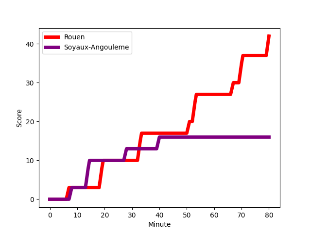
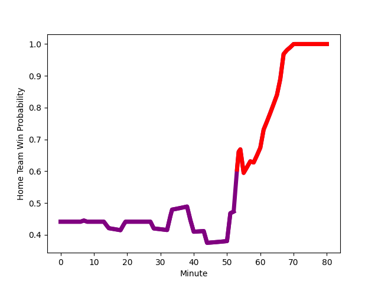

---  
layout: page  
title: Soyaux-Angouleme at Rouen; 16-42  
date: 2023-01-13 19:30:00 18:00:00 -0500  
categories: match review  
---
# Soyaux-Angouleme (1383.47) at Rouen (1280.84); 16-42

# Prediction: Soyaux-Angouleme by 6.3

Soyaux-Angouleme by 10.3 on a neutral field
## Scores over Time

## Win Probability over Time

# Pre-Match Prediction: Soyaux-Angouleme by 0.3

Soyaux-Angouleme by 3.7 on a neutral pitch

|   Away Minutes | Away Player                                                            |   Away elo |   Away Percentile |   Number |   Home Percentile |   Home elo | Home Player                                                         |   Home Minutes |
|---------------:|:-----------------------------------------------------------------------|-----------:|------------------:|---------:|------------------:|-----------:|:--------------------------------------------------------------------|---------------:|
|             80 | [Khatchik Vartanov](..//playerfiles//KhatchikVartanov_cleaned.md)      |      91.67 |                41 |        1 |                87 |     108.35 | [Soulemane Camara](..//playerfiles//SoulemaneCamara_cleaned.md)     |             39 |
|             51 | [Ole Avei](..//playerfiles//OleAvei_cleaned.md)                        |     108.19 |                82 |        2 |                 2 |      68.82 | [Efitusi Ma'afu](..//playerfiles//EfitusiMa'afu_cleaned.md)         |             71 |
|             51 | [Yassine Boutemane](..//playerfiles//YassineBoutemane_cleaned.md)      |      68.74 |                 2 |        3 |                68 |     101.17 | [Hugo Ndiaye](..//playerfiles//HugoNdiaye_cleaned.md)               |             66 |
|             80 | [Sikeli Nabou](..//playerfiles//SikeliNabou_cleaned.md)                |     122.24 |                93 |        4 |                 0 |      47.06 | [John-Charles Astle](..//playerfiles//John-CharlesAstle_cleaned.md) |             80 |
|             61 | [Ian Kitwanga](..//playerfiles//IanKitwanga_cleaned.md)                |      88.53 |                35 |        5 |                69 |     102.37 | [Toby Salmon](..//playerfiles//TobySalmon_cleaned.md)               |             57 |
|             61 | [Gautier Gibouin](..//playerfiles//GautierGibouin_cleaned.md)          |      81.42 |                14 |        6 |                19 |      84.75 | [Lucas Costa](..//playerfiles//LucasCosta_cleaned.md)               |             80 |
|             80 | [Nicolas Martins](..//playerfiles//NicolasMartins_cleaned.md)          |      84.67 |                29 |        7 |                 4 |      70.34 | [Abdelkarim Fofana](..//playerfiles//AbdelkarimFofana_cleaned.md)   |             61 |
|             58 | [Yassine Jarmouni](..//playerfiles//YassineJarmouni_cleaned.md)        |      87.69 |                27 |        8 |                17 |      83.34 | [Tino Mapapalangi](..//playerfiles//TinoMapapalangi_cleaned.md)     |             80 |
|             55 | [Adrien Bau](..//playerfiles//AdrienBau_cleaned.md)                    |      60.33 |                 1 |        9 |                 5 |      70.79 | [Florent Campeggia](..//playerfiles//FlorentCampeggia_cleaned.md)   |             66 |
|             80 | [Matthieu Ugalde](..//playerfiles//MatthieuUgalde_cleaned.md)          |     112.26 |                79 |       10 |                27 |      89.46 | [Franck Pourteau](..//playerfiles//FranckPourteau_cleaned.md)       |             80 |
|             80 | [Marvin Lestremau](..//playerfiles//MarvinLestremau_cleaned.md)        |      99.1  |                60 |       11 |                83 |     111.82 | [Benito Masilevu](..//playerfiles//BenitoMasilevu_cleaned.md)       |             80 |
|             80 | [Inaki Ayarza Saporta](..//playerfiles//InakiAyarzaSaporta_cleaned.md) |      77.83 |                11 |       12 |                24 |      85.81 | [JT Jackson](..//playerfiles//JTJackson_cleaned.md)                 |             63 |
|             80 | [Ledua Mau](..//playerfiles//LeduaMau_cleaned.md)                      |      72.81 |                 6 |       13 |                36 |      89.85 | [Opetera Peleseuma](..//playerfiles//OpeteraPeleseuma_cleaned.md)   |             80 |
|             80 | [Kamilieni Raivono](..//playerfiles//KamilieniRaivono_cleaned.md)      |     104.06 |                71 |       14 |                36 |      91.15 | [Malcolm Bertschy](..//playerfiles//MalcolmBertschy_cleaned.md)     |             58 |
|             44 | [Pierre Lafitte](..//playerfiles//PierreLafitte_cleaned.md)            |      72.25 |                 9 |       15 |                15 |      83.23 | [Paul Surano](..//playerfiles//PaulSurano_cleaned.md)               |             80 |
|             36 | [Rémi Brosset](..//playerfiles//RémiBrosset_cleaned.md)                |     101.09 |                63 |       16 |                 6 |      74.96 | [Antoine Fournier](..//playerfiles//AntoineFournier_cleaned.md)     |             41 |
|             29 | [Shota Gogisvanidze](..//playerfiles//ShotaGogisvanidze_cleaned.md)    |      94.08 |                44 |       17 |                65 |     101.72 | [Jean Leleu](..//playerfiles//JeanLeleu_cleaned.md)                 |             23 |
|             29 | [Kevin Le Guen](..//playerfiles//KevinLeGuen_cleaned.md)               |     130.84 |                98 |       18 |                14 |      77.61 | [Kevin Milhorat](..//playerfiles//KevinMilhorat_cleaned.md)         |             22 |
|             25 | [Manu Saubusse](..//playerfiles//ManuSaubusse_cleaned.md)              |     115.3  |                89 |       19 |                76 |     108.54 | [Willy N'Diaye](..//playerfiles//WillyN'Diaye_cleaned.md)           |             19 |
|             22 | [Matt Va'ai](..//playerfiles//MattVa'ai_cleaned.md)                    |      93.14 |                41 |       20 |                36 |      90.5  | [Taylor Gontineac](..//playerfiles//TaylorGontineac_cleaned.md)     |             17 |
|             19 | [Hubert Texier](..//playerfiles//HubertTexier_cleaned.md)              |     105.3  |                74 |       21 |                 2 |      64.76 | [Theo Nanette](..//playerfiles//TheoNanette_cleaned.md)             |             14 |
|             19 | [Matt Beukeboom](..//playerfiles//MattBeukeboom_cleaned.md)            |      75.59 |                 9 |       22 |                88 |     112.67 | [Alexandru Tarus](..//playerfiles//AlexandruTarus_cleaned.md)       |             14 |
|            nan | nan                                                                    |     nan    |               nan |       23 |                38 |      91.27 | [Lucas Malbert](..//playerfiles//LucasMalbert_cleaned.md)           |              9 |

