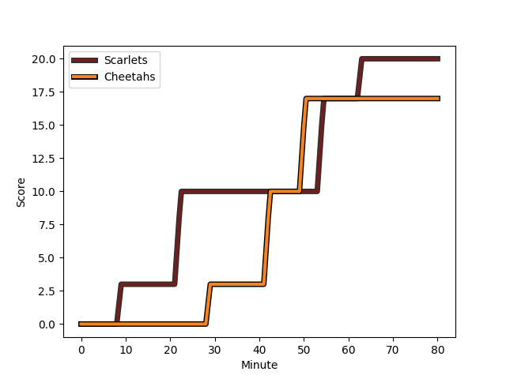
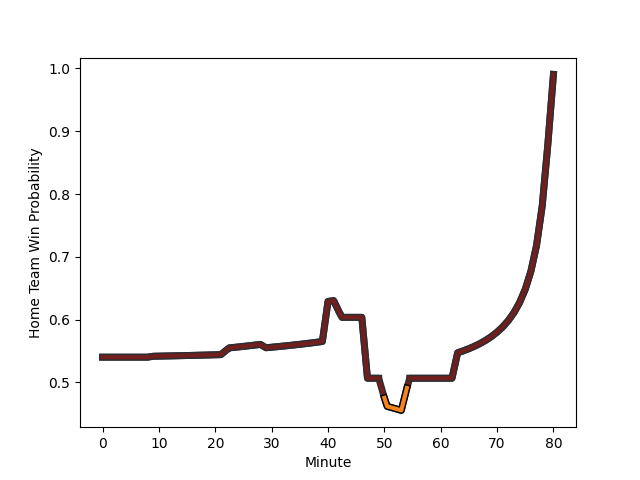

---  
layout: page  
title: Cheetahs at Scarlets; 17-20  
date: 2023-01-13 21:00:00 18:00:00 -0500  
categories: match review  
---
# Cheetahs (1457.05) at Scarlets (1527.18); 17-20

# Prediction: Scarlets by 11.0

Scarlets by 7.0 on a neutral field
## Scores over Time

## Win Probability over Time

# Pre-Match Prediction: Scarlets by 15.3

Scarlets by 11.3 on a neutral pitch

|   Away Minutes | Away Player                                                                              |   Away elo |   Away Percentile |   Number |   Home Percentile |   Home elo | Home Player                                                     |   Home Minutes |
|---------------:|:-----------------------------------------------------------------------------------------|-----------:|------------------:|---------:|------------------:|-----------:|:----------------------------------------------------------------|---------------:|
|             64 | [Schalk Ferreira](..//playerfiles//SchalkFerreira_cleaned.md)                            |      73.1  |                 5 |        1 |                55 |      96.11 | [Kemsley Mathias](..//playerfiles//KemsleyMathias_cleaned.md)   |             52 |
|             64 | [Louis van der Westhuizen](..//playerfiles//LouisvanderWesthuizen_cleaned.md)            |     119.88 |                93 |        2 |                82 |     108.26 | [Ken Owens](..//playerfiles//KenOwens_cleaned.md)               |             66 |
|             55 | [Aranos Coetzee](..//playerfiles//AranosCoetzee_cleaned.md)                              |     107.37 |                81 |        3 |                 4 |      72.01 | [Javan Sebastian](..//playerfiles//JavanSebastian_cleaned.md)   |             66 |
|             80 | [Rynier Bernardo](..//playerfiles//RynierBernardo_cleaned.md)                            |     102.63 |                66 |        4 |                 2 |      57.18 | [Morgan Jones](..//playerfiles//MorganJones_cleaned.md)         |             66 |
|             80 | [Victor Kutlwano Sekekete](..//playerfiles//VictorKutlwanoSekekete_cleaned.md)           |      92.05 |                38 |        5 |                96 |     127.12 | [Sam Lousi](..//playerfiles//SamLousi_cleaned.md)               |             80 |
|             80 | [Jeandre Rudolph](..//playerfiles//JeandreRudolph_cleaned.md)                            |      89.13 |                30 |        6 |                96 |     127.16 | [Vaea Fifita](..//playerfiles//VaeaFifita_cleaned.md)           |             80 |
|             40 | [Sibabalo Qoma](..//playerfiles//SibabaloQoma_cleaned.md)                                |     102.04 |                60 |        7 |                84 |     113.21 | [Dan Davis](..//playerfiles//DanDavis_cleaned.md)               |             51 |
|             80 | [Friedle Olivier](..//playerfiles//FriedleOlivier_cleaned.md)                            |     108.79 |                80 |        8 |                36 |      91.91 | [Carwyn Tuipulotu](..//playerfiles//CarwynTuipulotu_cleaned.md) |             80 |
|             80 | [Rewan Kruger](..//playerfiles//RewanKruger_cleaned.md)                                  |      96.2  |               nan |        9 |                 1 |      64.34 | [Dane Blacker](..//playerfiles//DaneBlacker_cleaned.md)         |             39 |
|             80 | [Siya Masuku](..//playerfiles//SiyaMasuku_cleaned.md)                                    |     113.26 |                81 |       10 |                99 |     146.15 | [Rhys Patchell](..//playerfiles//RhysPatchell_cleaned.md)       |             47 |
|             80 | [Munier Hartzenberg](..//playerfiles//MunierHartzenberg_cleaned.md)                      |      94.05 |                45 |       11 |                82 |     111.19 | [Steffan Evans](..//playerfiles//SteffanEvans_cleaned.md)       |             80 |
|             80 | [Reinhardt Fortuin](..//playerfiles//ReinhardtFortuin_cleaned.md)                        |      81.4  |                15 |       12 |                93 |     124.06 | [Jonathan Davies](..//playerfiles//JonathanDavies_cleaned.md)   |             80 |
|             80 | [David Benjamin Brits](..//playerfiles//DavidBenjaminBrits_cleaned.md)                   |     106.43 |                74 |       13 |                54 |      97.66 | [Joe Roberts](..//playerfiles//JoeRoberts_cleaned.md)           |             80 |
|             80 | [Daniel Kasende Kalepula](..//playerfiles//DanielKasendeKalepula_cleaned.md)             |      93.83 |                44 |       14 |                88 |     117.48 | [Johnny McNicholl](..//playerfiles//JohnnyMcNicholl_cleaned.md) |             80 |
|             55 | [Andell Loubster](..//playerfiles//AndellLoubster_cleaned.md)                            |      73.79 |               nan |       15 |                67 |     104.28 | [Leigh Halfpenny](..//playerfiles//LeighHalfpenny_cleaned.md)   |             80 |
|             40 | [Daniel Johannes Maartens](..//playerfiles//DanielJohannesMaartens_cleaned.md)           |     107.28 |                77 |       16 |                 2 |      64.64 | [Gareth Davies](..//playerfiles//GarethDavies_cleaned.md)       |             41 |
|             25 | [Hencus van Wyk](..//playerfiles//HencusvanWyk_cleaned.md)                               |      93.92 |                42 |       17 |                 9 |      77.76 | [Sam Costelow](..//playerfiles//SamCostelow_cleaned.md)         |             33 |
|             25 | [Tapiwa Lloyd Mafura](..//playerfiles//TapiwaLloydMafura_cleaned.md)                     |      82.69 |                22 |       18 |                26 |      87.09 | [Tomas Lezana](..//playerfiles//TomasLezana_cleaned.md)         |             29 |
|             16 | [Alulutho Tshakweni](..//playerfiles//AluluthoTshakweni_cleaned.md)                      |      95.64 |                64 |       19 |                94 |     119.1  | [Wyn Jones](..//playerfiles//WynJones_cleaned.md)               |             28 |
|             16 | [Marko Louis Janse van Rensburg](..//playerfiles//MarkoLouisJansevanRensburg_cleaned.md) |     106.87 |                79 |       20 |                36 |      89.52 | [Sam Wainwright](..//playerfiles//SamWainwright_cleaned.md)     |             14 |
|            nan | nan                                                                                      |     nan    |               nan |       21 |                16 |      77.89 | [Shaun Evans](..//playerfiles//ShaunEvans_cleaned.md)           |             14 |
|            nan | nan                                                                                      |     nan    |               nan |       22 |                 1 |      61.74 | [Tom Price](..//playerfiles//TomPrice_cleaned.md)               |             14 |

