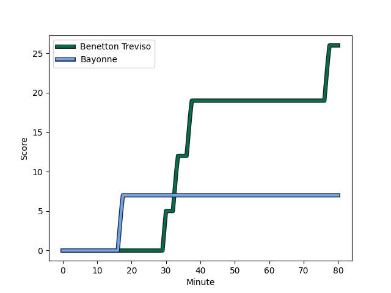
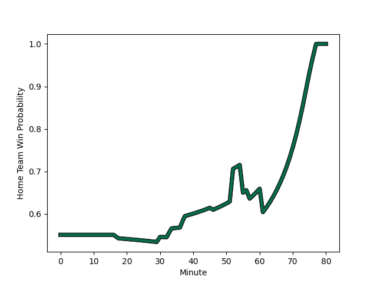

---  
layout: page  
title: Bayonne at Benetton Treviso; 7-26  
date: 2023-01-14 14:00:00 18:00:00 -0500  
categories: match review  
---
# Bayonne (1439.76) at Benetton Treviso (1528.54); 7-26

# Prediction: Benetton Treviso by 12.9

Benetton Treviso by 8.9 on a neutral field
## Scores over Time

## Win Probability over Time

# Pre-Match Prediction: Benetton Treviso by 13.1

Benetton Treviso by 9.1 on a neutral pitch

|   Away Minutes | Away Player                                                               |   Away elo |   Away Percentile |   Number |   Home Percentile |   Home elo | Home Player                                                           |   Home Minutes |
|---------------:|:--------------------------------------------------------------------------|-----------:|------------------:|---------:|------------------:|-----------:|:----------------------------------------------------------------------|---------------:|
|             64 | [Pieter Scholtz](..//playerfiles//PieterScholtz_cleaned.md)               |      92.96 |                32 |        1 |                64 |     100.03 | [Federico Zani](..//playerfiles//FedericoZani_cleaned.md)             |             61 |
|             52 | [Thomas Acquier](..//playerfiles//ThomasAcquier_cleaned.md)               |     121.58 |                94 |        2 |                44 |      94.03 | [Siua Maile](..//playerfiles//SiuaMaile_cleaned.md)                   |             46 |
|             64 | [Chris Talakai](..//playerfiles//ChrisTalakai_cleaned.md)                 |      76.67 |                 7 |        3 |                65 |     100.3  | [Simone Ferrari](..//playerfiles//SimoneFerrari_cleaned.md)           |             52 |
|             80 | [Manuel Leindekar](..//playerfiles//ManuelLeindekar_cleaned.md)           |     100.96 |                64 |        4 |                 0 |      51.6  | [Niccolo Cannone](..//playerfiles//NiccoloCannone_cleaned.md)         |             80 |
|             57 | [Kote Mikautadze](..//playerfiles//KoteMikautadze_cleaned.md)             |      86.23 |                23 |        5 |                52 |      96.38 | [Federico Ruzza](..//playerfiles//FedericoRuzza_cleaned.md)           |             52 |
|             52 | [Jean Monribot](..//playerfiles//JeanMonribot_cleaned.md)                 |      88.08 |                19 |        6 |                94 |     126.11 | [Giovanni Pettinelli](..//playerfiles//GiovanniPettinelli_cleaned.md) |             80 |
|             80 | [Geoff Cridge](..//playerfiles//GeoffCridge_cleaned.md)                   |      91.13 |                35 |        7 |                87 |     114.79 | [Michele Lamaro](..//playerfiles//MicheleLamaro_cleaned.md)           |             80 |
|             80 | [Aitor Hourcade](..//playerfiles//AitorHourcade_cleaned.md)               |      75.81 |                 7 |        8 |                42 |      94.67 | [Lorenzo Cannone](..//playerfiles//LorenzoCannone_cleaned.md)         |             55 |
|             52 | [Maxime Machenaud](..//playerfiles//MaximeMachenaud_cleaned.md)           |     113.19 |                87 |        9 |                89 |     116.14 | [Sam Hidalgo-Clyne](..//playerfiles//SamHidalgo-Clyne_cleaned.md)     |             46 |
|             80 | [Thomas Dolhagaray](..//playerfiles//ThomasDolhagaray_cleaned.md)         |     121.51 |                89 |       10 |                90 |     121.89 | [Tomas Albornoz](..//playerfiles//TomasAlbornoz_cleaned.md)           |             46 |
|             80 | [Bastien Pourailly](..//playerfiles//BastienPourailly_cleaned.md)         |      47.35 |                 0 |       11 |                82 |     110.73 | [Onisi Ratave](..//playerfiles//OnisiRatave_cleaned.md)               |             80 |
|             80 | [Eneriko Buliruarua](..//playerfiles//EnerikoBuliruarua_cleaned.md)       |      86.74 |                26 |       12 |                80 |     110.33 | [Tommaso Menoncello](..//playerfiles//TommasoMenoncello_cleaned.md)   |             80 |
|             61 | [Peyo Muscarditz](..//playerfiles//PeyoMuscarditz_cleaned.md)             |     116.45 |                87 |       13 |                81 |     111.35 | [Juan Ignacio Brex](..//playerfiles//JuanIgnacioBrex_cleaned.md)      |             61 |
|             80 | [Arnaud Erbinartegaray](..//playerfiles//ArnaudErbinartegaray_cleaned.md) |     112.05 |                83 |       14 |                15 |      82.63 | [Ignacio Mendy](..//playerfiles//IgnacioMendy_cleaned.md)             |             80 |
|             57 | [Yohan Orabé](..//playerfiles//YohanOrabé_cleaned.md)                     |      96.9  |                49 |       15 |                82 |     114.54 | [Matteo Minozzi](..//playerfiles//MatteoMinozzi_cleaned.md)           |             80 |
|             16 | [Swan Cormenier](..//playerfiles//SwanCormenier_cleaned.md)               |     105.84 |                79 |       16 |                21 |      86.93 | [Cherif Traore](..//playerfiles//CherifTraore_cleaned.md)             |             19 |
|             28 | [Torsten van Jaarsveld](..//playerfiles//TorstenvanJaarsveld_cleaned.md)  |     114.15 |                87 |       17 |                63 |      99.72 | [Tiziano Pasquali](..//playerfiles//TizianoPasquali_cleaned.md)       |             28 |
|             16 | [Badri Tsikhistavi](..//playerfiles//BadriTsikhistavi_cleaned.md)         |      95    |               nan |       18 |                78 |     106.61 | [Giacomo Nicotera](..//playerfiles//GiacomoNicotera_cleaned.md)       |             34 |
|             23 | [Denis Marchois](..//playerfiles//DenisMarchois_cleaned.md)               |     162.54 |                99 |       19 |               nan |      93.44 | [Riccardo Favretto](..//playerfiles//RiccardoFavretto_cleaned.md)     |             28 |
|             28 | [Mateaki Kafatolu](..//playerfiles//MateakiKafatolu_cleaned.md)           |      97.53 |                55 |       20 |                 5 |      74.12 | [Alessandro Izekor](..//playerfiles//AlessandroIzekor_cleaned.md)     |             25 |
|             28 | [Michael Ruru](..//playerfiles//MichaelRuru_cleaned.md)                   |     111.47 |                83 |       21 |                69 |     105.55 | [Jacob Umaga](..//playerfiles//JacobUmaga_cleaned.md)                 |             34 |
|             19 | [Guillaume Martocq](..//playerfiles//GuillaumeMartocq_cleaned.md)         |      74.14 |                 4 |       22 |                62 |     101.26 | [Manfredi Albanese](..//playerfiles//ManfrediAlbanese_cleaned.md)     |             34 |
|             23 | [Jason Robertson](..//playerfiles//JasonRobertson_cleaned.md)             |      75.75 |                 7 |       23 |                88 |     118.52 | [Marco Zanon](..//playerfiles//MarcoZanon_cleaned.md)                 |             19 |

