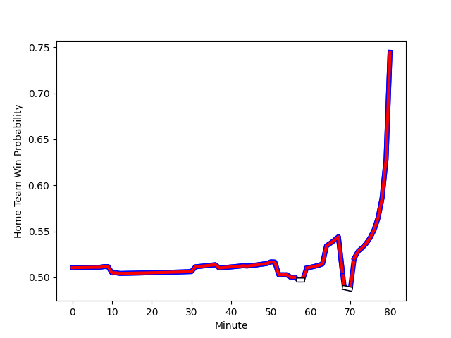

---  
layout: page  
title: Valence Romans Drome Rugby at Blagnac; 18-20  
date: 2023-01-14 16:00:00 18:00:00 -0500  
categories: match review  
---
# Valence Romans Drome Rugby (1410.94) at Blagnac (1429.41); 18-20

# Prediction: Blagnac by 5.8

Blagnac by 1.8 on a neutral field
## Scores over Time

## Win Probability over Time

# Pre-Match Prediction: Blagnac by 13.0

Blagnac by 9.0 on a neutral pitch

|   Away Minutes | Away Player                                                                |   Away elo |   Away Percentile |   Number |   Home Percentile |   Home elo | Home Player                                                              |   Home Minutes |
|---------------:|:---------------------------------------------------------------------------|-----------:|------------------:|---------:|------------------:|-----------:|:-------------------------------------------------------------------------|---------------:|
|             50 | [Anthony Aléo](..//playerfiles//AnthonyAléo_cleaned.md)                    |      99.04 |                61 |        1 |                80 |     106.33 | [Alexis Decaux](..//playerfiles//AlexisDecaux_cleaned.md)                |             55 |
|             80 | [Dorian Marco Pena](..//playerfiles//DorianMarcoPena_cleaned.md)           |     101.99 |                69 |        2 |                78 |     106.24 | [Gabin Villerouge](..//playerfiles//GabinVillerouge_cleaned.md)          |             55 |
|             50 | [John Henry Fincham](..//playerfiles//JohnHenryFincham_cleaned.md)         |      94.55 |                46 |        3 |                69 |      98.56 | [Marco Trauth](..//playerfiles//MarcoTrauth_cleaned.md)                  |             51 |
|             80 | [Francois Uys](..//playerfiles//FrancoisUys_cleaned.md)                    |      97.27 |                54 |        4 |                61 |      98.62 | [Nikita Bekov](..//playerfiles//NikitaBekov_cleaned.md)                  |             80 |
|             80 | [Florian Goumat](..//playerfiles//FlorianGoumat_cleaned.md)                |      82.06 |                16 |        5 |                74 |     105.52 | [Vincent Mutel](..//playerfiles//VincentMutel_cleaned.md)                |             80 |
|             80 | [Alexis Armary](..//playerfiles//AlexisArmary_cleaned.md)                  |     108.98 |                79 |        6 |                91 |     120.13 | [Benjamin Collet](..//playerfiles//BenjaminCollet_cleaned.md)            |             10 |
|             62 | [Matthew Gicquel](..//playerfiles//MatthewGicquel_cleaned.md)              |      82.3  |                22 |        7 |                61 |      99.61 | [Loïc Verdy](..//playerfiles//LoïcVerdy_cleaned.md)                      |             63 |
|             44 | [Dylan Hayes](..//playerfiles//DylanHayes_cleaned.md)                      |      92.54 |                49 |        8 |                66 |     104.66 | [Mathieu Vachon](..//playerfiles//MathieuVachon_cleaned.md)              |             72 |
|             69 | [Tim Menzel](..//playerfiles//TimMenzel_cleaned.md)                        |      82.85 |                14 |        9 |                91 |     117.27 | [Paul Ravier](..//playerfiles//PaulRavier_cleaned.md)                    |             80 |
|             80 | [Lucas Meret](..//playerfiles//LucasMeret_cleaned.md)                      |      83.45 |                15 |       10 |                71 |     103.9  | [Valentin Delpy](..//playerfiles//ValentinDelpy_cleaned.md)              |             72 |
|             80 | [Adam Vargas](..//playerfiles//AdamVargas_cleaned.md)                      |      96.8  |                52 |       11 |                 9 |      76.36 | [Benjamin Daurau Bedin](..//playerfiles//BenjaminDaurauBedin_cleaned.md) |             80 |
|             80 | [Ben Neiceru](..//playerfiles//BenNeiceru_cleaned.md)                      |     110.14 |                79 |       12 |                 3 |      62.08 | [Antoine Renaud](..//playerfiles//AntoineRenaud_cleaned.md)              |             80 |
|             57 | [Anatole Pauvert](..//playerfiles//AnatolePauvert_cleaned.md)              |      77.85 |                10 |       13 |                33 |      89.72 | [Aurelien Labau](..//playerfiles//AurelienLabau_cleaned.md)              |             80 |
|             80 | [Noe Perret-Tourlonias](..//playerfiles//NoePerret-Tourlonias_cleaned.md)  |      98.57 |                58 |       14 |                 7 |      74.87 | [Francois Tardieu](..//playerfiles//FrancoisTardieu_cleaned.md)          |             72 |
|             62 | [Joris Moura](..//playerfiles//JorisMoura_cleaned.md)                      |      97.8  |                53 |       15 |                73 |     107.86 | [Ugo Seunes](..//playerfiles//UgoSeunes_cleaned.md)                      |             80 |
|             36 | [Philippe Laville](..//playerfiles//PhilippeLaville_cleaned.md)            |      97.32 |               nan |       16 |                10 |      76.08 | [Lucas Tolofua](..//playerfiles//LucasTolofua_cleaned.md)                |             70 |
|             30 | [Andrea Pontanier](..//playerfiles//AndreaPontanier_cleaned.md)            |      84.37 |                21 |       17 |                40 |      92.8  | [Fabien Lorenzon](..//playerfiles//FabienLorenzon_cleaned.md)            |             29 |
|             30 | [Kevin Goze](..//playerfiles//KevinGoze_cleaned.md)                        |     102.31 |                79 |       18 |                79 |     104.6  | [Cesar Biscioni](..//playerfiles//CesarBiscioni_cleaned.md)              |             25 |
|             23 | [Akuila Joeli Tabualevu](..//playerfiles//AkuilaJoeliTabualevu_cleaned.md) |      96.22 |                50 |       19 |                41 |      91.1  | [Florian Bertrand](..//playerfiles//FlorianBertrand_cleaned.md)          |             25 |
|             18 | [Charles Brayer](..//playerfiles//CharlesBrayer_cleaned.md)                |      65.24 |                 4 |       20 |                66 |     102.41 | [Lilian Rousset](..//playerfiles//LilianRousset_cleaned.md)              |             17 |
|             18 | [Quentin Gobet](..//playerfiles//QuentinGobet_cleaned.md)                  |     114.69 |                83 |       21 |                33 |      85.72 | [Lukas Doyhenard](..//playerfiles//LukasDoyhenard_cleaned.md)            |              8 |
|             11 | [Léopold Dupas](..//playerfiles//LéopoldDupas_cleaned.md)                  |      82.37 |                13 |       22 |                92 |     129.45 | [Jean-Andre Vernetti](..//playerfiles//Jean-AndreVernetti_cleaned.md)    |              8 |
|            nan | nan                                                                        |     nan    |               nan |       23 |                54 |      98.1  | [Nekolo Tolofua](..//playerfiles//NekoloTolofua_cleaned.md)              |              8 |

