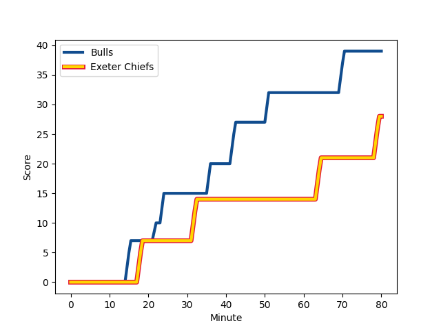
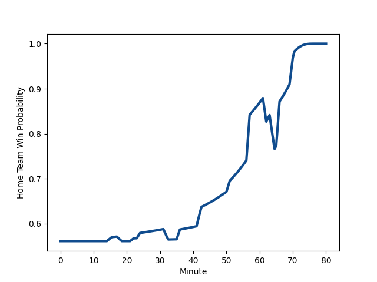

---  
layout: page  
title: Exeter Chiefs at Bulls; 28-39  
date: 2023-01-14 18:30:00 18:00:00 -0500  
categories: match review  
---
# Exeter Chiefs (1556.8) at Bulls (1664.07); 28-39

# Prediction: Bulls by 14.7

Bulls by 10.7 on a neutral field
## Scores over Time

## Win Probability over Time

# Pre-Match Prediction: Bulls by 14.7

Bulls by 10.7 on a neutral pitch

|   Away Minutes | Away Player                                                       |   Away elo |   Away Percentile |   Number |   Home Percentile |   Home elo | Home Player                                                          |   Home Minutes |
|---------------:|:------------------------------------------------------------------|-----------:|------------------:|---------:|------------------:|-----------:|:---------------------------------------------------------------------|---------------:|
|             57 | [Scott Sio](..//playerfiles//ScottSio_cleaned.md)                 |      78.15 |                 8 |        1 |                84 |     108.8  | [Gerhard Steenekamp](..//playerfiles//GerhardSteenekamp_cleaned.md)  |             57 |
|             51 | [Jack Innard](..//playerfiles//JackInnard_cleaned.md)             |      81.3  |                13 |        2 |                99 |     139.2  | [Johan Grobbelaar](..//playerfiles//JohanGrobbelaar_cleaned.md)      |             72 |
|             57 | [Harry Williams](..//playerfiles//HarryWilliams_cleaned.md)       |     113.13 |                88 |        3 |                53 |      96.41 | [Mornay Smith](..//playerfiles//MornaySmith_cleaned.md)              |             57 |
|             51 | [Jack Dunne](..//playerfiles//JackDunne_cleaned.md)               |      99.43 |                60 |        4 |                43 |      93.24 | [Ruan Vermaak](..//playerfiles//RuanVermaak_cleaned.md)              |             66 |
|             80 | [Dafydd Jenkins](..//playerfiles//DafyddJenkins_cleaned.md)       |     104.59 |                72 |        5 |                62 |     100.18 | [Ruan Nortje](..//playerfiles//RuanNortje_cleaned.md)                |             80 |
|             80 | [Dave Ewers](..//playerfiles//DaveEwers_cleaned.md)               |     135.73 |                98 |        6 |                60 |      99.27 | [Marco van Staden](..//playerfiles//MarcovanStaden_cleaned.md)       |             80 |
|             80 | [Christ Tshiunza](..//playerfiles//ChristTshiunza_cleaned.md)     |      88.75 |                29 |        7 |                13 |      81.2  | [Nizaam Carr](..//playerfiles//NizaamCarr_cleaned.md)                |             66 |
|             80 | [Sam Simmonds](..//playerfiles//SamSimmonds_cleaned.md)           |     126.42 |                93 |        8 |                45 |      95.83 | [Elrigh Louw](..//playerfiles//ElrighLouw_cleaned.md)                |             80 |
|             57 | [Sam Maunder](..//playerfiles//SamMaunder_cleaned.md)             |      80.52 |                11 |        9 |                85 |     111.83 | [Zak Burger](..//playerfiles//ZakBurger_cleaned.md)                  |             80 |
|             57 | [Joe Simmonds](..//playerfiles//JoeSimmonds_cleaned.md)           |     126.86 |                93 |       10 |                83 |     114.93 | [Chris Smith](..//playerfiles//ChrisSmith_cleaned.md)                |             57 |
|             80 | [Olly Woodburn](..//playerfiles//OllyWoodburn_cleaned.md)         |     125.58 |                94 |       11 |                96 |     130.49 | [David Kriel](..//playerfiles//DavidKriel_cleaned.md)                |             80 |
|             62 | [Solomone Kata](..//playerfiles//SolomoneKata_cleaned.md)         |     128.69 |                95 |       12 |                95 |     129.45 | [Harold Vorster](..//playerfiles//HaroldVorster_cleaned.md)          |             80 |
|             80 | [Henry Slade](..//playerfiles//HenrySlade_cleaned.md)             |     108.87 |                78 |       13 |                70 |     104.95 | [Wandisile Simelane](..//playerfiles//WandisileSimelane_cleaned.md)  |             75 |
|             80 | [Jack Nowell](..//playerfiles//JackNowell_cleaned.md)             |      89.64 |                31 |       14 |                90 |     120.56 | [Canan Moodie](..//playerfiles//CananMoodie_cleaned.md)              |             80 |
|             80 | [Josh Hodge](..//playerfiles//JoshHodge_cleaned.md)               |      70.14 |                 7 |       15 |                98 |     144.04 | [Kurt-Lee Arendse](..//playerfiles//Kurt-LeeArendse_cleaned.md)      |             80 |
|             29 | [Jack Yeandle](..//playerfiles//JackYeandle_cleaned.md)           |     127.72 |                97 |       16 |                86 |     111.63 | [Dylan Smith](..//playerfiles//DylanSmith_cleaned.md)                |             23 |
|             23 | [Josh Iosefa-Scott](..//playerfiles//JoshIosefa-Scott_cleaned.md) |      89.46 |               nan |       17 |                85 |     112.43 | [Bismarck du Plessis](..//playerfiles//BismarckduPlessis_cleaned.md) |              8 |
|             23 | [James Kenny](..//playerfiles//JamesKenny_cleaned.md)             |      79.51 |                15 |       18 |                28 |      91.17 | [Francois Klopper](..//playerfiles//FrancoisKlopper_cleaned.md)      |             23 |
|             29 | [Jannes Kirsten](..//playerfiles//JannesKirsten_cleaned.md)       |     111.45 |                83 |       19 |                46 |      94.52 | [Janko Swanepoel](..//playerfiles//JankoSwanepoel_cleaned.md)        |             14 |
|             23 | [Harvey Skinner](..//playerfiles//HarveySkinner_cleaned.md)       |     102.49 |                59 |       20 |                57 |     100.94 | [WJ Steenkamp](..//playerfiles//WJSteenkamp_cleaned.md)              |             14 |
|             23 | [Jack Maunder](..//playerfiles//JackMaunder_cleaned.md)           |      80.37 |                10 |       21 |                28 |      89.79 | [Johan Goosen](..//playerfiles//JohanGoosen_cleaned.md)              |             23 |
|             18 | [Rory O'Loughlin](..//playerfiles//RoryO'Loughlin_cleaned.md)     |      89.98 |                34 |       22 |                86 |     114.59 | [Lionel Mapoe](..//playerfiles//LionelMapoe_cleaned.md)              |              5 |

