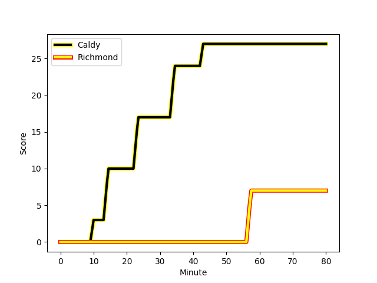
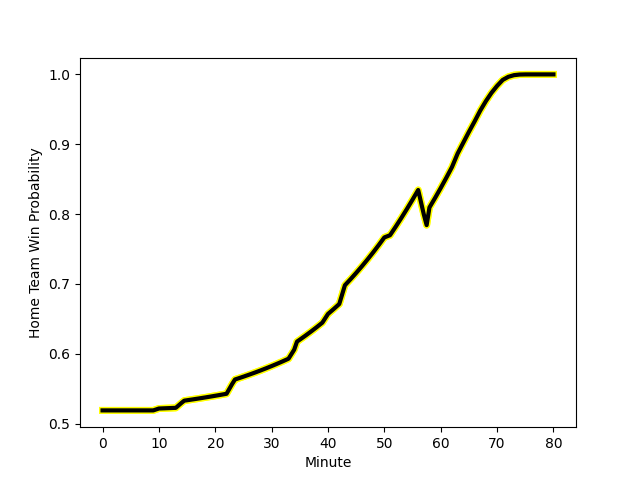

---  
layout: page  
title: Richmond at Caldy; 7-27  
date: 2023-01-14 15:00:00 18:00:00 -0500  
categories: match review  
---
# Richmond (1367.43) at Caldy (1400.15); 7-27

# Prediction: Caldy by 7.3

Caldy by 3.3 on a neutral field
## Scores over Time

## Win Probability over Time

# Pre-Match Prediction: Caldy by 8.0

Caldy by 4.0 on a neutral pitch

|   Away Minutes | Away Player                                                       |   Away elo |   Away Percentile |   Number |   Home Percentile |   Home elo | Home Player                                                     |   Home Minutes |
|---------------:|:------------------------------------------------------------------|-----------:|------------------:|---------:|------------------:|-----------:|:----------------------------------------------------------------|---------------:|
|             51 | [Conor Maguire](..//playerfiles//ConorMaguire_cleaned.md)         |      88.19 |                24 |        1 |                33 |      93.62 | [Adam Aigbokhae](..//playerfiles//AdamAigbokhae_cleaned.md)     |             71 |
|             51 | [Callum Torpey](..//playerfiles//CallumTorpey_cleaned.md)         |      77.52 |                11 |        2 |                53 |      95.86 | [Oliver Hearn](..//playerfiles//OliverHearn_cleaned.md)         |             71 |
|             34 | [Jimmy Litchfield](..//playerfiles//JimmyLitchfield_cleaned.md)   |      68.85 |                 2 |        3 |                38 |      92.08 | [Nathan Rushton](..//playerfiles//NathanRushton_cleaned.md)     |             58 |
|             80 | [Sam Collingridge](..//playerfiles//SamCollingridge_cleaned.md)   |      95.92 |                51 |        4 |                17 |      82.99 | [Josiah Dickinson](..//playerfiles//JosiahDickinson_cleaned.md) |             80 |
|             71 | [Jake Monson](..//playerfiles//JakeMonson_cleaned.md)             |      95.79 |                51 |        5 |                27 |      87.96 | [Thomas Sanders](..//playerfiles//ThomasSanders_cleaned.md)     |             80 |
|             80 | [David Massey](..//playerfiles//DavidMassey_cleaned.md)           |      93.37 |                43 |        6 |                24 |      86.34 | [Rouben Birch](..//playerfiles//RoubenBirch_cleaned.md)         |             67 |
|             58 | [Tobias Saysell](..//playerfiles//TobiasSaysell_cleaned.md)       |     113.88 |                86 |        7 |                45 |      94.24 | [Callum Ridgway](..//playerfiles//CallumRidgway_cleaned.md)     |             80 |
|             80 | [Mark Bright](..//playerfiles//MarkBright_cleaned.md)             |      82.86 |                16 |        8 |                67 |     104.98 | [Sam Dickinson](..//playerfiles//SamDickinson_cleaned.md)       |             66 |
|             58 | [Jack Stafford](..//playerfiles//JackStafford_cleaned.md)         |     103.39 |                69 |        9 |                21 |      88.46 | [Chris Pilgrim](..//playerfiles//ChrisPilgrim_cleaned.md)       |             67 |
|             71 | [Bill Johnston](..//playerfiles//BillJohnston_cleaned.md)         |     103.51 |                66 |       10 |                26 |      89.28 | [Rhys Hayes](..//playerfiles//RhysHayes_cleaned.md)             |             71 |
|             63 | [Jack Caddy](..//playerfiles//JackCaddy_cleaned.md)               |      77.97 |                10 |       11 |                66 |     101.37 | [Louis Beer](..//playerfiles//LouisBeer_cleaned.md)             |             80 |
|             80 | [Paul Kiernan](..//playerfiles//PaulKiernan_cleaned.md)           |      88.72 |                30 |       12 |                59 |      99.78 | [Michael Barlow](..//playerfiles//MichaelBarlow_cleaned.md)     |             80 |
|             80 | [Michael Little](..//playerfiles//MichaelLittle_cleaned.md)       |     102.74 |                70 |       13 |                24 |      85.7  | [Michael Cartmill](..//playerfiles//MichaelCartmill_cleaned.md) |             40 |
|             80 | [Alexander O'Meara](..//playerfiles//AlexanderO'Meara_cleaned.md) |      98.08 |                57 |       14 |                39 |      92.31 | [Nick Royle](..//playerfiles//NickRoyle_cleaned.md)             |             80 |
|             80 | [Darren Atkins](..//playerfiles//DarrenAtkins_cleaned.md)         |      72.42 |                 9 |       15 |                52 |      97.62 | [Elliott Gourlay](..//playerfiles//ElliottGourlay_cleaned.md)   |             80 |
|             46 | [Luke Spring](..//playerfiles//LukeSpring_cleaned.md)             |      90.45 |                39 |       16 |               nan |      95.33 | [Lewis Barker](..//playerfiles//LewisBarker_cleaned.md)         |             40 |
|             29 | [Joseph Vajner](..//playerfiles//JosephVajner_cleaned.md)         |      87.41 |                23 |       17 |                54 |      99.62 | [Ryan Higginson](..//playerfiles//RyanHigginson_cleaned.md)     |             22 |
|             29 | [George Cave](..//playerfiles//GeorgeCave_cleaned.md)             |      95.51 |               nan |       18 |                64 |     102.82 | [Martin Gerrard](..//playerfiles//MartinGerrard_cleaned.md)     |             14 |
|             22 | [James Lennon](..//playerfiles//JamesLennon_cleaned.md)           |      98.1  |                54 |       19 |                26 |      87.35 | [Harrison Crowe](..//playerfiles//HarrisonCrowe_cleaned.md)     |             13 |
|             22 | [Miles Wakeling](..//playerfiles//MilesWakeling_cleaned.md)       |      86.1  |                20 |       20 |                38 |      92.1  | [Joseph Murray](..//playerfiles//JosephMurray_cleaned.md)       |             13 |
|             17 | [Will Kaye](..//playerfiles//WillKaye_cleaned.md)                 |      66.19 |                 3 |       21 |               nan |      97.2  | [Jack Parker](..//playerfiles//JackParker_cleaned.md)           |              9 |
|              9 | [Henri Williams](..//playerfiles//HenriWilliams_cleaned.md)       |      80.07 |                15 |       22 |               nan |      92.43 | [Thomas Clarke](..//playerfiles//ThomasClarke_cleaned.md)       |              9 |
|              9 | [Alex Burrage](..//playerfiles//AlexBurrage_cleaned.md)           |      94.01 |               nan |       23 |                35 |      91.69 | [Ezra Hinchcliffe](..//playerfiles//EzraHinchcliffe_cleaned.md) |              9 |

