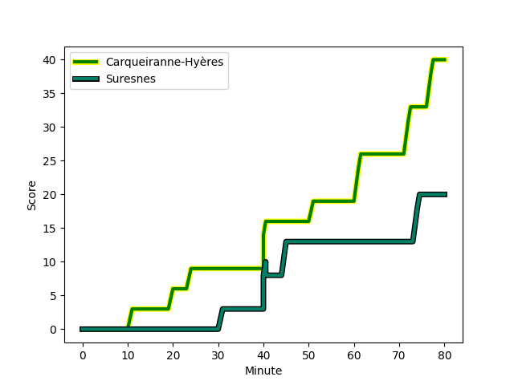
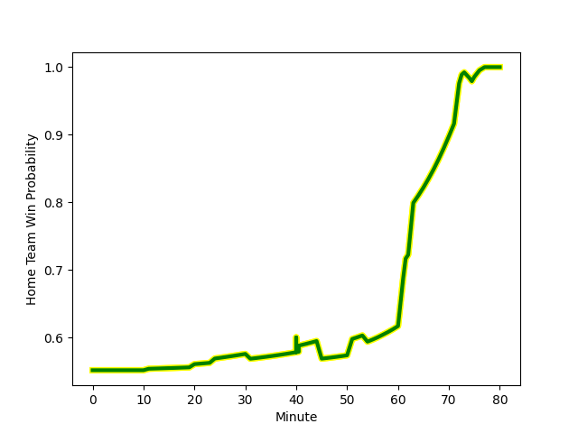

---  
layout: page  
title: Suresnes at Carqueiranne-Hyères; 20-40  
date: 2023-01-14 15:00:00 18:00:00 -0500  
categories: match review  
---
# Suresnes (1343.9) at Carqueiranne-Hyères (1434.53); 20-40

# Prediction: Carqueiranne-Hyères by 13.1

Carqueiranne-Hyères by 9.1 on a neutral field
## Scores over Time

## Win Probability over Time

# Pre-Match Prediction: Carqueiranne-Hyères by 10.5

Carqueiranne-Hyères by 6.5 on a neutral pitch

|   Away Minutes | Away Player                                                                  |   Away elo |   Away Percentile |   Number |   Home Percentile |   Home elo | Home Player                                                                 |   Home Minutes |
|---------------:|:-----------------------------------------------------------------------------|-----------:|------------------:|---------:|------------------:|-----------:|:----------------------------------------------------------------------------|---------------:|
|             57 | [Lucas Dycke](..//playerfiles//LucasDycke_cleaned.md)                        |      89.1  |                28 |        1 |                43 |      93.46 | [Liam Chad Hendricks](..//playerfiles//LiamChadHendricks_cleaned.md)        |             70 |
|             57 | [Thomas Bordes](..//playerfiles//ThomasBordes_cleaned.md)                    |      92.06 |                49 |        2 |                14 |      81.39 | [Yan Tabarot](..//playerfiles//YanTabarot_cleaned.md)                       |             63 |
|             57 | [Leandro Mario Assi](..//playerfiles//LeandroMarioAssi_cleaned.md)           |     108.12 |                82 |        3 |                38 |      91.96 | [Lasha Mchelidze](..//playerfiles//LashaMchelidze_cleaned.md)               |             63 |
|             80 | [Christopher van Leeuwen](..//playerfiles//ChristophervanLeeuwen_cleaned.md) |      75.63 |                 9 |        4 |                46 |      94.53 | [Nathan Gendre](..//playerfiles//NathanGendre_cleaned.md)                   |             66 |
|             80 | [Yakine Djebarri](..//playerfiles//YakineDjebarri_cleaned.md)                |      81.57 |                15 |        5 |                20 |      84.61 | [Cesar Damiani](..//playerfiles//CesarDamiani_cleaned.md)                   |             80 |
|             63 | [Wian Vosloo](..//playerfiles//WianVosloo_cleaned.md)                        |     110.78 |                84 |        6 |                41 |      92.62 | [Florian Munoz Rivero](..//playerfiles//FlorianMunozRivero_cleaned.md)      |             80 |
|             80 | [Bastien Berenguel](..//playerfiles//BastienBerenguel_cleaned.md)            |     108.32 |                79 |        7 |                75 |     106.38 | [Joachim Beaumont](..//playerfiles//JoachimBeaumont_cleaned.md)             |             80 |
|             75 | [Louis-Mathieu Jazeix](..//playerfiles//Louis-MathieuJazeix_cleaned.md)      |     105.81 |                74 |        8 |                33 |      93.52 | [Julien Ormea](..//playerfiles//JulienOrmea_cleaned.md)                     |             73 |
|             63 | [Théo Bachiri](..//playerfiles//ThéoBachiri_cleaned.md)                      |      97.82 |                53 |        9 |                80 |     110.77 | [Thomas Sonetti](..//playerfiles//ThomasSonetti_cleaned.md)                 |             54 |
|             63 | [Gaëtan Robert](..//playerfiles//GaëtanRobert_cleaned.md)                    |      95.3  |                44 |       10 |                52 |      98.87 | [Ionel Melinte](..//playerfiles//IonelMelinte_cleaned.md)                   |             73 |
|             80 | [Ervin Muric](..//playerfiles//ErvinMuric_cleaned.md)                        |      -1.05 |                 0 |       11 |                22 |      86.97 | [Vincent Alessi](..//playerfiles//VincentAlessi_cleaned.md)                 |             80 |
|             57 | [Hugo Detre](..//playerfiles//HugoDetre_cleaned.md)                          |      93.81 |               nan |       12 |                88 |     117.47 | [Romain Leveque](..//playerfiles//RomainLeveque_cleaned.md)                 |             80 |
|             80 | [Arthur Proult](..//playerfiles//ArthurProult_cleaned.md)                    |     102.75 |                66 |       13 |                83 |     112.61 | [Charles Brousse](..//playerfiles//CharlesBrousse_cleaned.md)               |             80 |
|             80 | [Alexis Clement](..//playerfiles//AlexisClement_cleaned.md)                  |      88.21 |                27 |       14 |                11 |      77.75 | [David Raikuna](..//playerfiles//DavidRaikuna_cleaned.md)                   |             66 |
|             80 | [Goulwen Gueho](..//playerfiles//GoulwenGueho_cleaned.md)                    |      89.94 |                28 |       15 |                75 |     108.24 | [Josselyn Bouchon](..//playerfiles//JosselynBouchon_cleaned.md)             |             80 |
|             23 | [Petero Tuwai](..//playerfiles//PeteroTuwai_cleaned.md)                      |      93.48 |                44 |       16 |                16 |      83.88 | [Rémi Dubié](..//playerfiles//RémiDubié_cleaned.md)                         |             26 |
|             23 | [Beqa Kakabadze](..//playerfiles//BeqaKakabadze_cleaned.md)                  |     110.38 |                86 |       17 |                 7 |      76.96 | [Michael Tyumenev](..//playerfiles//MichaelTyumenev_cleaned.md)             |             17 |
|             23 | [Hayam El Bibouji](..//playerfiles//HayamElBibouji_cleaned.md)               |      95.16 |                51 |       18 |                42 |      93.7  | [Costel Burtila](..//playerfiles//CostelBurtila_cleaned.md)                 |             17 |
|             23 | [Victor Damian Arias](..//playerfiles//VictorDamianArias_cleaned.md)         |     115.86 |                92 |       19 |                29 |      90.67 | [Dylan Sage](..//playerfiles//DylanSage_cleaned.md)                         |             14 |
|             17 | [Quentin Dauvergne](..//playerfiles//QuentinDauvergne_cleaned.md)            |      77.46 |                 8 |       20 |                 1 |      55.59 | [Lucas Cazac](..//playerfiles//LucasCazac_cleaned.md)                       |             14 |
|             17 | [Antonie Claassen](..//playerfiles//AntonieClaassen_cleaned.md)              |     124.79 |                92 |       21 |                22 |      89.02 | [Eli Serra-Miglietti](..//playerfiles//EliSerra-Miglietti_cleaned.md)       |             10 |
|             17 | [Enzo Barbarit](..//playerfiles//EnzoBarbarit_cleaned.md)                    |      88.36 |                29 |       22 |                17 |      83.63 | [Théo Defrance](..//playerfiles//ThéoDefrance_cleaned.md)                   |              7 |
|              5 | [Théo David Nathan Tanda](..//playerfiles//ThéoDavidNathanTanda_cleaned.md)  |      96.36 |                52 |       23 |                18 |      83.55 | [Geoffrey Nouhaillaguet](..//playerfiles//GeoffreyNouhaillaguet_cleaned.md) |              7 |

