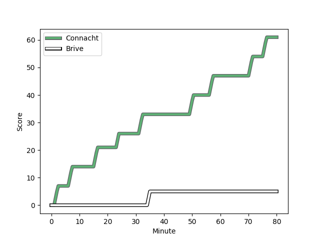
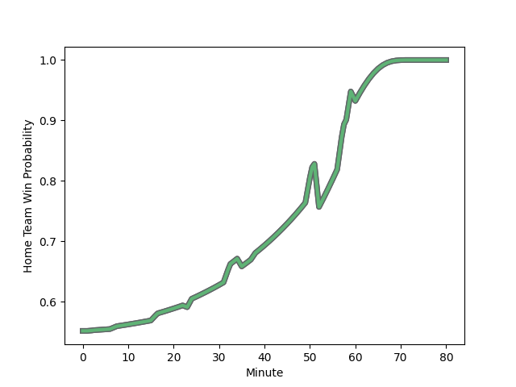

---  
layout: page  
title: Brive at Connacht; 5-61  
date: 2023-01-14 18:30:00 18:00:00 -0500  
categories: match review  
---
# Brive (1409.06) at Connacht (1499.61); 5-61

# Prediction: Connacht by 13.1

Connacht by 9.1 on a neutral field
## Scores over Time

## Win Probability over Time

# Pre-Match Prediction: Connacht by 12.9

Connacht by 8.9 on a neutral pitch

|   Away Minutes | Away Player                                                                      |   Away elo |   Away Percentile |   Number |   Home Percentile |   Home elo | Home Player                                                             |   Home Minutes |
|---------------:|:---------------------------------------------------------------------------------|-----------:|------------------:|---------:|------------------:|-----------:|:------------------------------------------------------------------------|---------------:|
|             52 | [Hayden Thompson-Stringer](..//playerfiles//HaydenThompson-Stringer_cleaned.md)  |     112.42 |                93 |        1 |                98 |     133.49 | [Peter Dooley](..//playerfiles//PeterDooley_cleaned.md)                 |             52 |
|             59 | [Vano Karkadze](..//playerfiles//VanoKarkadze_cleaned.md)                        |      93.19 |                43 |        2 |                17 |      84.01 | [Dave Heffernan](..//playerfiles//DaveHeffernan_cleaned.md)             |             63 |
|             38 | [Tietie Tuimauga](..//playerfiles//TietieTuimauga_cleaned.md)                    |      96.02 |                52 |        3 |                56 |      97.46 | [Finlay Bealham](..//playerfiles//FinlayBealham_cleaned.md)             |             52 |
|             80 | [Andres Zafra Tarazona](..//playerfiles//AndresZafraTarazona_cleaned.md)         |      81.23 |                14 |        4 |                93 |     123.06 | [Josh Murphy](..//playerfiles//JoshMurphy_cleaned.md)                   |             80 |
|             80 | [Oskar Rixen](..//playerfiles//OskarRixen_cleaned.md)                            |      97.26 |                51 |        5 |                79 |     108.09 | [Niall Murray](..//playerfiles//NiallMurray_cleaned.md)                 |             60 |
|             80 | [Matthieu Voisin](..//playerfiles//MatthieuVoisin_cleaned.md)                    |      87.88 |                21 |        6 |                12 |      79.87 | [Cian Prendergast](..//playerfiles//CianPrendergast_cleaned.md)         |             80 |
|             80 | [Sasha Gue](..//playerfiles//SashaGue_cleaned.md)                                |      87.37 |                26 |        7 |                80 |     109.3  | [Conor Oliver](..//playerfiles//ConorOliver_cleaned.md)                 |             80 |
|             54 | [Abraham Papali'i](..//playerfiles//AbrahamPapali'i_cleaned.md)                  |     109.38 |                74 |        8 |                50 |      98.24 | [Jarrad Butler](..//playerfiles//JarradButler_cleaned.md)               |             60 |
|             46 | [Vaso Lobzhanidze](..//playerfiles//VasoLobzhanidze_cleaned.md)                  |     100.6  |                61 |        9 |                65 |     103.12 | [Colm Reilly](..//playerfiles//ColmReilly_cleaned.md)                   |             63 |
|             80 | [Tom Raffy](..//playerfiles//TomRaffy_cleaned.md)                                |      94.68 |                31 |       10 |                44 |      95.18 | [Jack Carty](..//playerfiles//JackCarty_cleaned.md)                     |             80 |
|             23 | [Valentin Tirefort](..//playerfiles//ValentinTirefort_cleaned.md)                |      73.13 |                 6 |       11 |                44 |      94.04 | [Alex Wootton](..//playerfiles//AlexWootton_cleaned.md)                 |             80 |
|             46 | [Nico Lee](..//playerfiles//NicoLee_cleaned.md)                                  |     124.09 |                93 |       12 |                49 |      95.55 | [Cathal Forde](..//playerfiles//CathalForde_cleaned.md)                 |             59 |
|             80 | [Wesley Douglas](..//playerfiles//WesleyDouglas_cleaned.md)                      |      69.76 |                 4 |       13 |                37 |      89.49 | [Byron Ralston](..//playerfiles//ByronRalston_cleaned.md)               |             80 |
|             80 | [Kevin Fabien](..//playerfiles//KevinFabien_cleaned.md)                          |     102.08 |                56 |       14 |                90 |     120.29 | [John Porch](..//playerfiles//JohnPorch_cleaned.md)                     |             59 |
|             60 | [Maxence Biasotto](..//playerfiles//MaxenceBiasotto_cleaned.md)                  |      96.04 |               nan |       15 |                29 |      89.08 | [Mack Hansen](..//playerfiles//MackHansen_cleaned.md)                   |             80 |
|             28 | [Nathan Fraissenon](..//playerfiles//NathanFraissenon_cleaned.md)                |     102.93 |                54 |       16 |                57 |      94.96 | [Jordan Duggan](..//playerfiles//JordanDuggan_cleaned.md)               |             28 |
|             21 | [Aymeric Tronc](..//playerfiles//AymericTronc_cleaned.md)                        |      95.48 |               nan |       17 |                41 |      90.85 | [Dylan Tierney-Martin](..//playerfiles//DylanTierney-Martin_cleaned.md) |             17 |
|             42 | [Francisco Coria Marchetti](..//playerfiles//FranciscoCoriaMarchetti_cleaned.md) |      85.61 |               nan |       18 |                81 |     106.82 | [Jack Aungier](..//playerfiles//JackAungier_cleaned.md)                 |             28 |
|             26 | [Joeli Matalaweru](..//playerfiles//JoeliMatalaweru_cleaned.md)                  |      74.14 |                 6 |       19 |                94 |     122.74 | [Leva Fifita](..//playerfiles//LevaFifita_cleaned.md)                   |             20 |
|             34 | [Leo Carbonneau](..//playerfiles//LeoCarbonneau_cleaned.md)                      |      88.79 |                28 |       20 |               nan |      94.88 | [Ciaran Booth](..//playerfiles//CiaranBooth_cleaned.md)                 |             20 |
|             57 | [Tom Danovaro](..//playerfiles//TomDanovaro_cleaned.md)                          |      83.53 |               nan |       21 |                74 |     105.15 | [Kieran Marmion](..//playerfiles//KieranMarmion_cleaned.md)             |             17 |
|             34 | [Enzo Herve](..//playerfiles//EnzoHerve_cleaned.md)                              |     132.63 |                95 |       22 |                17 |      81.47 | [Tom Daly](..//playerfiles//TomDaly_cleaned.md)                         |             21 |
|             20 | [Noe Bedou](..//playerfiles//NoeBedou_cleaned.md)                                |      86.23 |                30 |       23 |                13 |      76.65 | [Conor Fitzgerald](..//playerfiles//ConorFitzgerald_cleaned.md)         |             21 |

