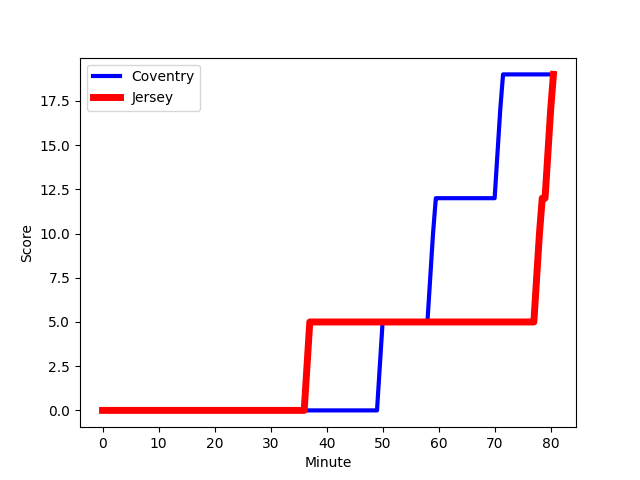
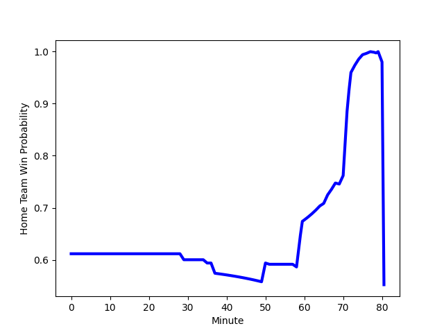

---  
layout: page  
title: Jersey at Coventry; 19-19  
date: 2023-01-14 16:00:00 18:00:00 -0500  
categories: match review  
---
# Jersey (1505.71) at Coventry (1703.42); 19-19

# Prediction: Coventry by 23.8

Coventry by 19.8 on a neutral field
## Scores over Time

## Win Probability over Time

# Pre-Match Prediction: Coventry by 19.6

Coventry by 15.6 on a neutral pitch

|   Away Minutes | Away Player                                                                          |   Away elo |   Away Percentile |   Number |   Home Percentile |   Home elo | Home Player                                                               |   Home Minutes |
|---------------:|:-------------------------------------------------------------------------------------|-----------:|------------------:|---------:|------------------:|-----------:|:--------------------------------------------------------------------------|---------------:|
|             51 | [Samuel Alexander Grahamslaw](..//playerfiles//SamuelAlexanderGrahamslaw_cleaned.md) |      95.2  |                49 |        1 |                73 |     103.26 | [Toby Trinder](..//playerfiles//TobyTrinder_cleaned.md)                   |             76 |
|             29 | [Antonio TJ Harris](..//playerfiles//AntonioTJHarris_cleaned.md)                     |      84.72 |                21 |        2 |                95 |     123.14 | [Jordon Poole](..//playerfiles//JordonPoole_cleaned.md)                   |             76 |
|             35 | [Adam Nicol](..//playerfiles//AdamNicol_cleaned.md)                                  |      93.7  |                49 |        3 |                95 |     119.69 | [Harry Seward](..//playerfiles//HarrySeward_cleaned.md)                   |             69 |
|             66 | [Sean O'Connor](..//playerfiles//SeanO'Connor_cleaned.md)                            |     110.8  |                82 |        4 |                60 |      99.37 | [James Tyas](..//playerfiles//JamesTyas_cleaned.md)                       |             80 |
|             80 | [Macauley Cook](..//playerfiles//MacauleyCook_cleaned.md)                            |     170.95 |                99 |        5 |                92 |     121.06 | [Adam Peters](..//playerfiles//AdamPeters_cleaned.md)                     |             80 |
|             80 | [James Dun](..//playerfiles//JamesDun_cleaned.md)                                    |      76.05 |                 8 |        6 |                96 |     130.55 | [Thomas Dodd](..//playerfiles//ThomasDodd_cleaned.md)                     |             69 |
|             80 | [Lewis Wynne](..//playerfiles//LewisWynne_cleaned.md)                                |     103.57 |                69 |        7 |                82 |     111.12 | [Josh Bainbridge](..//playerfiles//JoshBainbridge_cleaned.md)             |             80 |
|             58 | [Hallam Chapman](..//playerfiles//HallamChapman_cleaned.md)                          |      95.25 |                48 |        8 |                88 |     117.97 | [Senitiki Nayalo](..//playerfiles//SenitikiNayalo_cleaned.md)             |             69 |
|             51 | [James Elliott](..//playerfiles//JamesElliott_cleaned.md)                            |      76.97 |                 9 |        9 |                98 |     136.26 | [Will Chudley](..//playerfiles//WillChudley_cleaned.md)                   |             80 |
|             80 | [Russell Bennett](..//playerfiles//RussellBennett_cleaned.md)                        |      95.12 |                44 |       10 |                78 |     111.74 | [Patrick Pellegrini](..//playerfiles//PatrickPellegrini_cleaned.md)       |             80 |
|             80 | [Tomi Lewis](..//playerfiles//TomiLewis_cleaned.md)                                  |      99.91 |                62 |       11 |                56 |      97.86 | [James Martin](..//playerfiles//JamesMartin_cleaned.md)                   |             65 |
|             80 | [Jordan Holgate](..//playerfiles//JordanHolgate_cleaned.md)                          |      82.79 |                18 |       12 |                81 |     111.87 | [Will Rigg](..//playerfiles//WillRigg_cleaned.md)                         |             80 |
|             72 | [Alex McHenry](..//playerfiles//AlexMcHenry_cleaned.md)                              |     104.63 |                70 |       13 |                70 |     104.63 | [Will Wand](..//playerfiles//WillWand_cleaned.md)                         |             80 |
|             72 | [Ben Woollett](..//playerfiles//BenWoollett_cleaned.md)                              |      91.78 |                38 |       14 |                42 |      93.05 | [William Talbot-Davies](..//playerfiles//WilliamTalbot-Davies_cleaned.md) |             80 |
|             80 | [Brendan Owen](..//playerfiles//BrendanOwen_cleaned.md)                              |      96.28 |                50 |       15 |                95 |     133.12 | [Louis Brown](..//playerfiles//LouisBrown_cleaned.md)                     |             80 |
|             51 | [Eoghan Clarke](..//playerfiles//EoghanClarke_cleaned.md)                            |     109.61 |                84 |       16 |                23 |      88.89 | [Louis James](..//playerfiles//LouisJames_cleaned.md)                     |             15 |
|             45 | [Steven Longwell](..//playerfiles//StevenLongwell_cleaned.md)                        |     107.27 |                81 |       17 |                55 |      99.02 | [Ollie Andrews](..//playerfiles//OllieAndrews_cleaned.md)                 |             11 |
|             29 | [Greg McGrath](..//playerfiles//GregMcGrath_cleaned.md)                              |      90.84 |                39 |       18 |                57 |      97.26 | [Fred Betteridge](..//playerfiles//FredBetteridge_cleaned.md)             |             11 |
|             29 | [James Mitchell](..//playerfiles//JamesMitchell_cleaned.md)                          |      86.49 |                22 |       19 |                77 |     112.98 | [Tom Ball](..//playerfiles//TomBall_cleaned.md)                           |             11 |
|             22 | [Tim Grey](..//playerfiles//TimGrey_cleaned.md)                                      |     106.24 |                73 |       20 |               nan |      96.68 | [Danny Southworth](..//playerfiles//DannySouthworth_cleaned.md)           |              4 |
|             14 | [James Scott](..//playerfiles//JamesScott_cleaned.md)                                |      94.33 |                50 |       21 |                55 |      99.73 | [Suva Ma'asi](..//playerfiles//SuvaMa'asi_cleaned.md)                     |              4 |
|              8 | [Will Brown](..//playerfiles//WillBrown_cleaned.md)                                  |     121.83 |                92 |       22 |               nan |     nan    | nan                                                                       |            nan |
|              8 | [Charlie Powell](..//playerfiles//CharliePowell_cleaned.md)                          |      99.41 |                63 |       23 |               nan |     nan    | nan                                                                       |            nan |

