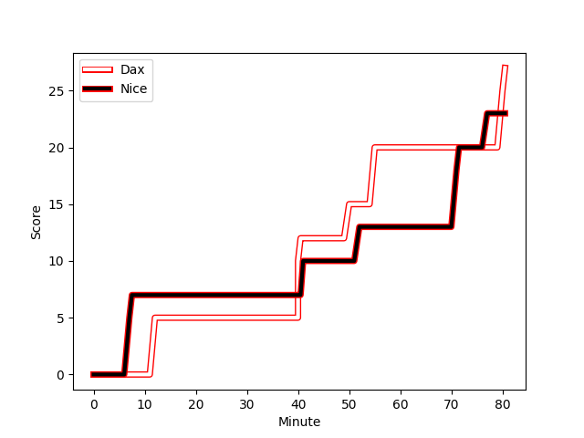
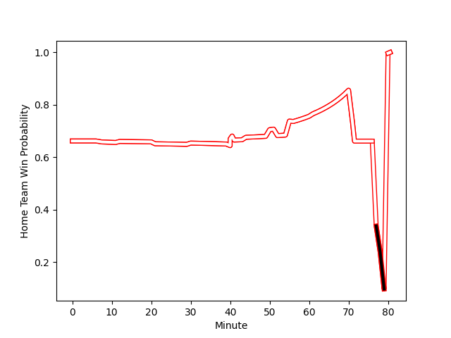

---  
layout: page  
title: Nice at Dax; 23-27  
date: 2023-01-14 19:00:00 18:00:00 -0500  
categories: match review  
---
# Nice (1330.12) at Dax (1622.04); 23-27

# Prediction: Dax by 33.2

Dax by 29.2 on a neutral field
## Scores over Time

## Win Probability over Time

# Pre-Match Prediction: Dax by 24.1

Dax by 20.1 on a neutral pitch

|   Away Minutes | Away Player                                                           |   Away elo |   Away Percentile |   Number |   Home Percentile |   Home elo | Home Player                                                        |   Home Minutes |
|---------------:|:----------------------------------------------------------------------|-----------:|------------------:|---------:|------------------:|-----------:|:-------------------------------------------------------------------|---------------:|
|             80 | [Nika Neparidze](..//playerfiles//NikaNeparidze_cleaned.md)           |      78.62 |                 9 |        1 |                97 |     125.08 | [Asa Faitotoa](..//playerfiles//AsaFaitotoa_cleaned.md)            |             80 |
|             80 | [Badri Alkhazashvili](..//playerfiles//BadriAlkhazashvili_cleaned.md) |      82.35 |                14 |        2 |                92 |     118.35 | [Maxime Delonca](..//playerfiles//MaximeDelonca_cleaned.md)        |             80 |
|             80 | [James Johnston](..//playerfiles//JamesJohnston_cleaned.md)           |      94.4  |                50 |        3 |                19 |      85.9  | [Thibaud Dréan](..//playerfiles//ThibaudDréan_cleaned.md)          |             80 |
|             61 | [Thibaud Rey](..//playerfiles//ThibaudRey_cleaned.md)                 |      91.34 |                37 |        4 |                70 |     103.57 | [Mattieu Bidau](..//playerfiles//MattieuBidau_cleaned.md)          |             30 |
|             80 | [Martin Freytes](..//playerfiles//MartinFreytes_cleaned.md)           |      71.19 |                 5 |        5 |                21 |      85.72 | [Mat Luamanu](..//playerfiles//MatLuamanu_cleaned.md)              |             80 |
|             80 | [Louis Suaud](..//playerfiles//LouisSuaud_cleaned.md)                 |      97.33 |                54 |        6 |                80 |     109.76 | [Arnaud Aletti](..//playerfiles//ArnaudAletti_cleaned.md)          |             80 |
|             56 | [Arthur Vignolles](..//playerfiles//ArthurVignolles_cleaned.md)       |      92.82 |                50 |        7 |                77 |     108.98 | [Paul Arnaud Ausset](..//playerfiles//PaulArnaudAusset_cleaned.md) |             80 |
|             80 | [Steffon Armitage](..//playerfiles//SteffonArmitage_cleaned.md)       |     100.07 |                62 |        8 |                48 |      96.78 | [Brice Ferrer](..//playerfiles//BriceFerrer_cleaned.md)            |             80 |
|             59 | [Mathieu Loree](..//playerfiles//MathieuLoree_cleaned.md)             |     116.7  |                90 |        9 |                66 |     102.41 | [Simon Garrouteigt](..//playerfiles//SimonGarrouteigt_cleaned.md)  |             80 |
|             80 | [Mathis Viard](..//playerfiles//MathisViard_cleaned.md)               |      90.19 |                31 |       10 |                79 |     111.97 | [Hugo Cerisier](..//playerfiles//HugoCerisier_cleaned.md)          |             80 |
|             80 | [Augustin Slowik](..//playerfiles//AugustinSlowik_cleaned.md)         |      93.37 |                42 |       11 |                86 |     114.83 | [Rodrigo Marta](..//playerfiles//RodrigoMarta_cleaned.md)          |             80 |
|             80 | [Luca Cutayar](..//playerfiles//LucaCutayar_cleaned.md)               |      88.86 |                29 |       12 |                64 |     101.68 | [Ilikena Bolakoro](..//playerfiles//IlikenaBolakoro_cleaned.md)    |             44 |
|             80 | [Alban Conduche](..//playerfiles//AlbanConduche_cleaned.md)           |      76.81 |                10 |       13 |                78 |     109.05 | [Sylvère Reteau](..//playerfiles//SylvèreReteau_cleaned.md)        |             80 |
|             21 | [Baptiste Delage](..//playerfiles//BaptisteDelage_cleaned.md)         |      61.13 |                 1 |       14 |                75 |     106.52 | [Théo Gatelier](..//playerfiles//ThéoGatelier_cleaned.md)          |             80 |
|             40 | [David Odiete](..//playerfiles//DavidOdiete_cleaned.md)               |      84.42 |                24 |       15 |                93 |     127.71 | [Théo Duprat](..//playerfiles//ThéoDuprat_cleaned.md)              |             80 |
|             59 | [Hugo Martin](..//playerfiles//HugoMartin_cleaned.md)                 |      74.3  |                 7 |       16 |                85 |     113.29 | [Théo Tremeau](..//playerfiles//ThéoTremeau_cleaned.md)            |             50 |
|             40 | [Clement Egiziano](..//playerfiles//ClementEgiziano_cleaned.md)       |      95    |               nan |       17 |                89 |     118.67 | [Hugo Fourquet](..//playerfiles//HugoFourquet_cleaned.md)          |             36 |
|             24 | [Marvin Woki](..//playerfiles//MarvinWoki_cleaned.md)                 |     104.73 |                72 |       18 |               nan |     nan    | nan                                                                |            nan |
|             21 | [Louis Peutin](..//playerfiles//LouisPeutin_cleaned.md)               |      83.57 |                24 |       19 |               nan |     nan    | nan                                                                |            nan |
|             19 | [Jérôme Mondoulet](..//playerfiles//JérômeMondoulet_cleaned.md)       |      94.01 |                50 |       20 |               nan |     nan    | nan                                                                |            nan |

