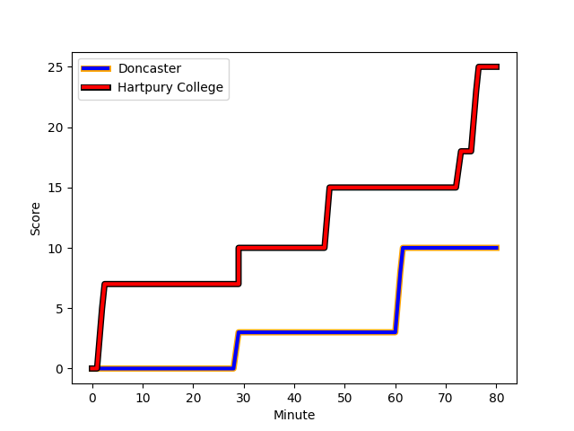
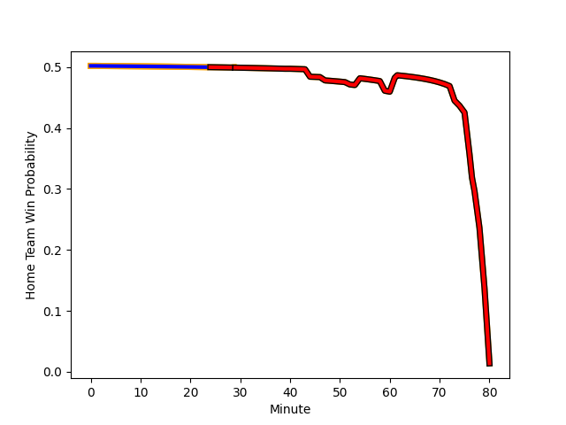

---  
layout: page  
title: Hartpury College at Doncaster; 25-10  
date: 2023-01-14 15:30:00 18:00:00 -0500  
categories: match review  
---
# Hartpury College (1350.9) at Doncaster (1354.6); 25-10

# Prediction: Doncaster by 4.4

Doncaster by 0.4 on a neutral field
## Scores over Time

## Win Probability over Time

# Pre-Match Prediction: Doncaster by 8.2

Doncaster by 4.2 on a neutral pitch

|   Away Minutes | Away Player                                                               |   Away elo |   Away Percentile |   Number |   Home Percentile |   Home elo | Home Player                                                 |   Home Minutes |
|---------------:|:--------------------------------------------------------------------------|-----------:|------------------:|---------:|------------------:|-----------:|:------------------------------------------------------------|---------------:|
|             67 | [Joe Wrafter](..//playerfiles//JoeWrafter_cleaned.md)                     |      94.42 |                46 |        1 |                17 |      84.28 | [Ben Carlile](..//playerfiles//BenCarlile_cleaned.md)       |             44 |
|             61 | [Will Tanner](..//playerfiles//WillTanner_cleaned.md)                     |      75.65 |                 6 |        2 |                17 |      83.88 | [George Roberts](..//playerfiles//GeorgeRoberts_cleaned.md) |             44 |
|             54 | [Jonathan Benz-Salomon](..//playerfiles//JonathanBenz-Salomon_cleaned.md) |      81.81 |                13 |        3 |                61 |      98.96 | [Jake Armstrong](..//playerfiles//JakeArmstrong_cleaned.md) |             72 |
|             80 | [Jack Davies](..//playerfiles//JackDavies_cleaned.md)                     |      90.79 |                35 |        4 |                 3 |      63.87 | [Ehize Ehizode](..//playerfiles//EhizeEhizode_cleaned.md)   |             80 |
|             80 | [Dale Lemon](..//playerfiles//DaleLemon_cleaned.md)                       |     101.19 |                65 |        5 |                75 |     105.93 | [Evan Mintern](..//playerfiles//EvanMintern_cleaned.md)     |             80 |
|             80 | [Samuel Lewis](..//playerfiles//SamuelLewis_cleaned.md)                   |      78.28 |                10 |        6 |                66 |     101.65 | [Sam Hudson](..//playerfiles//SamHudson_cleaned.md)         |             70 |
|             40 | [Oli Robinson](..//playerfiles//OliRobinson_cleaned.md)                   |      90.32 |                35 |        7 |                 9 |      77.97 | [Thom Smith](..//playerfiles//ThomSmith_cleaned.md)         |             80 |
|             73 | [Joe Howard](..//playerfiles//JoeHoward_cleaned.md)                       |      80.15 |                13 |        8 |                67 |     105.3  | [John Kelly](..//playerfiles//JohnKelly_cleaned.md)         |             52 |
|             80 | [Matty Jones](..//playerfiles//MattyJones_cleaned.md)                     |     105.09 |                73 |        9 |                77 |     106.51 | [Alex Dolly](..//playerfiles//AlexDolly_cleaned.md)         |             59 |
|             80 | [Tommy Mathews](..//playerfiles//TommyMathews_cleaned.md)                 |     100.86 |                58 |       10 |                32 |      90.92 | [Sam Olver](..//playerfiles//SamOlver_cleaned.md)           |             80 |
|             61 | [Matt Smith](..//playerfiles//MattSmith_cleaned.md)                       |      95.02 |                47 |       11 |                 4 |      69.18 | [Robbie Smith](..//playerfiles//RobbieSmith_cleaned.md)     |             80 |
|             80 | [Harry Tarling](..//playerfiles//HarryTarling_cleaned.md)                 |     103.29 |                67 |       12 |                16 |      82.03 | [Connor Edwards](..//playerfiles//ConnorEdwards_cleaned.md) |             80 |
|             40 | [William Butler](..//playerfiles//WilliamButler_cleaned.md)               |      78.89 |                11 |       13 |                37 |      91.09 | [Joe Margetts](..//playerfiles//JoeMargetts_cleaned.md)     |             52 |
|             80 | [Bradley Denty](..//playerfiles//BradleyDenty_cleaned.md)                 |      96.99 |                53 |       14 |                29 |      89.05 | [George Simpson](..//playerfiles//GeorgeSimpson_cleaned.md) |             80 |
|             80 | [Jake Morris](..//playerfiles//JakeMorris_cleaned.md)                     |      71.84 |                 6 |       15 |                91 |     123.05 | [Maliq Holden](..//playerfiles//MaliqHolden_cleaned.md)     |             59 |
|             40 | [Ben Foley](..//playerfiles//BenFoley_cleaned.md)                         |      86.95 |                23 |       16 |               nan |      99.35 | [James Wayland](..//playerfiles//JamesWayland_cleaned.md)   |             36 |
|             40 | [Ethan Staddon](..//playerfiles//EthanStaddon_cleaned.md)                 |      94.88 |               nan |       17 |                53 |      93.69 | [Will Holling](..//playerfiles//WillHolling_cleaned.md)     |             36 |
|             26 | [Alex Gibson](..//playerfiles//AlexGibson_cleaned.md)                     |      64.1  |                 2 |       18 |                 2 |      60.11 | [Jack Metcalf](..//playerfiles//JackMetcalf_cleaned.md)     |             28 |
|             19 | [Luke Stratford](..//playerfiles//LukeStratford_cleaned.md)               |     103.28 |                74 |       19 |                16 |      82.88 | [Martin Molina](..//playerfiles//MartinMolina_cleaned.md)   |             28 |
|             19 | [Matthew McNab](..//playerfiles//MatthewMcNab_cleaned.md)                 |      84.39 |                21 |       20 |                37 |      94.22 | [Joe Green](..//playerfiles//JoeGreen_cleaned.md)           |             21 |
|             13 | [Aristot Benz-Salomon](..//playerfiles//AristotBenz-Salomon_cleaned.md)   |      97.39 |                59 |       21 |                76 |     108.4  | [Billy McBryde](..//playerfiles//BillyMcBryde_cleaned.md)   |             21 |
|              7 | [Jake Holcombe](..//playerfiles//JakeHolcombe_cleaned.md)                 |      94.37 |                36 |       22 |                25 |      87.91 | [Jared Cardew](..//playerfiles//JaredCardew_cleaned.md)     |             10 |
|            nan | nan                                                                       |     nan    |               nan |       23 |                 4 |      71.02 | [Karl Garside](..//playerfiles//KarlGarside_cleaned.md)     |              8 |

