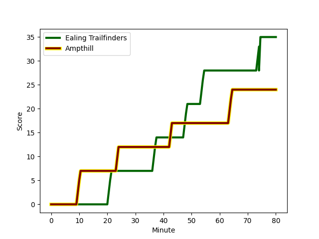
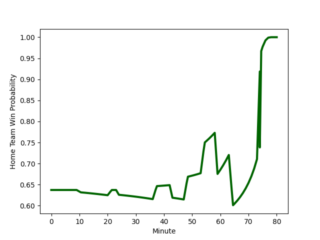

---  
layout: page  
title: Ampthill at Ealing Trailfinders; 24-35  
date: 2023-01-14 16:00:00 18:00:00 -0500  
categories: match review  
---
# Ampthill (1314.74) at Ealing Trailfinders (1559.55); 24-35

# Prediction: Ealing Trailfinders by 28.5

Ealing Trailfinders by 24.5 on a neutral field
## Scores over Time

## Win Probability over Time

# Pre-Match Prediction: Ealing Trailfinders by 21.6

Ealing Trailfinders by 17.6 on a neutral pitch

|   Away Minutes | Away Player                                                   |   Away elo |   Away Percentile |   Number |   Home Percentile |   Home elo | Home Player                                                           |   Home Minutes |
|---------------:|:--------------------------------------------------------------|-----------:|------------------:|---------:|------------------:|-----------:|:----------------------------------------------------------------------|---------------:|
|             55 | [Zac Nearchou](..//playerfiles//ZacNearchou_cleaned.md)       |      92.86 |                41 |        1 |                98 |     132.81 | [Kyle John Whyte](..//playerfiles//KyleJohnWhyte_cleaned.md)          |             54 |
|             59 | [Beck Cutting](..//playerfiles//BeckCutting_cleaned.md)       |      83.18 |                15 |        2 |                 4 |      74.07 | [Jan-Henning Campher](..//playerfiles//Jan-HenningCampher_cleaned.md) |             80 |
|             55 | [Rob Hardwick](..//playerfiles//RobHardwick_cleaned.md)       |      97.03 |                66 |        3 |                97 |     126.67 | [Lewis Thiede](..//playerfiles//LewisThiede_cleaned.md)               |             65 |
|             80 | [Charlie Beckett](..//playerfiles//CharlieBeckett_cleaned.md) |     107.71 |                78 |        4 |                 7 |      73.48 | [David O'Connor](..//playerfiles//DavidO'Connor_cleaned.md)           |             26 |
|             64 | [Cameron Boon](..//playerfiles//CameronBoon_cleaned.md)       |      89.33 |               nan |        5 |                52 |      96.81 | [Daniel Cutmore](..//playerfiles//DanielCutmore_cleaned.md)           |             80 |
|             80 | [Harry Wilson](..//playerfiles//HarryWilson_cleaned.md)       |      73.43 |                 7 |        6 |                11 |      79.77 | [Rob Farrar](..//playerfiles//RobFarrar_cleaned.md)                   |             80 |
|             67 | [Josh Smart](..//playerfiles//JoshSmart_cleaned.md)           |      86.63 |                23 |        7 |                60 |      99.43 | [Carlo Tizzano](..//playerfiles//CarloTizzano_cleaned.md)             |             80 |
|             80 | [Morgan Strong](..//playerfiles//MorganStrong_cleaned.md)     |      81.77 |                15 |        8 |                61 |     100.51 | [Jack Digby](..//playerfiles//JackDigby_cleaned.md)                   |             31 |
|             76 | [Peter White](..//playerfiles//PeterWhite_cleaned.md)         |     107.25 |                84 |        9 |                83 |     110.77 | [Craig Hampson](..//playerfiles//CraigHampson_cleaned.md)             |             80 |
|             80 | [Tom Hardwick](..//playerfiles//TomHardwick_cleaned.md)       |      73.66 |                13 |       10 |                97 |     139.07 | [Craig Willis](..//playerfiles//CraigWillis_cleaned.md)               |             71 |
|             80 | [Ben Harris](..//playerfiles//BenHarris_cleaned.md)           |      96.6  |                52 |       11 |                86 |     115.31 | [Cian Kelleher](..//playerfiles//CianKelleher_cleaned.md)             |             80 |
|             80 | [Joshua Bragman](..//playerfiles//JoshuaBragman_cleaned.md)   |      67.61 |                 2 |       12 |                50 |      95.77 | [Pat Howard](..//playerfiles//PatHoward_cleaned.md)                   |             80 |
|             80 | [George Worth](..//playerfiles//GeorgeWorth_cleaned.md)       |      89.72 |                33 |       13 |                 1 |      59.88 | [Max Bodilly](..//playerfiles//MaxBodilly_cleaned.md)                 |             80 |
|             76 | [Conor Rankin](..//playerfiles//ConorRankin_cleaned.md)       |      84.01 |                17 |       14 |                95 |     126.94 | [Nathan Earle](..//playerfiles//NathanEarle_cleaned.md)               |             80 |
|             80 | [Tomas Bacon](..//playerfiles//TomasBacon_cleaned.md)         |      76.62 |                12 |       15 |                90 |     121.33 | [Jonah Holmes](..//playerfiles//JonahHolmes_cleaned.md)               |             80 |
|             25 | [Michael Jones](..//playerfiles//MichaelJones_cleaned.md)     |      90.52 |                44 |       16 |                92 |     120.17 | [Bobby de Wee](..//playerfiles//BobbydeWee_cleaned.md)                |             54 |
|             25 | [Dominic Hardman](..//playerfiles//DominicHardman_cleaned.md) |      96.56 |                54 |       17 |                75 |     108.03 | [Ryan Smid](..//playerfiles//RyanSmid_cleaned.md)                     |             49 |
|             21 | [Paddy Ryan](..//playerfiles//PaddyRyan_cleaned.md)           |     106.15 |                75 |       18 |                57 |      84.75 | [George Davis](..//playerfiles//GeorgeDavis_cleaned.md)               |             15 |
|             16 | [Sid Blackmore](..//playerfiles//SidBlackmore_cleaned.md)     |     101.18 |                66 |       19 |                81 |     103.54 | [Steve Shingler](..//playerfiles//SteveShingler_cleaned.md)           |              9 |
|             13 | [Matt Gallagher](..//playerfiles//MattGallagher_cleaned.md)   |      89.42 |               nan |       20 |                10 |      79.53 | [James Gibbons](..//playerfiles//JamesGibbons_cleaned.md)             |             26 |
|              4 | [Lewis Finlay](..//playerfiles//LewisFinlay_cleaned.md)       |      88.55 |                28 |       21 |               nan |     nan    | nan                                                                   |            nan |
|              4 | [Gwyn Parks](..//playerfiles//GwynParks_cleaned.md)           |      89.76 |                28 |       22 |               nan |     nan    | nan                                                                   |            nan |

