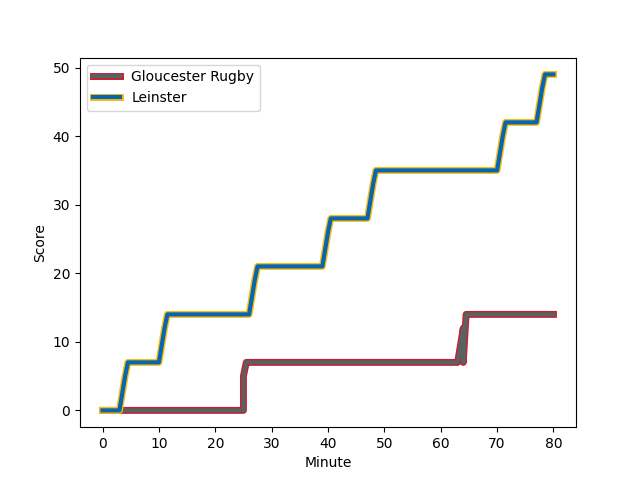
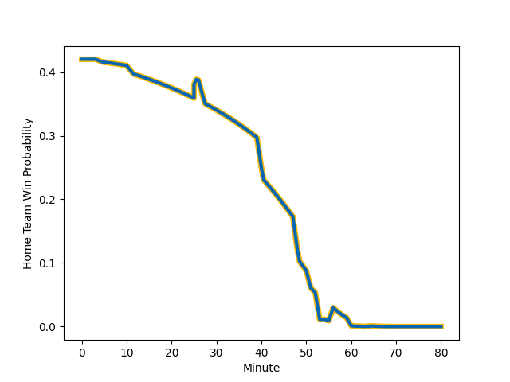

---  
layout: page  
title: Leinster at Gloucester Rugby; 49-14  
date: 2023-01-14 14:00:00 18:00:00 -0500  
categories: match review  
---
# Leinster (1681.69) at Gloucester Rugby (1541.91); 49-14

# Prediction: Leinster by 10.0

Leinster by 14.0 on a neutral field
## Scores over Time

## Win Probability over Time

# Pre-Match Prediction: Leinster by 7.6

Leinster by 11.6 on a neutral pitch

|   Away Minutes | Away Player                                                           |   Away elo |   Away Percentile |   Number |   Home Percentile |   Home elo | Home Player                                                         |   Home Minutes |
|---------------:|:----------------------------------------------------------------------|-----------:|------------------:|---------:|------------------:|-----------:|:--------------------------------------------------------------------|---------------:|
|             72 | [Andrew Porter](..//playerfiles//AndrewPorter_cleaned.md)             |      91.89 |                37 |        1 |                31 |      90.12 | [Val Rapava-Ruskin](..//playerfiles//ValRapava-Ruskin_cleaned.md)   |             57 |
|             51 | [Dan Sheehan](..//playerfiles//DanSheehan_cleaned.md)                 |      98.12 |                58 |        2 |                53 |      95.85 | [George McGuigan](..//playerfiles//GeorgeMcGuigan_cleaned.md)       |             54 |
|             51 | [Michael Alaalatoa](..//playerfiles//MichaelAlaalatoa_cleaned.md)     |      88.05 |                24 |        3 |                91 |     115.37 | [Kirill Gotovtsev](..//playerfiles//KirillGotovtsev_cleaned.md)     |             60 |
|             72 | [Ross Molony](..//playerfiles//RossMolony_cleaned.md)                 |     115.53 |                87 |        4 |                62 |     100.18 | [Freddie Clarke](..//playerfiles//FreddieClarke_cleaned.md)         |             60 |
|             80 | [James Ryan](..//playerfiles//JamesRyan_cleaned.md)                   |     114.65 |                87 |        5 |                88 |     116.4  | [Matias Alemanno](..//playerfiles//MatiasAlemanno_cleaned.md)       |             80 |
|             56 | [Ryan Baird](..//playerfiles//RyanBaird_cleaned.md)                   |     113.08 |                84 |        6 |                86 |     114.26 | [Ruan Ackermann](..//playerfiles//RuanAckermann_cleaned.md)         |             80 |
|             80 | [Josh van der Flier](..//playerfiles//JoshvanderFlier_cleaned.md)     |     125.73 |                94 |        7 |                40 |      92.4  | [Lewis Ludlow](..//playerfiles//LewisLudlow_cleaned.md)             |             80 |
|             80 | [Caelan Doris](..//playerfiles//CaelanDoris_cleaned.md)               |     126.98 |                94 |        8 |                76 |     108.6  | [Ben Morgan](..//playerfiles//BenMorgan_cleaned.md)                 |             60 |
|             56 | [Jamison Gibson-Park](..//playerfiles//JamisonGibson-Park_cleaned.md) |     113.36 |                87 |        9 |                70 |     104.03 | [Ben Meehan](..//playerfiles//BenMeehan_cleaned.md)                 |             57 |
|             51 | [Ross Byrne](..//playerfiles//RossByrne_cleaned.md)                   |      95.29 |                45 |       10 |                98 |     145.05 | [Santiago Carreras](..//playerfiles//SantiagoCarreras_cleaned.md)   |             80 |
|             80 | [Jimmy O'Brien](..//playerfiles//JimmyO'Brien_cleaned.md)             |     132.26 |                97 |       11 |                78 |     108.3  | [Ollie Thorley](..//playerfiles//OllieThorley_cleaned.md)           |             80 |
|             80 | [Jamie Osborne](..//playerfiles//JamieOsborne_cleaned.md)             |      98.58 |                55 |       12 |                 2 |      65.73 | [Sebastien Atkinson](..//playerfiles//SebastienAtkinson_cleaned.md) |             80 |
|             72 | [Garry Ringrose](..//playerfiles//GarryRingrose_cleaned.md)           |      86.27 |                25 |       13 |                82 |     112.12 | [Chris Harris](..//playerfiles//ChrisHarris_cleaned.md)             |             66 |
|             80 | [Jordan Larmour](..//playerfiles//JordanLarmour_cleaned.md)           |     104.98 |                73 |       14 |                53 |      97.1  | [Jonny May](..//playerfiles//JonnyMay_cleaned.md)                   |             80 |
|             80 | [Hugo Keenan](..//playerfiles//HugoKeenan_cleaned.md)                 |     133.37 |                95 |       15 |                40 |      93.72 | [George Barton](..//playerfiles//GeorgeBarton_cleaned.md)           |             53 |
|              8 | [Michael Milne](..//playerfiles//MichaelMilne_cleaned.md)             |      97.53 |                63 |       16 |                51 |      93.34 | [Harry Elrington](..//playerfiles//HarryElrington_cleaned.md)       |             23 |
|             29 | [Ronan Kelleher](..//playerfiles//RonanKelleher_cleaned.md)           |     123.59 |                95 |       17 |               nan |      88.65 | [Seb Blake](..//playerfiles//SebBlake_cleaned.md)                   |             26 |
|             29 | [Cian Healy](..//playerfiles//CianHealy_cleaned.md)                   |     140.77 |                99 |       18 |                 0 |      57.52 | [Ciaran Knight](..//playerfiles//CiaranKnight_cleaned.md)           |             20 |
|             24 | [Jack Conan](..//playerfiles//JackConan_cleaned.md)                   |     144.16 |                99 |       19 |                91 |     113.63 | [Cameron Jordan](..//playerfiles//CameronJordan_cleaned.md)         |             20 |
|              8 | [Brian Deeny](..//playerfiles//BrianDeeny_cleaned.md)                 |      90.51 |                33 |       20 |                52 |      95.83 | [Jack Clement](..//playerfiles//JackClement_cleaned.md)             |             20 |
|             24 | [Nick McCarthy](..//playerfiles//NickMcCarthy_cleaned.md)             |      97.18 |                51 |       21 |                 8 |      77.92 | [Stephen Varney](..//playerfiles//StephenVarney_cleaned.md)         |             23 |
|             29 | [Harry Byrne](..//playerfiles//HarryByrne_cleaned.md)                 |     121.78 |                90 |       22 |                96 |     130.5  | [Billy Twelvetrees](..//playerfiles//BillyTwelvetrees_cleaned.md)   |             27 |
|              8 | [Liam Turner](..//playerfiles//LiamTurner_cleaned.md)                 |     116.95 |                88 |       23 |                10 |      74.93 | [Tom Seabrook](..//playerfiles//TomSeabrook_cleaned.md)             |             14 |

