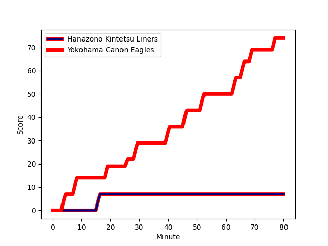
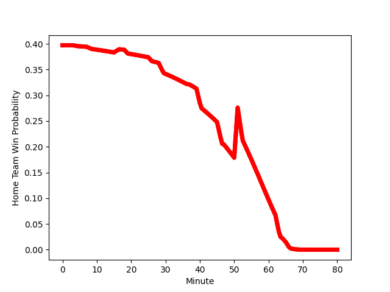

---  
layout: page  
title: Yokohama Canon Eagles at Hanazono Kintetsu Liners; 74-7  
date: 2023-01-14 04:00:00 18:00:00 -0500  
categories: match review  
---
# Yokohama Canon Eagles (1613.02) at Hanazono Kintetsu Liners (1431.87); 74-7

# Prediction: Yokohama Canon Eagles by 14.1

Yokohama Canon Eagles by 18.1 on a neutral field
## Scores over Time

## Win Probability over Time

# Pre-Match Prediction: Yokohama Canon Eagles by 15.3

Yokohama Canon Eagles by 19.3 on a neutral pitch

|   Away Minutes | Away Player                                                         |   Away elo |   Away Percentile |   Number |   Home Percentile |   Home elo | Home Player                                                               |   Home Minutes |
|---------------:|:--------------------------------------------------------------------|-----------:|------------------:|---------:|------------------:|-----------:|:--------------------------------------------------------------------------|---------------:|
|             40 | [Sione Halasili](..//playerfiles//SioneHalasili_cleaned.md)         |     100.86 |                66 |        1 |                 9 |      78.44 | [Shun Sasaki](..//playerfiles//ShunSasaki_cleaned.md)                     |             47 |
|             40 | [Shin Kawamura](..//playerfiles//ShinKawamura_cleaned.md)           |      75.56 |                 5 |        2 |                52 |      95.75 | [Keiichi Kaneko](..//playerfiles//KeiichiKaneko_cleaned.md)               |             47 |
|             64 | [Rento Tsukayama](..//playerfiles//RentoTsukayama_cleaned.md)       |      98.28 |                53 |        3 |                17 |      85    | [Lata Tangimana](..//playerfiles//LataTangimana_cleaned.md)               |             47 |
|             51 | [Cory Hill](..//playerfiles//CoryHill_cleaned.md)                   |     149.75 |                99 |        4 |                16 |      82.27 | [Sam Caird](..//playerfiles//SamCaird_cleaned.md)                         |             80 |
|             54 | [Liaki Moli](..//playerfiles//LiakiMoli_cleaned.md)                 |      84.58 |                20 |        5 |                97 |     133.38 | [Ben Toolis](..//playerfiles//BenToolis_cleaned.md)                       |             80 |
|             80 | [Sioeli Vakalahi](..//playerfiles//SioeliVakalahi_cleaned.md)       |      94.68 |               nan |        6 |                54 |      97.43 | [Takahito Sugahara](..//playerfiles//TakahitoSugahara_cleaned.md)         |             65 |
|             80 | [Ryota Suginaga](..//playerfiles//RyotaSuginaga_cleaned.md)         |     116.22 |               nan |        7 |                68 |     102.4  | [Hayato Yokoi](..//playerfiles//HayatoYokoi_cleaned.md)                   |             80 |
|             80 | [Amanaki Mafi](..//playerfiles//AmanakiMafi_cleaned.md)             |     112.98 |                84 |        8 |                17 |      77    | [Daiki Miyashita](..//playerfiles//DaikiMiyashita_cleaned.md)             |             47 |
|             54 | [Faf de Klerk](..//playerfiles//FafdeKlerk_cleaned.md)              |      95.32 |                46 |        9 |                29 |      88.87 | [Will Genia](..//playerfiles//WillGenia_cleaned.md)                       |             47 |
|             64 | [Yu Tamura](..//playerfiles//YuTamura_cleaned.md)                   |     108.98 |                75 |       10 |                78 |     111.37 | [Jackson Garden-Bachop](..//playerfiles//JacksonGarden-Bachop_cleaned.md) |             37 |
|             80 | [Viliame Takayawa](..//playerfiles//ViliameTakayawa_cleaned.md)     |     119.21 |                90 |       11 |                61 |      99.41 | [Semisi Masirewa](..//playerfiles//SemisiMasirewa_cleaned.md)             |             80 |
|             80 | [Yusuke Kajimura](..//playerfiles//YusukeKajimura_cleaned.md)       |     101.72 |                64 |       12 |                20 |      83.98 | [Koji Okamura](..//playerfiles//KojiOkamura_cleaned.md)                   |             80 |
|             80 | [Jesse Kriel](..//playerfiles//JesseKriel_cleaned.md)               |     134.11 |                97 |       13 |                12 |      79.38 | [Siosaia Fifita](..//playerfiles//SiosaiaFifita_cleaned.md)               |             80 |
|             64 | [Inoke Burua](..//playerfiles//InokeBurua_cleaned.md)               |     104.06 |                71 |       14 |                20 |      80.08 | [Akihide Onogi](..//playerfiles//AkihideOnogi_cleaned.md)                 |             37 |
|             80 | [SP Marais](..//playerfiles//SPMarais_cleaned.md)                   |     124.52 |                91 |       15 |                52 |      97.56 | [Yoshizumi Takeda](..//playerfiles//YoshizumiTakeda_cleaned.md)           |             80 |
|             40 | [Chang Ho Ahn](..//playerfiles//ChangHoAhn_cleaned.md)              |      93.22 |               nan |       16 |                58 |     100.61 | [Takumi Yoshimoto](..//playerfiles//TakumiYoshimoto_cleaned.md)           |             43 |
|             40 | [Song Ho Park](..//playerfiles//SongHoPark_cleaned.md)              |      95.05 |               nan |       17 |                59 |      96.43 | [Joshua Nohra](..//playerfiles//JoshuaNohra_cleaned.md)                   |             43 |
|             29 | [Max Douglas](..//playerfiles//MaxDouglas_cleaned.md)               |     103.12 |                70 |       18 |                77 |     100.27 | [Kenta Tanaka](..//playerfiles//KentaTanaka_cleaned.md)                   |             33 |
|             26 | [Kobus Van Dyk](..//playerfiles//KobusVanDyk_cleaned.md)            |     107.19 |                77 |       19 |                96 |     121.71 | [Atsushi Kashimoto](..//playerfiles//AtsushiKashimoto_cleaned.md)         |             33 |
|             26 | [Kafazumi Yamasuga](..//playerfiles//KafazumiYamasuga_cleaned.md)   |     102.2  |                65 |       20 |                16 |      80.63 | [Patrick Tafa](..//playerfiles//PatrickTafa_cleaned.md)                   |             33 |
|             16 | [Shouta Matsuoka](..//playerfiles//ShoutaMatsuoka_cleaned.md)       |      95    |               nan |       21 |                88 |     109.04 | [Fumihiro Toru](..//playerfiles//FumihiroToru_cleaned.md)                 |             33 |
|             16 | [Jumpei Ogura](..//playerfiles//JumpeiOgura_cleaned.md)             |     119.1  |                88 |       22 |                71 |      99.95 | [Keitaro Hitora](..//playerfiles//KeitaroHitora_cleaned.md)               |             33 |
|             16 | [Masayoshi Takezawa](..//playerfiles//MasayoshiTakezawa_cleaned.md) |      65.17 |                 3 |       23 |                66 |     101.87 | [Tevita Tupou](..//playerfiles//TevitaTupou_cleaned.md)                   |             15 |

