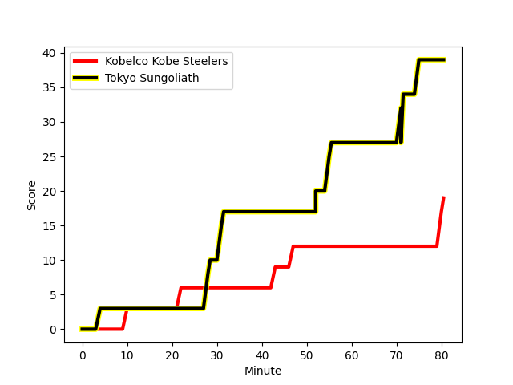
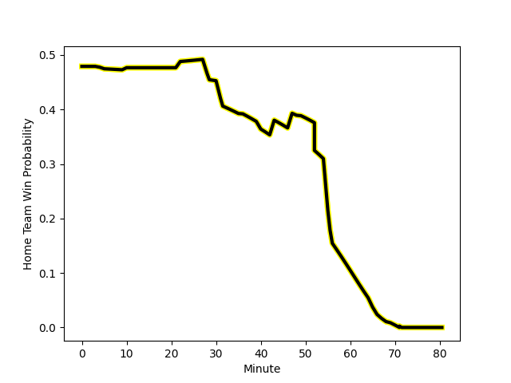

---  
layout: page  
title: Tokyo Sungoliath at Kobelco Kobe Steelers; 39-19  
date: 2023-01-14 06:30:00 18:00:00 -0500  
categories: match review  
---
# Tokyo Sungoliath (1654.2) at Kobelco Kobe Steelers (1617.63); 39-19

# Prediction: Kobelco Kobe Steelers by 0.3

Tokyo Sungoliath by 3.7 on a neutral field
## Scores over Time

## Win Probability over Time

# Pre-Match Prediction: Tokyo Sungoliath by 1.6

Tokyo Sungoliath by 2.4 on a neutral pitch

|   Away Minutes | Away Player                                                           |   Away elo |   Away Percentile |   Number |   Home Percentile |   Home elo | Home Player                                                                    |   Home Minutes |
|---------------:|:----------------------------------------------------------------------|-----------:|------------------:|---------:|------------------:|-----------:|:-------------------------------------------------------------------------------|---------------:|
|             49 | [Shintaro Ishihara](..//playerfiles//ShintaroIshihara_cleaned.md)     |     111.62 |                86 |        1 |                83 |     105.87 | [Shigure Takao](..//playerfiles//ShigureTakao_cleaned.md)                      |             47 |
|             71 | [Shunta Nakamura](..//playerfiles//ShuntaNakamura_cleaned.md)         |     127.29 |                98 |        2 |                42 |      92.48 | [Takuya Kitade](..//playerfiles//TakuyaKitade_cleaned.md)                      |             36 |
|             65 | [Shinnosuke Kakinaga](..//playerfiles//ShinnosukeKakinaga_cleaned.md) |      98.85 |                60 |        3 |                97 |     125.75 | [Hiroshi Yamashita](..//playerfiles//HiroshiYamashita_cleaned.md)              |             66 |
|             65 | [Hendrik Tui](..//playerfiles//HendrikTui_cleaned.md)                 |      91.89 |                38 |        4 |                67 |     103.27 | [Gerard Cowley-Tuioti](..//playerfiles//GerardCowley-Tuioti_cleaned.md)        |             65 |
|             80 | [Harry Hockings](..//playerfiles//HarryHockings_cleaned.md)           |     135.23 |                97 |        5 |                16 |      82.17 | [JD Schickerling](..//playerfiles//JDSchickerling_cleaned.md)                  |             80 |
|              5 | [Ryuga Hashimoto](..//playerfiles//RyugaHashimoto_cleaned.md)         |     104.87 |                72 |        6 |                66 |     102.4  | [Takara Imamura](..//playerfiles//TakaraImamura_cleaned.md)                    |             65 |
|             80 | [Kai Yamamoto](..//playerfiles//KaiYamamoto_cleaned.md)               |      92.73 |                41 |        7 |                83 |     112.48 | [Marcell Coetzee](..//playerfiles//MarcellCoetzee_cleaned.md)                  |             80 |
|             80 | [Tevita Tatafu](..//playerfiles//TevitaTatafu_cleaned.md)             |      96.76 |               nan |        8 |                91 |     122.43 | [Ataata Moeakiola](..//playerfiles//AtaataMoeakiola_cleaned.md)                |             80 |
|             49 | [Naoto Saito](..//playerfiles//NaotoSaito_cleaned.md)                 |      95.01 |                45 |        9 |                94 |     123.37 | [Atsushi Hiwasa](..//playerfiles//AtsushiHiwasa_cleaned.md)                    |             56 |
|             80 | [Keisuke Moriya](..//playerfiles//KeisukeMoriya_cleaned.md)           |     131.46 |                94 |       10 |                78 |     111.73 | [Seungsin Lee](..//playerfiles//SeungsinLee_cleaned.md)                        |             80 |
|             69 | [Tevita Li](..//playerfiles//TevitaLi_cleaned.md)                     |     133.37 |                97 |       11 |                96 |     131.43 | [Rakuhei Yamashita](..//playerfiles//RakuheiYamashita_cleaned.md)              |             80 |
|             69 | [Ryoto Nakamura](..//playerfiles//RyotoNakamura_cleaned.md)           |     107.5  |                76 |       12 |                85 |     114.17 | [Ngani Laumape](..//playerfiles//NganiLaumape_cleaned.md)                      |             40 |
|             80 | [Shogo Nakano](..//playerfiles//ShogoNakano_cleaned.md)               |      98.79 |                56 |       13 |                77 |     108.3  | [Timothy Lafaele](..//playerfiles//TimothyLafaele_cleaned.md)                  |             80 |
|             80 | [Seiya Ozaki](..//playerfiles//SeiyaOzaki_cleaned.md)                 |     120.62 |                90 |       14 |                73 |     105.29 | [Shinsuke Iseki](..//playerfiles//ShinsukeIseki_cleaned.md)                    |             75 |
|             80 | [Kotaro Matsushima](..//playerfiles//KotaroMatsushima_cleaned.md)     |     111.04 |                80 |       15 |                47 |      95.09 | [Ryohei Yamanaka](..//playerfiles//RyoheiYamanaka_cleaned.md)                  |             80 |
|             75 | [Kanji Shimokawa](..//playerfiles//KanjiShimokawa_cleaned.md)         |     107.26 |                76 |       16 |               nan |      96.03 | [Kyungmun Wang](..//playerfiles//KyungmunWang_cleaned.md)                      |             44 |
|             31 | [Kenta Kobayashi](..//playerfiles//KentaKobayashi_cleaned.md)         |      95.86 |               nan |       17 |                70 |     104.83 | [Michael Little](..//playerfiles//MichaelLittle_cleaned.md)                    |             40 |
|             31 | [Yutaka Nagare](..//playerfiles//YutakaNagare_cleaned.md)             |     107.85 |                73 |       18 |                56 |      97.38 | [Isileli Nakajima Vakauta](..//playerfiles//IsileliNakajimaVakauta_cleaned.md) |             33 |
|             15 | [Ryosuke Iwaihara](..//playerfiles//RyosukeIwaihara_cleaned.md)       |      96.91 |               nan |       19 |               nan |      95.53 | [Kentaro Obata](..//playerfiles//KentaroObata_cleaned.md)                      |             24 |
|             15 | [Tom Savage](..//playerfiles//TomSavage_cleaned.md)                   |     125.94 |                94 |       20 |                53 |     105.01 | [Shohei Maekawa](..//playerfiles//ShoheiMaekawa_cleaned.md)                    |             15 |
|             11 | [Ryosuke Kawase](..//playerfiles//RyosukeKawase_cleaned.md)           |      95    |               nan |       21 |                77 |     107.25 | [Naohiro Kotaki](..//playerfiles//NaohiroKotaki_cleaned.md)                    |             15 |
|             11 | [Isaiah Punivai](..//playerfiles//IsaiahPunivai_cleaned.md)           |     101.39 |                61 |       22 |                58 |      99.48 | [Koki Yamamoto](..//playerfiles//KokiYamamoto_cleaned.md)                      |             14 |
|              9 | [Kienori Go](..//playerfiles//KienoriGo_cleaned.md)                   |      93.15 |               nan |       23 |                48 |      94.99 | [Kanta Matsunaga](..//playerfiles//KantaMatsunaga_cleaned.md)                  |              5 |

