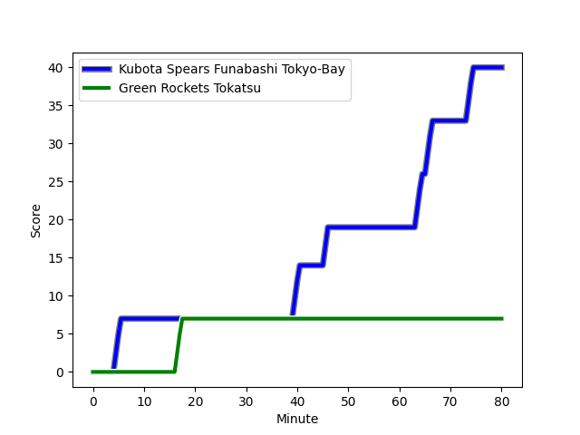
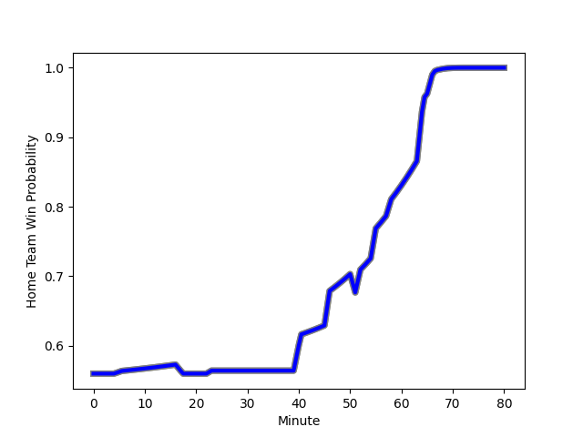

---  
layout: page  
title: Green Rockets Tokatsu at Kubota Spears Funabashi Tokyo-Bay; 7-40  
date: 2023-01-14 06:30:00 18:00:00 -0500  
categories: match review  
---
# Green Rockets Tokatsu (1521.49) at Kubota Spears Funabashi Tokyo-Bay (1625.24); 7-40

# Prediction: Kubota Spears Funabashi Tokyo-Bay by 14.4

Kubota Spears Funabashi Tokyo-Bay by 10.4 on a neutral field
## Scores over Time

## Win Probability over Time

# Pre-Match Prediction: Kubota Spears Funabashi Tokyo-Bay by 17.4

Kubota Spears Funabashi Tokyo-Bay by 13.4 on a neutral pitch

|   Away Minutes | Away Player                                                   |   Away elo |   Away Percentile |   Number |   Home Percentile |   Home elo | Home Player                                                               |   Home Minutes |
|---------------:|:--------------------------------------------------------------|-----------:|------------------:|---------:|------------------:|-----------:|:--------------------------------------------------------------------------|---------------:|
|             55 | [Gakuto Ishida](..//playerfiles//GakutoIshida_cleaned.md)     |     112.14 |                87 |        1 |                23 |      89.29 | [Kazuki Kato](..//playerfiles//KazukiKato_cleaned.md)                     |             23 |
|             64 | [Ash Dixon](..//playerfiles//AshDixon_cleaned.md)             |     116.23 |                89 |        2 |                65 |      97.48 | [Schalk Erasmus](..//playerfiles//SchalkErasmus_cleaned.md)               |             58 |
|             51 | [Takahiro Doi](..//playerfiles//TakahiroDoi_cleaned.md)       |      75.49 |                 6 |        3 |                90 |     114.7  | [Opeti Helu](..//playerfiles//OpetiHelu_cleaned.md)                       |             52 |
|             80 | [Daiki Yamagiwa](..//playerfiles//DaikiYamagiwa_cleaned.md)   |      97.21 |                54 |        4 |                12 |      77.57 | [Yuki Aoki](..//playerfiles//YukiAoki_cleaned.md)                         |             80 |
|             69 | [Jake Ball](..//playerfiles//JakeBall_cleaned.md)             |     112.63 |                85 |        5 |                94 |     124.2  | [Ruan Botha](..//playerfiles//RuanBotha_cleaned.md)                       |             58 |
|             80 | [Whetu Douglas](..//playerfiles//WhetuDouglas_cleaned.md)     |      95.14 |                42 |        6 |                95 |     128.3  | [Finau Tupa](..//playerfiles//FinauTupa_cleaned.md)                       |             80 |
|             80 | [Ryoi Kamei](..//playerfiles//RyoiKamei_cleaned.md)           |      90.84 |                36 |        7 |                76 |     106.69 | [Lappies Labuschagne](..//playerfiles//LappiesLabuschagne_cleaned.md)     |             80 |
|             80 | [Aseri Masivou](..//playerfiles//AseriMasivou_cleaned.md)     |     112.09 |                82 |        8 |                60 |     101.83 | [Faulua Makisi](..//playerfiles//FauluaMakisi_cleaned.md)                 |             58 |
|             80 | [Nick Phipps](..//playerfiles//NickPhipps_cleaned.md)         |     112.87 |                86 |        9 |                88 |     118.7  | [Kazuhiro Taniguchi](..//playerfiles//KazuhiroTaniguchi_cleaned.md)       |             52 |
|             80 | [Taisetsu Kanai](..//playerfiles//TaisetsuKanai_cleaned.md)   |     103.51 |                65 |       10 |               nan |      97.96 | [Atsushi Oshikawa](..//playerfiles//AtsushiOshikawa_cleaned.md)           |             52 |
|             80 | [Kenta Omata](..//playerfiles//KentaOmata_cleaned.md)         |     127.67 |                95 |       11 |                67 |     102.14 | [Haruto Kida](..//playerfiles//HarutoKida_cleaned.md)                     |             80 |
|             67 | [Tim Bennetts](..//playerfiles//TimBennetts_cleaned.md)       |      92.99 |                42 |       12 |                88 |     117.46 | [Harumichi Tatekawa](..//playerfiles//HarumichiTatekawa_cleaned.md)       |             80 |
|             64 | [Koichi Matsura](..//playerfiles//KoichiMatsura_cleaned.md)   |      79.53 |                12 |       13 |                70 |     105.43 | [Ryan Crotty](..//playerfiles//RyanCrotty_cleaned.md)                     |             80 |
|             64 | [Teruya Goto](..//playerfiles//TeruyaGoto_cleaned.md)         |      97.35 |                49 |       14 |                57 |      98.27 | [Koga Nezuka](..//playerfiles//KogaNezuka_cleaned.md)                     |             80 |
|             80 | [Lomano Lemeki](..//playerfiles//LomanoLemeki_cleaned.md)     |     108.39 |                78 |       15 |                94 |     131.75 | [Gerhard van den Heever](..//playerfiles//GerhardvandenHeever_cleaned.md) |             67 |
|             29 | [Satoshi Ueda](..//playerfiles//SatoshiUeda_cleaned.md)       |     124.98 |                95 |       16 |               nan |      95    | [Kenshi Yamamoto](..//playerfiles//KenshiYamamoto_cleaned.md)             |             57 |
|             25 | [Sunao Takizawa](..//playerfiles//SunaoTakizawa_cleaned.md)   |      55.44 |                 0 |       17 |                91 |     115.71 | [Kengo Kitagawa](..//playerfiles//KengoKitagawa_cleaned.md)               |             28 |
|             16 | [Yo Sato](..//playerfiles//YoSato_cleaned.md)                 |      70.19 |                 2 |       18 |                71 |     104.35 | [Shinobu Fujiwara](..//playerfiles//ShinobuFujiwara_cleaned.md)           |             28 |
|             16 | [Maritino Nemani](..//playerfiles//MaritinoNemani_cleaned.md) |      68.2  |                 3 |       19 |               100 |     148.83 | [Bernard Foley](..//playerfiles//BernardFoley_cleaned.md)                 |             28 |
|             16 | [Yuma Sugimoto](..//playerfiles//YumaSugimoto_cleaned.md)     |      98.18 |                57 |       20 |                84 |     113.19 | [Hiraoki Sugimoto](..//playerfiles//HiraokiSugimoto_cleaned.md)           |             22 |
|             13 | [Tatsuya Fujii](..//playerfiles//TatsuyaFujii_cleaned.md)     |     100.5  |                56 |       21 |                74 |     105.33 | [David Bulbring](..//playerfiles//DavidBulbring_cleaned.md)               |             22 |
|             11 | [Luke Porter](..//playerfiles//LukePorter_cleaned.md)         |      92.96 |                42 |       22 |                84 |     113.14 | [Takeo Suenaga](..//playerfiles//TakeoSuenaga_cleaned.md)                 |             22 |
|            nan | nan                                                           |     nan    |               nan |       23 |               nan |      94.87 | [Yuhei Shimada](..//playerfiles//YuheiShimada_cleaned.md)                 |             13 |

