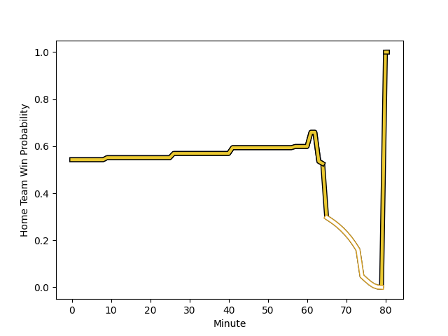

---  
layout: page  
title: Ulster at La Rochelle; 3-7  
date: 2023-01-14 18:30:00 18:00:00 -0500  
categories: match review  
---
# Ulster (1543.5) at La Rochelle (1617.44); 3-7

# Prediction: La Rochelle by 11.4

La Rochelle by 7.4 on a neutral field
## Scores over Time

## Win Probability over Time

# Pre-Match Prediction: La Rochelle by 11.7

La Rochelle by 7.7 on a neutral pitch

|   Away Minutes | Away Player                                                         |   Away elo |   Away Percentile |   Number |   Home Percentile |   Home elo | Home Player                                                               |   Home Minutes |
|---------------:|:--------------------------------------------------------------------|-----------:|------------------:|---------:|------------------:|-----------:|:--------------------------------------------------------------------------|---------------:|
|             61 | [Rory Sutherland](..//playerfiles//RorySutherland_cleaned.md)       |     103.76 |                75 |        1 |                81 |     108.58 | [Thierry Paiva](..//playerfiles//ThierryPaiva_cleaned.md)                 |              9 |
|             65 | [Rob Herring](..//playerfiles//RobHerring_cleaned.md)               |      88.4  |                29 |        2 |                55 |     102.72 | [Samuel Lagrange](..//playerfiles//SamuelLagrange_cleaned.md)             |             65 |
|             70 | [Jeff Toomaga-Allen](..//playerfiles//JeffToomaga-Allen_cleaned.md) |     114.25 |                89 |        3 |                 2 |      72.82 | [Georges-Henri Colombe](..//playerfiles//Georges-HenriColombe_cleaned.md) |             74 |
|             80 | [Alan O'Connor](..//playerfiles//AlanO'Connor_cleaned.md)           |     114.71 |                89 |        4 |                59 |      99.57 | [Ultan Dillane](..//playerfiles//UltanDillane_cleaned.md)                 |             61 |
|             57 | [Kieran Treadwell](..//playerfiles//KieranTreadwell_cleaned.md)     |      99.35 |                60 |        5 |                69 |     103.31 | [Remi Picquette](..//playerfiles//RemiPicquette_cleaned.md)               |             74 |
|             61 | [Iain Henderson](..//playerfiles//IainHenderson_cleaned.md)         |     105.42 |                74 |        6 |                97 |     139.07 | [Remi Bourdeau](..//playerfiles//RemiBourdeau_cleaned.md)                 |             80 |
|             80 | [Nick Timoney](..//playerfiles//NickTimoney_cleaned.md)             |     119.77 |                90 |        7 |                42 |      93.21 | [Paul Boudehent](..//playerfiles//PaulBoudehent_cleaned.md)               |             80 |
|             80 | [Duane Vermeulen](..//playerfiles//DuaneVermeulen_cleaned.md)       |     115.6  |                87 |        8 |                73 |     107.25 | [Gregory Alldritt](..//playerfiles//GregoryAlldritt_cleaned.md)           |             80 |
|             80 | [Nathan Doak](..//playerfiles//NathanDoak_cleaned.md)               |      67.63 |                 3 |        9 |                59 |      99.9  | [Thomas Berjon](..//playerfiles//ThomasBerjon_cleaned.md)                 |             41 |
|             80 | [Ian Madigan](..//playerfiles//IanMadigan_cleaned.md)               |      87.2  |                22 |       10 |                60 |     101.14 | [Antoine Hastoy](..//playerfiles//AntoineHastoy_cleaned.md)               |             80 |
|             80 | [Jacob Stockdale](..//playerfiles//JacobStockdale_cleaned.md)       |     116.63 |                88 |       11 |                81 |     112.48 | [Pierre Boudehent](..//playerfiles//PierreBoudehent_cleaned.md)           |             80 |
|             26 | [Luke Marshall](..//playerfiles//LukeMarshall_cleaned.md)           |     106.55 |                74 |       12 |                96 |     132.02 | [Jules Favre](..//playerfiles//JulesFavre_cleaned.md)                     |             80 |
|             80 | [Stewart Moore](..//playerfiles//StewartMoore_cleaned.md)           |     108.45 |                79 |       13 |                32 |      88.75 | [Ulupano Seuteni](..//playerfiles//UlupanoSeuteni_cleaned.md)             |             80 |
|             80 | [Rob Lyttle](..//playerfiles//RobLyttle_cleaned.md)                 |     116.1  |                87 |       14 |                88 |     116.69 | [Teddy Thomas](..//playerfiles//TeddyThomas_cleaned.md)                   |             41 |
|             80 | [Michael Lowry](..//playerfiles//MichaelLowry_cleaned.md)           |      96.96 |                50 |       15 |                87 |     118.13 | [Brice Dulin](..//playerfiles//BriceDulin_cleaned.md)                     |             80 |
|             19 | [Eric O'Sullivan](..//playerfiles//EricO'Sullivan_cleaned.md)       |      90.29 |                31 |       16 |                91 |     115.73 | [Joel Sclavi](..//playerfiles//JoelSclavi_cleaned.md)                     |             71 |
|             10 | [Andrew Warwick](..//playerfiles//AndrewWarwick_cleaned.md)         |     103.75 |                76 |       17 |                 2 |      77.06 | [Quentin Lespiaucq](..//playerfiles//QuentinLespiaucq_cleaned.md)         |             15 |
|             15 | [John Andrew](..//playerfiles//JohnAndrew_cleaned.md)               |      84.08 |                22 |       18 |                45 |      94.18 | [Aleksandre Kuntelia](..//playerfiles//AleksandreKuntelia_cleaned.md)     |              6 |
|             19 | [David McCann](..//playerfiles//DavidMcCann_cleaned.md)             |     102.57 |                68 |       19 |                97 |     135.58 | [Romain Sazy](..//playerfiles//RomainSazy_cleaned.md)                     |             19 |
|             23 | [Harry Sheridan](..//playerfiles//HarrySheridan_cleaned.md)         |      95    |               nan |       20 |                72 |     104.49 | [Thomas Lavault](..//playerfiles//ThomasLavault_cleaned.md)               |              6 |
|             54 | [Ben Moxham](..//playerfiles//BenMoxham_cleaned.md)                 |      91.7  |                45 |       21 |                95 |     123.67 | [Tawera Kerr-Barlow](..//playerfiles//TaweraKerr-Barlow_cleaned.md)       |             39 |
|            nan | nan                                                                 |     nan    |               nan |       22 |                84 |     113.48 | [Raymond Rhule](..//playerfiles//RaymondRhule_cleaned.md)                 |             39 |

