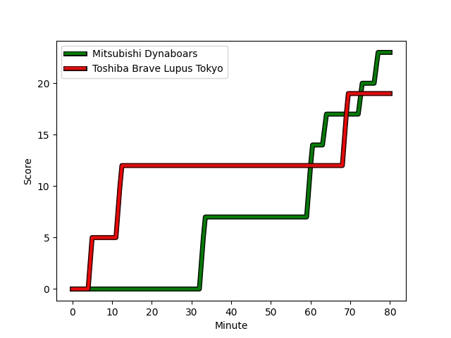
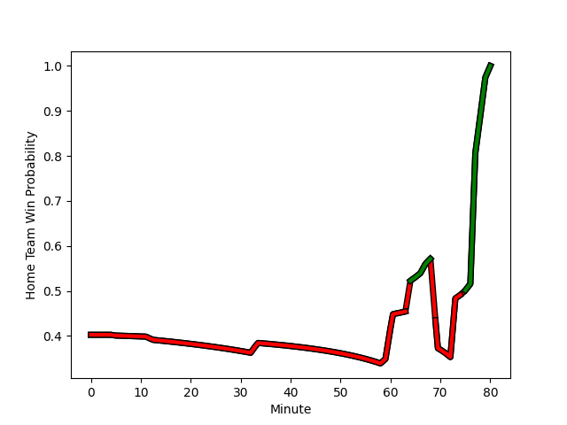

---  
layout: page  
title: Toshiba Brave Lupus Tokyo at Mitsubishi Dynaboars; 19-23  
date: 2023-01-14 04:00:00 18:00:00 -0500  
categories: match review  
---
# Toshiba Brave Lupus Tokyo (1663.3) at Mitsubishi Dynaboars (1491.53); 19-23

# Prediction: Toshiba Brave Lupus Tokyo by 13.2

Toshiba Brave Lupus Tokyo by 17.2 on a neutral field
## Scores over Time

## Win Probability over Time

# Pre-Match Prediction: Toshiba Brave Lupus Tokyo by 19.8

Toshiba Brave Lupus Tokyo by 23.8 on a neutral pitch

|   Away Minutes | Away Player                                                         |   Away elo |   Away Percentile |   Number |   Home Percentile |   Home elo | Home Player                                                                 |   Home Minutes |
|---------------:|:--------------------------------------------------------------------|-----------:|------------------:|---------:|------------------:|-----------:|:----------------------------------------------------------------------------|---------------:|
|             59 | [Masataka Mikami](..//playerfiles//MasatakaMikami_cleaned.md)       |     107.02 |                80 |        1 |               nan |      90.3  | [Shunsuke Sakamoto](..//playerfiles//ShunsukeSakamoto_cleaned.md)           |             64 |
|             59 | [Daigo Hashimoto](..//playerfiles//DaigoHashimoto_cleaned.md)       |      89.18 |                33 |        2 |                10 |      78.91 | [Yuki Miyazato](..//playerfiles//YukiMiyazato_cleaned.md)                   |             59 |
|             67 | [Yuta Kokaji](..//playerfiles//YutaKokaji_cleaned.md)               |     108.73 |                83 |        3 |                99 |     142.16 | [Tomoaki Ishii](..//playerfiles//TomoakiIshii_cleaned.md)                   |             80 |
|             80 | [Warner Dearns](..//playerfiles//WarnerDearns_cleaned.md)           |     101.55 |                65 |        4 |                28 |      88.22 | [Daniel Linde](..//playerfiles//DanielLinde_cleaned.md)                     |             80 |
|             80 | [Jacob Pierce](..//playerfiles//JacobPierce_cleaned.md)             |     126.15 |                95 |        5 |                66 |     102.16 | [Walt Steenkamp](..//playerfiles//WaltSteenkamp_cleaned.md)                 |             80 |
|             69 | [Yoshitaka Tokunaga](..//playerfiles//YoshitakaTokunaga_cleaned.md) |      96.87 |                52 |        6 |                92 |     121.22 | [Masataka Tsuruya](..//playerfiles//MasatakaTsuruya_cleaned.md)             |             80 |
|             80 | [Matt Todd](..//playerfiles//MattTodd_cleaned.md)                   |     149.37 |                99 |        7 |                23 |      86.33 | [Yusuke Sakamoto](..//playerfiles//YusukeSakamoto_cleaned.md)               |             80 |
|             80 | [Michael Leitch](..//playerfiles//MichaelLeitch_cleaned.md)         |     126.56 |                93 |        8 |                81 |     110.75 | [Jackson Hemopo](..//playerfiles//JacksonHemopo_cleaned.md)                 |             80 |
|             61 | [Takahiro Ogawa](..//playerfiles//TakahiroOgawa_cleaned.md)         |      98.63 |                55 |        9 |                88 |     113.98 | [Kota Iwamura](..//playerfiles//KotaIwamura_cleaned.md)                     |             80 |
|             64 | [Hayata Nakao](..//playerfiles//HayataNakao_cleaned.md)             |     125.77 |                93 |       10 |                73 |     107.16 | [James Shillcock](..//playerfiles//JamesShillcock_cleaned.md)               |             80 |
|             80 | [Atsuki Kuwayama](..//playerfiles//AtsukiKuwayama_cleaned.md)       |      96.66 |                52 |       11 |                58 |      98.51 | [Honeti Taumoha'apai](..//playerfiles//HonetiTaumoha'apai_cleaned.md)       |             80 |
|             61 | [Burger Odendaal](..//playerfiles//BurgerOdendaal_cleaned.md)       |     120.94 |                91 |       12 |                 2 |      63.06 | [Brackin Karauria-Henry](..//playerfiles//BrackinKarauria-Henry_cleaned.md) |             80 |
|             80 | [Seta Tamanivalu](..//playerfiles//SetaTamanivalu_cleaned.md)       |     115.23 |                86 |       13 |                58 |      96.31 | [Matt Vaega](..//playerfiles//MattVaega_cleaned.md)                         |             59 |
|             80 | [Jone Naikabula](..//playerfiles//JoneNaikabula_cleaned.md)         |     103.3  |                70 |       14 |                39 |      92.18 | [Tomoyuki Ochiai](..//playerfiles//TomoyukiOchiai_cleaned.md)               |             67 |
|             80 | [Takuro Matsunaga](..//playerfiles//TakuroMatsunaga_cleaned.md)     |     104.83 |                68 |       15 |                46 |      94.51 | [Roland Alaiasa](..//playerfiles//RolandAlaiasa_cleaned.md)                 |             80 |
|             21 | [Yuma Fujino](..//playerfiles//YumaFujino_cleaned.md)               |      96.52 |                62 |       16 |                89 |     113.32 | [Yoshimitsu Yasue](..//playerfiles//YoshimitsuYasue_cleaned.md)             |             21 |
|             21 | [Mamoru Harada](..//playerfiles//MamoruHarada_cleaned.md)           |      96.46 |                55 |       17 |                26 |      86.91 | [Curtis Rona](..//playerfiles//CurtisRona_cleaned.md)                       |             21 |
|             19 | [Nicholas McCurran](..//playerfiles//NicholasMcCurran_cleaned.md)   |     100.33 |                57 |       18 |                12 |      80.85 | [Hayato Hosoda](..//playerfiles//HayatoHosoda_cleaned.md)                   |             16 |
|             19 | [Jack Stratton](..//playerfiles//JackStratton_cleaned.md)           |     118.53 |                92 |       19 |                59 |      99.01 | [Kazuki Ishida](..//playerfiles//KazukiIshida_cleaned.md)                   |             13 |
|             16 | [Shohei Toyoshima](..//playerfiles//ShoheiToyoshima_cleaned.md)     |     106.17 |                68 |       20 |               nan |     nan    | nan                                                                         |            nan |
|             13 | [Latu Taufa](..//playerfiles//LatuTaufa_cleaned.md)                 |      96.4  |               nan |       21 |               nan |     nan    | nan                                                                         |            nan |
|             11 | [Shin Ito](..//playerfiles//ShinIto_cleaned.md)                     |      92.71 |                41 |       22 |               nan |     nan    | nan                                                                         |            nan |

