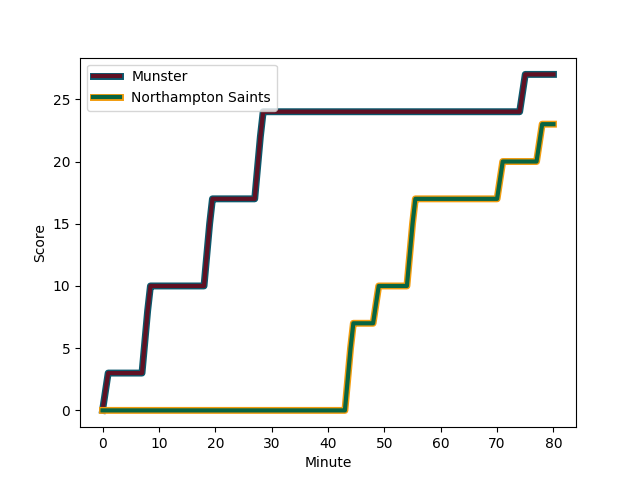
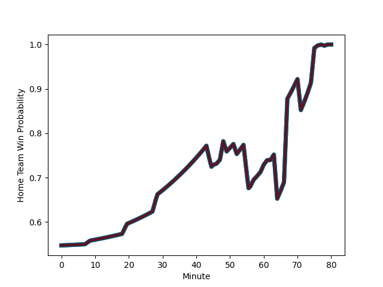

---  
layout: page  
title: Northampton Saints at Munster; 23-27  
date: 2023-01-14 16:15:00 18:00:00 -0500  
categories: match review  
---
# Northampton Saints (1551.04) at Munster (1633.44); 23-27

# Prediction: Munster by 12.2

Munster by 8.2 on a neutral field
## Scores over Time

## Win Probability over Time

# Pre-Match Prediction: Munster by 11.6

Munster by 7.6 on a neutral pitch

|   Away Minutes | Away Player                                                             |   Away elo |   Away Percentile |   Number |   Home Percentile |   Home elo | Home Player                                                   |   Home Minutes |
|---------------:|:------------------------------------------------------------------------|-----------:|------------------:|---------:|------------------:|-----------:|:--------------------------------------------------------------|---------------:|
|             67 | [Alex Waller](..//playerfiles//AlexWaller_cleaned.md)                   |     134.89 |                98 |        1 |                98 |     130.71 | [Dave Kilcoyne](..//playerfiles//DaveKilcoyne_cleaned.md)     |             52 |
|             71 | [Mike Haywood](..//playerfiles//MikeHaywood_cleaned.md)                 |     143.31 |                99 |        2 |                85 |     112.11 | [Niall Scannell](..//playerfiles//NiallScannell_cleaned.md)   |             80 |
|             67 | [Paul Hill](..//playerfiles//PaulHill_cleaned.md)                       |      98.9  |                60 |        3 |                77 |     104.9  | [Roman Salanoa](..//playerfiles//RomanSalanoa_cleaned.md)     |             46 |
|             80 | [David Ribbans](..//playerfiles//DavidRibbans_cleaned.md)               |     103.72 |                70 |        4 |                50 |      95.78 | [Jean Kleyn](..//playerfiles//JeanKleyn_cleaned.md)           |             60 |
|             62 | [Alex Moon](..//playerfiles//AlexMoon_cleaned.md)                       |      94.39 |                46 |        5 |                95 |     126.06 | [Tadhg Beirne](..//playerfiles//TadhgBeirne_cleaned.md)       |             80 |
|             80 | [Lukhan Salakaia-Loto](..//playerfiles//LukhanSalakaia-Loto_cleaned.md) |      89.12 |                31 |        6 |                87 |     115.09 | [Jack O'Donoghue](..//playerfiles//JackO'Donoghue_cleaned.md) |             80 |
|             62 | [Courtney Lawes](..//playerfiles//CourtneyLawes_cleaned.md)             |      92.29 |                40 |        7 |                11 |      79.68 | [Peter O'Mahony](..//playerfiles//PeterO'Mahony_cleaned.md)   |             64 |
|             80 | [Lewis Ludlam](..//playerfiles//LewisLudlam_cleaned.md)                 |      90.78 |                34 |        8 |                82 |     110.76 | [Gavin Coombes](..//playerfiles//GavinCoombes_cleaned.md)     |             80 |
|             80 | [Alex Mitchell](..//playerfiles//AlexMitchell_cleaned.md)               |     109.76 |                82 |        9 |                78 |     107.49 | [Craig Casey](..//playerfiles//CraigCasey_cleaned.md)         |             64 |
|             80 | [Fin Smith](..//playerfiles//FinSmith_cleaned.md)                       |      77.58 |                 9 |       10 |                65 |     103.17 | [Joey Carbery](..//playerfiles//JoeyCarbery_cleaned.md)       |             57 |
|             80 | [James Ramm](..//playerfiles//JamesRamm_cleaned.md)                     |     106.94 |                76 |       11 |                93 |     124.39 | [Shane Daly](..//playerfiles//ShaneDaly_cleaned.md)           |             80 |
|             80 | [Rory Hutchinson](..//playerfiles//RoryHutchinson_cleaned.md)           |      88.42 |                31 |       12 |                78 |     111.08 | [Jack Crowley](..//playerfiles//JackCrowley_cleaned.md)       |             80 |
|             48 | [Matt Proctor](..//playerfiles//MattProctor_cleaned.md)                 |     109.69 |                79 |       13 |                68 |     103.85 | [Antoine Frisch](..//playerfiles//AntoineFrisch_cleaned.md)   |             80 |
|             80 | [Tommy Freeman](..//playerfiles//TommyFreeman_cleaned.md)               |     118.24 |                87 |       14 |                96 |     131.22 | [Calvin Nash](..//playerfiles//CalvinNash_cleaned.md)         |             80 |
|             80 | [George Furbank](..//playerfiles//GeorgeFurbank_cleaned.md)             |     134.49 |                95 |       15 |                31 |      87.8  | [Mike Haley](..//playerfiles//MikeHaley_cleaned.md)           |             80 |
|              9 | [Robbie Smith](..//playerfiles//RobbieSmith_cleaned.md)                 |      67.83 |               nan |       16 |                19 |      86.04 | [Josh Wycherley](..//playerfiles//JoshWycherley_cleaned.md)   |             28 |
|             13 | [Alfie Petch](..//playerfiles//AlfiePetch_cleaned.md)                   |      71.87 |                 8 |       17 |                57 |      97.83 | [John Ryan](..//playerfiles//JohnRyan_cleaned.md)             |             34 |
|             13 | [Ethan Waller](..//playerfiles//EthanWaller_cleaned.md)                 |     104.47 |                86 |       18 |                68 |     105.17 | [Alex Kendellen](..//playerfiles//AlexKendellen_cleaned.md)   |             20 |
|             18 | [Alex Coles](..//playerfiles//AlexColes_cleaned.md)                     |      56.98 |                 1 |       19 |                64 |     100.66 | [John Hodnett](..//playerfiles//JohnHodnett_cleaned.md)       |             16 |
|             18 | [Angus Scott-Young](..//playerfiles//AngusScott-Young_cleaned.md)       |     106.79 |                75 |       20 |                63 |     101.43 | [Paddy Patterson](..//playerfiles//PaddyPatterson_cleaned.md) |             16 |
|             32 | [Fraser Dingwall](..//playerfiles//FraserDingwall_cleaned.md)           |      63.39 |                 2 |       21 |                82 |     112.37 | [Rory Scannell](..//playerfiles//RoryScannell_cleaned.md)     |             23 |

