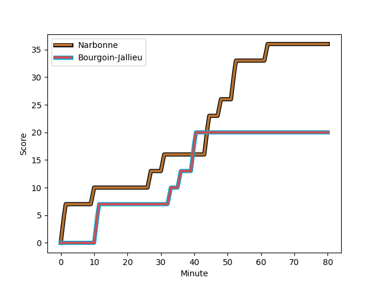
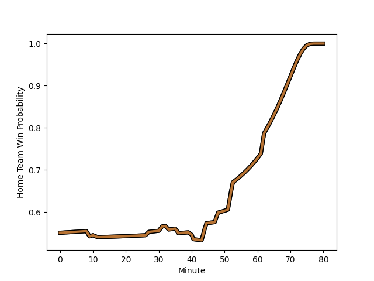

---  
layout: page  
title: Bourgoin-Jallieu at Narbonne; 20-36  
date: 2023-01-14 18:30:00 18:00:00 -0500  
categories: match review  
---
# Bourgoin-Jallieu (1397.85) at Narbonne (1486.62); 20-36

# Prediction: Narbonne by 12.9

Narbonne by 8.9 on a neutral field
## Scores over Time

## Win Probability over Time

# Pre-Match Prediction: Narbonne by 13.1

Narbonne by 9.1 on a neutral pitch

|   Away Minutes | Away Player                                                               |   Away elo |   Away Percentile |   Number |   Home Percentile |   Home elo | Home Player                                                         |   Home Minutes |
|---------------:|:--------------------------------------------------------------------------|-----------:|------------------:|---------:|------------------:|-----------:|:--------------------------------------------------------------------|---------------:|
|             48 | [Romain Favaretto](..//playerfiles//RomainFavaretto_cleaned.md)           |      83.25 |                15 |        1 |                33 |      91.32 | [Geoffrey Moise](..//playerfiles//GeoffreyMoise_cleaned.md)         |             52 |
|             48 | [Maxime Castant](..//playerfiles//MaximeCastant_cleaned.md)               |      85.94 |                36 |        2 |                72 |     103.55 | [Christophe David](..//playerfiles//ChristopheDavid_cleaned.md)     |             52 |
|             46 | [Michael Simutoga](..//playerfiles//MichaelSimutoga_cleaned.md)           |     103.19 |                74 |        3 |                38 |      92.03 | [Matthieu Loudet](..//playerfiles//MatthieuLoudet_cleaned.md)       |             52 |
|             80 | [Kemueli Lavetanakoroi](..//playerfiles//KemueliLavetanakoroi_cleaned.md) |     114.87 |                87 |        4 |                84 |     111.74 | [Valentin Sese](..//playerfiles//ValentinSese_cleaned.md)           |             80 |
|             40 | [Poutasi Luafutu](..//playerfiles//PoutasiLuafutu_cleaned.md)             |     109.89 |                80 |        5 |                48 |      95.11 | [Mohamed Kbaier](..//playerfiles//MohamedKbaier_cleaned.md)         |             52 |
|             80 | [Theophile Cotte](..//playerfiles//TheophileCotte_cleaned.md)             |      82.37 |                15 |        6 |                66 |     101.79 | [Thibault Clauzade](..//playerfiles//ThibaultClauzade_cleaned.md)   |             80 |
|             48 | [Bynjamin Rabatel](..//playerfiles//BynjaminRabatel_cleaned.md)           |     105.44 |                74 |        7 |                 9 |      78.12 | [Paul Belzons](..//playerfiles//PaulBelzons_cleaned.md)             |             80 |
|             80 | [Lakisipone Lee](..//playerfiles//LakisiponeLee_cleaned.md)               |      80.25 |                23 |        8 |                79 |     109.67 | [Luke Nakobukobua](..//playerfiles//LukeNakobukobua_cleaned.md)     |             61 |
|             48 | [Tomas Munilla lo Duca](..//playerfiles//TomasMunillaloDuca_cleaned.md)   |     110.35 |                83 |        9 |                74 |     105.07 | [Pierrick Nova](..//playerfiles//PierrickNova_cleaned.md)           |             61 |
|             80 | [Nicolas Vuillemin](..//playerfiles//NicolasVuillemin_cleaned.md)         |      86.94 |                21 |       10 |                42 |      94.45 | [Tom Chauvet](..//playerfiles//TomChauvet_cleaned.md)               |             80 |
|             80 | [Naibuka Rokua](..//playerfiles//NaibukaRokua_cleaned.md)                 |      81.27 |                13 |       11 |                39 |      92.02 | [Sébastien Giorgis](..//playerfiles//SébastienGiorgis_cleaned.md)   |             80 |
|             80 | [Romain Sola](..//playerfiles//RomainSola_cleaned.md)                     |      86.12 |                31 |       12 |                89 |     118.77 | [Jose Lima](..//playerfiles//JoseLima_cleaned.md)                   |             63 |
|             52 | [Pieter Morton](..//playerfiles//PieterMorton_cleaned.md)                 |      98.67 |                61 |       13 |                44 |      93.28 | [Pierre Nueno](..//playerfiles//PierreNueno_cleaned.md)             |             80 |
|             80 | [Quentin Lefort](..//playerfiles//QuentinLefort_cleaned.md)               |      95.58 |                48 |       14 |                75 |     106.85 | [Pierre-Hugo Ducom](..//playerfiles//Pierre-HugoDucom_cleaned.md)   |             80 |
|              9 | [Nicolas Cachet](..//playerfiles//NicolasCachet_cleaned.md)               |      76    |                11 |       15 |                71 |     108.05 | [James Kane](..//playerfiles//JamesKane_cleaned.md)                 |             66 |
|             71 | [Christopher Bosch](..//playerfiles//ChristopherBosch_cleaned.md)         |     101.95 |                64 |       16 |                83 |     116.16 | [Théo Castinel](..//playerfiles//ThéoCastinel_cleaned.md)           |             28 |
|             40 | [Léandre Cotte](..//playerfiles//LéandreCotte_cleaned.md)                 |      74.51 |                 8 |       17 |                23 |      87.51 | [Morgan Maga](..//playerfiles//MorganMaga_cleaned.md)               |             28 |
|             34 | [Oktay Yilmaz](..//playerfiles//OktayYilmaz_cleaned.md)                   |      92.46 |                39 |       18 |                59 |      98.59 | [Sylvain Abadie](..//playerfiles//SylvainAbadie_cleaned.md)         |             28 |
|             32 | [Mohamed Khribache](..//playerfiles//MohamedKhribache_cleaned.md)         |     104.67 |                75 |       19 |                21 |      87.3  | [Jordan Rochier](..//playerfiles//JordanRochier_cleaned.md)         |             28 |
|             32 | [Kevin Chaudouard](..//playerfiles//KevinChaudouard_cleaned.md)           |      96.07 |                55 |       20 |                16 |      85.36 | [Guillem Montagne](..//playerfiles//GuillemMontagne_cleaned.md)     |             19 |
|             32 | [Nugzar Somkhishvili](..//playerfiles//NugzarSomkhishvili_cleaned.md)     |      97.78 |                64 |       21 |                11 |      82.44 | [Christopher Kaiser](..//playerfiles//ChristopherKaiser_cleaned.md) |             19 |
|             32 | [Adrien Pontarollo](..//playerfiles//AdrienPontarollo_cleaned.md)         |      91.48 |                40 |       22 |                51 |      97.89 | [Étienne Ducom](..//playerfiles//ÉtienneDucom_cleaned.md)           |             17 |
|             28 | [Pablo Patilla](..//playerfiles//PabloPatilla_cleaned.md)                 |      84.16 |                25 |       23 |                60 |      95.23 | [Thibault Santoro](..//playerfiles//ThibaultSantoro_cleaned.md)     |             14 |

