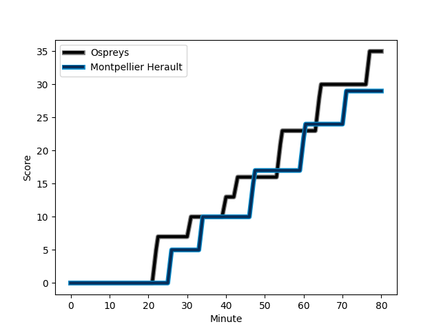
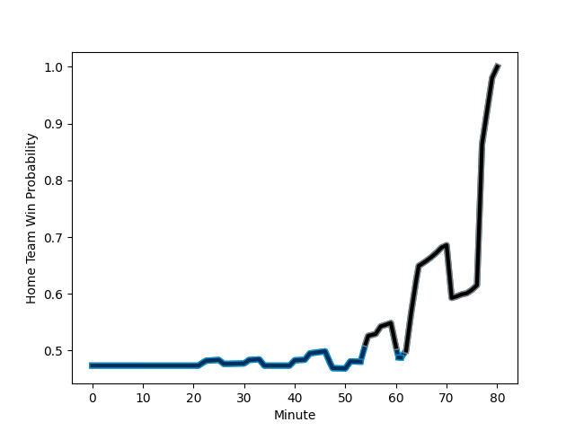

---  
layout: page  
title: Montpellier Herault at Ospreys; 29-35  
date: 2023-01-14 21:00:00 18:00:00 -0500  
categories: match review  
---
# Montpellier Herault (1633.09) at Ospreys (1587.07); 29-35

# Prediction: Montpellier Herault by 0.6

Montpellier Herault by 4.6 on a neutral field
## Scores over Time

## Win Probability over Time

# Pre-Match Prediction: Montpellier Herault by 6.4

Montpellier Herault by 10.4 on a neutral pitch

|   Away Minutes | Away Player                                                                         |   Away elo |   Away Percentile |   Number |   Home Percentile |   Home elo | Home Player                                                                 |   Home Minutes |
|---------------:|:------------------------------------------------------------------------------------|-----------:|------------------:|---------:|------------------:|-----------:|:----------------------------------------------------------------------------|---------------:|
|             62 | [Enzo Forletta](..//playerfiles//EnzoForletta_cleaned.md)                           |      99.87 |                64 |        1 |                 1 |      60.8  | [Gareth Thomas](..//playerfiles//GarethThomas_cleaned.md)                   |             51 |
|             51 | [Brandon Paenga-Amosa](..//playerfiles//BrandonPaenga-Amosa_cleaned.md)             |      97.72 |                56 |        2 |                54 |      96.68 | [Scott Baldwin](..//playerfiles//ScottBaldwin_cleaned.md)                   |             51 |
|             51 | [Titi Lamositele](..//playerfiles//TitiLamositele_cleaned.md)                       |      93.89 |                44 |        3 |                21 |      88.09 | [Tom Botha](..//playerfiles//TomBotha_cleaned.md)                           |             51 |
|             57 | [Bastien Chalureau](..//playerfiles//BastienChalureau_cleaned.md)                   |     130.92 |                97 |        4 |                33 |      90.25 | [Adam Beard](..//playerfiles//AdamBeard_cleaned.md)                         |             80 |
|             80 | [Paul Willemse](..//playerfiles//PaulWillemse_cleaned.md)                           |     138.25 |                98 |        5 |                89 |     116.91 | [Alun Wyn Jones](..//playerfiles//AlunWynJones_cleaned.md)                  |             63 |
|             41 | [Nicolaas Janse van Rensburg](..//playerfiles//NicolaasJansevanRensburg_cleaned.md) |     125.52 |                94 |        6 |                85 |     112.86 | [Rhys Davies](..//playerfiles//RhysDavies_cleaned.md)                       |             70 |
|             80 | [Alexandre Becognee](..//playerfiles//AlexandreBecognee_cleaned.md)                 |      83.92 |                18 |        7 |                96 |     129.47 | [Justin Tipuric](..//playerfiles//JustinTipuric_cleaned.md)                 |             80 |
|             80 | [Zach Mercer](..//playerfiles//ZachMercer_cleaned.md)                               |     102.45 |                62 |        8 |                66 |     102.03 | [Jac Morgan](..//playerfiles//JacMorgan_cleaned.md)                         |             80 |
|             51 | [Léo Coly](..//playerfiles//LéoColy_cleaned.md)                                     |     106.54 |                74 |        9 |                86 |     112.73 | [Rhys Webb](..//playerfiles//RhysWebb_cleaned.md)                           |             10 |
|             80 | [Louis Carbonel](..//playerfiles//LouisCarbonel_cleaned.md)                         |     101.03 |                59 |       10 |                94 |     130.89 | [Owen Williams](..//playerfiles//OwenWilliams_cleaned.md)                   |             80 |
|             80 | [Vincent Rattez](..//playerfiles//VincentRattez_cleaned.md)                         |     129.17 |                95 |       11 |                21 |      86.06 | [Keelan Giles](..//playerfiles//KeelanGiles_cleaned.md)                     |             80 |
|             62 | [Geoffrey Doumayrou](..//playerfiles//GeoffreyDoumayrou_cleaned.md)                 |     129.55 |                95 |       12 |                19 |      85.03 | [Joe Hawkins](..//playerfiles//JoeHawkins_cleaned.md)                       |             63 |
|             80 | [Thomas Darmon](..//playerfiles//ThomasDarmon_cleaned.md)                           |      89.17 |                32 |       13 |                94 |     126.48 | [Michael Collins](..//playerfiles//MichaelCollins_cleaned.md)               |             80 |
|             74 | [Julien Tisseron](..//playerfiles//JulienTisseron_cleaned.md)                       |     121.2  |                91 |       14 |                97 |     132.92 | [Alex Cuthbert](..//playerfiles//AlexCuthbert_cleaned.md)                   |             80 |
|             80 | [Anthony Bouthier](..//playerfiles//AnthonyBouthier_cleaned.md)                     |     105.29 |                69 |       15 |                60 |     100.4  | [Cai Evans](..//playerfiles//CaiEvans_cleaned.md)                           |             80 |
|             18 | [Karl Tu'inukuafe](..//playerfiles//KarlTu'inukuafe_cleaned.md)                     |     102.81 |               nan |       16 |                19 |      85.6  | [Nicky Smith](..//playerfiles//NickySmith_cleaned.md)                       |             29 |
|             29 | [Curtis Langdon](..//playerfiles//CurtisLangdon_cleaned.md)                         |     104.73 |                75 |       17 |                97 |     126.1  | [Tomas Francis](..//playerfiles//TomasFrancis_cleaned.md)                   |             29 |
|             29 | [Mohamed Haouas](..//playerfiles//MohamedHaouas_cleaned.md)                         |      84.99 |                17 |       18 |                26 |      87.4  | [Dewi Lake](..//playerfiles//DewiLake_cleaned.md)                           |             29 |
|             23 | [Elliott Stooke](..//playerfiles//ElliottStooke_cleaned.md)                         |      97.03 |                53 |       19 |                35 |      91.18 | [Morgan Morris](..//playerfiles//MorganMorris_cleaned.md)                   |             17 |
|             39 | [Yacouba Camara](..//playerfiles//YacoubaCamara_cleaned.md)                         |     121.52 |                93 |       20 |                35 |      90.72 | [Bradley Davies](..//playerfiles//BradleyDavies_cleaned.md)                 |             10 |
|             29 | [Cobus Reinach](..//playerfiles//CobusReinach_cleaned.md)                           |     103.81 |                70 |       21 |                86 |     112.7  | [Reuben Morgan-Williams](..//playerfiles//ReubenMorgan-Williams_cleaned.md) |             70 |
|             18 | [Pierre Lucas](..//playerfiles//PierreLucas_cleaned.md)                             |      88.22 |                29 |       22 |                72 |     105.41 | [George North](..//playerfiles//GeorgeNorth_cleaned.md)                     |             17 |
|              6 | [Ben Lam](..//playerfiles//BenLam_cleaned.md)                                       |     129.33 |                96 |       23 |               nan |     nan    | nan                                                                         |            nan |

