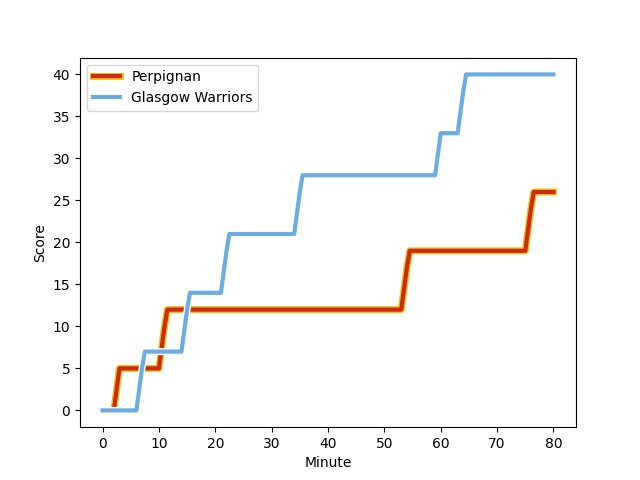
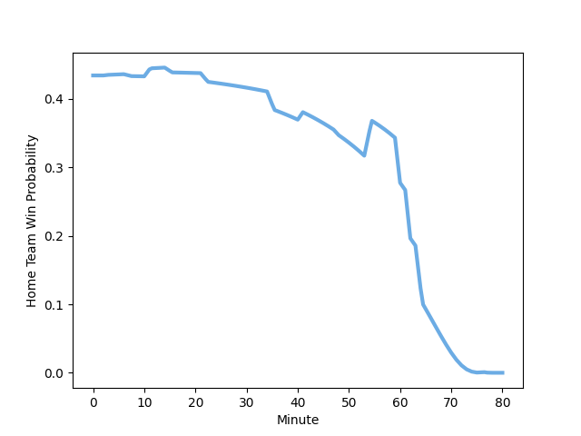

---  
layout: page  
title: Glasgow Warriors at Perpignan; 40-26  
date: 2023-01-14 21:00:00 18:00:00 -0500  
categories: match review  
---
# Glasgow Warriors (1504.97) at Perpignan (1390.27); 40-26

# Prediction: Glasgow Warriors by 7.5

Glasgow Warriors by 11.5 on a neutral field
## Scores over Time

## Win Probability over Time

# Pre-Match Prediction: Glasgow Warriors by 6.9

Glasgow Warriors by 10.9 on a neutral pitch

|   Away Minutes | Away Player                                                       |   Away elo |   Away Percentile |   Number |   Home Percentile |   Home elo | Home Player                                                               |   Home Minutes |
|---------------:|:------------------------------------------------------------------|-----------:|------------------:|---------:|------------------:|-----------:|:--------------------------------------------------------------------------|---------------:|
|             80 | [Nathan McBeth](..//playerfiles//NathanMcBeth_cleaned.md)         |      93.07 |               nan |        1 |                13 |      81.5  | [Xavier Chiocci](..//playerfiles//XavierChiocci_cleaned.md)               |             48 |
|             62 | [Johnny Matthews](..//playerfiles//JohnnyMatthews_cleaned.md)     |     102.17 |                68 |        2 |                20 |      90.77 | [Victor Montgaillard](..//playerfiles//VictorMontgaillard_cleaned.md)     |             48 |
|             48 | [Lucio Sordoni](..//playerfiles//LucioSordoni_cleaned.md)         |     108.5  |                83 |        3 |               nan |      91.12 | [Akato Fakatika](..//playerfiles//AkatoFakatika_cleaned.md)               |             48 |
|             48 | [JP du Preez](..//playerfiles//JPduPreez_cleaned.md)              |      92.39 |                41 |        4 |               nan |      95    | [Bastien Chinarro](..//playerfiles//BastienChinarro_cleaned.md)           |             48 |
|             62 | [Richie Gray](..//playerfiles//RichieGray_cleaned.md)             |     116.8  |                89 |        5 |                61 |      99.6  | [Andrei Mahu](..//playerfiles//AndreiMahu_cleaned.md)                     |             80 |
|             80 | [Euan Ferrie](..//playerfiles//EuanFerrie_cleaned.md)             |     104.43 |               nan |        6 |                33 |      89.89 | [Taniela Ramasibana](..//playerfiles//TanielaRamasibana_cleaned.md)       |             69 |
|             48 | [Cameron Neild](..//playerfiles//CameronNeild_cleaned.md)         |      90.2  |                36 |        7 |                33 |      89.89 | [Ewan Bertheau](..//playerfiles//EwanBertheau_cleaned.md)                 |             80 |
|             80 | [Jack Dempsey](..//playerfiles//JackDempsey_cleaned.md)           |      85.98 |                23 |        8 |               nan |      95.42 | [Valentin Moro](..//playerfiles//ValentinMoro_cleaned.md)                 |             80 |
|             67 | [Jamie Dobie](..//playerfiles//JamieDobie_cleaned.md)             |      92.27 |                38 |        9 |                57 |      97.27 | [Tom Ecochard](..//playerfiles//TomEcochard_cleaned.md)                   |             41 |
|             11 | [Domingo Miotti](..//playerfiles//DomingoMiotti_cleaned.md)       |     103.13 |                65 |       10 |                39 |      92.86 | [Matteo Rodor](..//playerfiles//MatteoRodor_cleaned.md)                   |             80 |
|             80 | [Ollie Smith](..//playerfiles//OllieSmith_cleaned.md)             |      90.25 |                37 |       11 |                16 |      82.23 | [Edward Sawailau](..//playerfiles//EdwardSawailau_cleaned.md)             |             80 |
|             80 | [Sam Johnson](..//playerfiles//SamJohnson_cleaned.md)             |     109.9  |                79 |       12 |                81 |     113.44 | [Patricio Fernandez](..//playerfiles//PatricioFernandez_cleaned.md)       |             80 |
|             80 | [Stafford McDowall](..//playerfiles//StaffordMcDowall_cleaned.md) |     134.04 |                97 |       13 |                58 |      99.75 | [Afusipa Taumoepeau](..//playerfiles//AfusipaTaumoepeau_cleaned.md)       |             80 |
|             80 | [Cole Forbes](..//playerfiles//ColeForbes_cleaned.md)             |     101.51 |                65 |       14 |               nan |      93.56 | [Nino Seguela](..//playerfiles//NinoSeguela_cleaned.md)                   |             69 |
|             80 | [Josh McKay](..//playerfiles//JoshMcKay_cleaned.md)               |      88.38 |                32 |       15 |                 2 |      60.44 | [Boris Goutard](..//playerfiles//BorisGoutard_cleaned.md)                 |             41 |
|             18 | [Angus Fraser](..//playerfiles//AngusFraser_cleaned.md)           |      95.09 |               nan |       16 |                20 |      86.2  | [Giorgi Tetrashvili](..//playerfiles//GiorgiTetrashvili_cleaned.md)       |             32 |
|             32 | [Simon Berghan](..//playerfiles//SimonBerghan_cleaned.md)         |      91.47 |                33 |       17 |                43 |      92.82 | [Mike Tadjer Barbosa](..//playerfiles//MikeTadjerBarbosa_cleaned.md)      |             32 |
|             32 | [Lewis Bean](..//playerfiles//LewisBean_cleaned.md)               |     105.3  |                73 |       18 |               nan |      87.57 | [Vakhtang Jintcharadze](..//playerfiles//VakhtangJintcharadze_cleaned.md) |             32 |
|             32 | [Tom Gordon](..//playerfiles//TomGordon_cleaned.md)               |     123.61 |                93 |       19 |               nan |      94.03 | [Posolo Tuilagi](..//playerfiles//PosoloTuilagi_cleaned.md)               |             32 |
|             18 | [Alex Samuel](..//playerfiles//AlexSamuel_cleaned.md)             |     107.54 |                78 |       20 |               nan |      95    | [Antoine Bouthier](..//playerfiles//AntoineBouthier_cleaned.md)           |             11 |
|             69 | [Duncan Weir](..//playerfiles//DuncanWeir_cleaned.md)             |      88.82 |                25 |       21 |               nan |      95    | [Lilian Pichon](..//playerfiles//LilianPichon_cleaned.md)                 |             39 |
|             13 | [Sean Kennedy](..//playerfiles//SeanKennedy_cleaned.md)           |      69.2  |               nan |       22 |               nan |      95    | [Keanu Desrues](..//playerfiles//KeanuDesrues_cleaned.md)                 |             11 |
|            nan | nan                                                               |     nan    |               nan |       23 |               nan |      95    | [Alexandre Perez](..//playerfiles//AlexandrePerez_cleaned.md)             |             39 |

