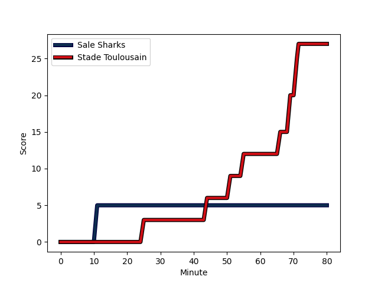
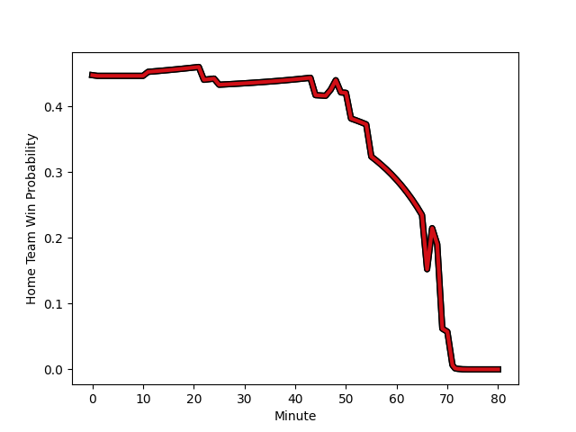

---  
layout: page  
title: Stade Toulousain at Sale Sharks; 27-5  
date: 2023-01-14 14:00:00 18:00:00 -0500  
categories: match review  
---
# Stade Toulousain (1635.44) at Sale Sharks (1544.17); 27-5

# Prediction: Stade Toulousain by 5.1

Stade Toulousain by 9.1 on a neutral field
## Scores over Time

## Win Probability over Time

# Pre-Match Prediction: Stade Toulousain by 0.3

Stade Toulousain by 3.7 on a neutral pitch

|   Away Minutes | Away Player                                                             |   Away elo |   Away Percentile |   Number |   Home Percentile |   Home elo | Home Player                                                         |   Home Minutes |
|---------------:|:------------------------------------------------------------------------|-----------:|------------------:|---------:|------------------:|-----------:|:--------------------------------------------------------------------|---------------:|
|             48 | [Cyril Baille](..//playerfiles//CyrilBaille_cleaned.md)                 |     110.24 |                86 |        1 |                84 |     108.87 | [Simon McIntyre](..//playerfiles//SimonMcIntyre_cleaned.md)         |              1 |
|             70 | [Julien Marchand](..//playerfiles//JulienMarchand_cleaned.md)           |     105.92 |                77 |        2 |                97 |     127.06 | [Akker van der Merwe](..//playerfiles//AkkervanderMerwe_cleaned.md) |             55 |
|             80 | [Dorian Aldegheri](..//playerfiles//DorianAldegheri_cleaned.md)         |     103.52 |                74 |        3 |                20 |      86.43 | [Nic Schonert](..//playerfiles//NicSchonert_cleaned.md)             |              1 |
|             67 | [Richie Arnold](..//playerfiles//RichieArnold_cleaned.md)               |      95.19 |                52 |        4 |                44 |      93.53 | [Cobus Wiese](..//playerfiles//CobusWiese_cleaned.md)               |             80 |
|             80 | [Emmanuel Meafou](..//playerfiles//EmmanuelMeafou_cleaned.md)           |     102.85 |                67 |        5 |                43 |      93.26 | [Jonny Hill](..//playerfiles//JonnyHill_cleaned.md)                 |             80 |
|             67 | [Anthony Jelonch](..//playerfiles//AnthonyJelonch_cleaned.md)           |      90.41 |                35 |        6 |                60 |      98.18 | [Jono Ross](..//playerfiles//JonoRoss_cleaned.md)                   |             67 |
|             49 | [Alban Placines](..//playerfiles//AlbanPlacines_cleaned.md)             |     105.85 |                74 |        7 |                39 |      91.79 | [Ben Curry](..//playerfiles//BenCurry_cleaned.md)                   |             80 |
|             80 | [Alexandre Roumat](..//playerfiles//AlexandreRoumat_cleaned.md)         |     135.86 |                98 |        8 |                75 |     107.87 | [Jean-Luc du Preez](..//playerfiles//Jean-LucduPreez_cleaned.md)    |             80 |
|             80 | [Antoine Dupont](..//playerfiles//AntoineDupont_cleaned.md)             |     114.03 |                82 |        9 |                28 |      88.75 | [Gus Warr](..//playerfiles//GusWarr_cleaned.md)                     |             47 |
|             80 | [Romain Ntamack](..//playerfiles//RomainNtamack_cleaned.md)             |     112.98 |                80 |       10 |                19 |      86.23 | [Robert du Preez](..//playerfiles//RobertduPreez_cleaned.md)        |             80 |
|             72 | [Matthis Lebel](..//playerfiles//MatthisLebel_cleaned.md)               |     129.79 |                96 |       11 |                92 |     123.22 | [Tom O'Flaherty](..//playerfiles//TomO'Flaherty_cleaned.md)         |             80 |
|             61 | [Sofiane Guitoune](..//playerfiles//SofianeGuitoune_cleaned.md)         |      93.39 |                44 |       12 |                75 |     107.32 | [Manu Tuilagi](..//playerfiles//ManuTuilagi_cleaned.md)             |             67 |
|             80 | [Pierre-Louis Barassi](..//playerfiles//Pierre-LouisBarassi_cleaned.md) |      97.58 |                53 |       13 |                99 |     152.81 | [Sam James](..//playerfiles//SamJames_cleaned.md)                   |             80 |
|             80 | [Juan Cruz Mallia](..//playerfiles//JuanCruzMallia_cleaned.md)          |     103.68 |                71 |       14 |                91 |     121.34 | [Arron Reed](..//playerfiles//ArronReed_cleaned.md)                 |             22 |
|             80 | [Melvyn Jaminet](..//playerfiles//MelvynJaminet_cleaned.md)             |     130.15 |                94 |       15 |                16 |      77.3  | [Joe Carpenter](..//playerfiles//JoeCarpenter_cleaned.md)           |             70 |
|             32 | [Rodrigue Neti](..//playerfiles//RodrigueNeti_cleaned.md)               |      90.89 |                34 |       16 |                91 |     115.49 | [Bevan Rodd](..//playerfiles//BevanRodd_cleaned.md)                 |             79 |
|             10 | [Guillaume Cramont](..//playerfiles//GuillaumeCramont_cleaned.md)       |      86.02 |                20 |       17 |               nan |      78.44 | [James Harper](..//playerfiles//JamesHarper_cleaned.md)             |             79 |
|             13 | [Joshua Brennan](..//playerfiles//JoshuaBrennan_cleaned.md)             |     104.02 |                71 |       18 |                26 |      87.5  | [Ewan Ashman](..//playerfiles//EwanAshman_cleaned.md)               |             25 |
|             19 | [Dimitri Delibes](..//playerfiles//DimitriDelibes_cleaned.md)           |     110.44 |                83 |       19 |                83 |     111.52 | [Josh Beaumont](..//playerfiles//JoshBeaumont_cleaned.md)           |             13 |
|              8 | [Arthur Retiere](..//playerfiles//ArthurRetiere_cleaned.md)             |      98.35 |                58 |       20 |                51 |     101.82 | [Tom Curtis](..//playerfiles//TomCurtis_cleaned.md)                 |             13 |
|             31 | [Jack Willis](..//playerfiles//JackWillis_cleaned.md)                   |     129.26 |                96 |       21 |                64 |     101.73 | [Raffi Quirke](..//playerfiles//RaffiQuirke_cleaned.md)             |             33 |
|             13 | [Rynhardt Elstadt](..//playerfiles//RynhardtElstadt_cleaned.md)         |     107.66 |                78 |       22 |                93 |     129.2  | [Luke James](..//playerfiles//LukeJames_cleaned.md)                 |             10 |
|            nan | nan                                                                     |     nan    |               nan |       23 |                54 |      94.88 | [Sam Dugdale](..//playerfiles//SamDugdale_cleaned.md)               |             58 |

