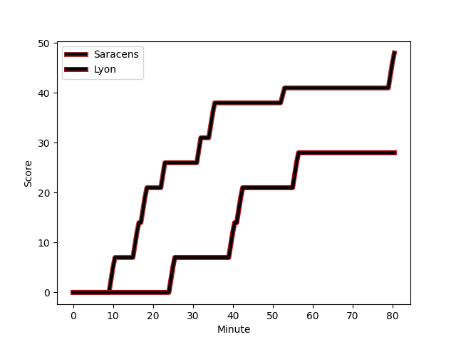
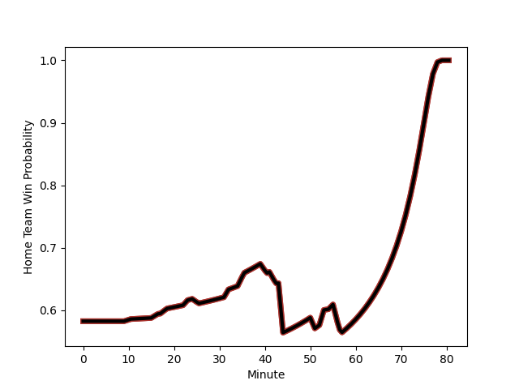

---  
layout: page  
title: Lyon at Saracens; 28-48  
date: 2023-01-14 21:00:00 18:00:00 -0500  
categories: match review  
---
# Lyon (1515.8) at Saracens (1660.64); 28-48

# Prediction: Saracens by 18.5

Saracens by 14.5 on a neutral field
## Scores over Time

## Win Probability over Time

# Pre-Match Prediction: Saracens by 21.2

Saracens by 17.2 on a neutral pitch

|   Away Minutes | Away Player                                                                |   Away elo |   Away Percentile |   Number |   Home Percentile |   Home elo | Home Player                                                       |   Home Minutes |
|---------------:|:---------------------------------------------------------------------------|-----------:|------------------:|---------:|------------------:|-----------:|:------------------------------------------------------------------|---------------:|
|             51 | [Hamza Kaabeche](..//playerfiles//HamzaKaabeche_cleaned.md)                |      82.27 |                14 |        1 |                99 |     138.53 | [Mako Vunipola](..//playerfiles//MakoVunipola_cleaned.md)         |             44 |
|             51 | [Guillaume Marchand](..//playerfiles//GuillaumeMarchand_cleaned.md)        |      78.65 |                10 |        2 |               100 |     154.59 | [Jamie George](..//playerfiles//JamieGeorge_cleaned.md)           |             59 |
|             43 | [Francisco Gomez Kodela](..//playerfiles//FranciscoGomezKodela_cleaned.md) |     105.38 |                79 |        3 |                70 |     102    | [Marco Riccioni](..//playerfiles//MarcoRiccioni_cleaned.md)       |             67 |
|             58 | [Joel Kpoku](..//playerfiles//JoelKpoku_cleaned.md)                        |      94.6  |                43 |        4 |                71 |     104.43 | [Maro Itoje](..//playerfiles//MaroItoje_cleaned.md)               |             75 |
|             80 | [Temo Mayanavanua](..//playerfiles//TemoMayanavanua_cleaned.md)            |      91.5  |                37 |        5 |                73 |     105.09 | [Hugh Tizard](..//playerfiles//HughTizard_cleaned.md)             |             54 |
|             80 | [Dylan Cretin](..//playerfiles//DylanCretin_cleaned.md)                    |      98.56 |                59 |        6 |                37 |      91.07 | [Andy Christie](..//playerfiles//AndyChristie_cleaned.md)         |             80 |
|             51 | [Patrick Sobela](..//playerfiles//PatrickSobela_cleaned.md)                |     105.06 |                62 |        7 |                81 |     110.17 | [Ben Earl](..//playerfiles//BenEarl_cleaned.md)                   |             80 |
|             58 | [Arno Botha](..//playerfiles//ArnoBotha_cleaned.md)                        |     125.05 |                93 |        8 |                83 |     112.46 | [Billy Vunipola](..//playerfiles//BillyVunipola_cleaned.md)       |             80 |
|             27 | [Jonathan Pelissie](..//playerfiles//JonathanPelissie_cleaned.md)          |      86.93 |                23 |        9 |                90 |     116.3  | [Ivan van Zyl](..//playerfiles//IvanvanZyl_cleaned.md)            |             57 |
|             60 | [Fletcher Smith](..//playerfiles//FletcherSmith_cleaned.md)                |      75.41 |                 7 |       10 |                76 |     109.03 | [Alex Goode](..//playerfiles//AlexGoode_cleaned.md)               |             80 |
|             80 | [Tavite Veredamu](..//playerfiles//TaviteVeredamu_cleaned.md)              |      84.3  |                13 |       11 |                86 |     115.71 | [Sean Maitland](..//playerfiles//SeanMaitland_cleaned.md)         |             80 |
|             80 | [Kyle Godwin](..//playerfiles//KyleGodwin_cleaned.md)                      |     124.32 |                93 |       12 |                99 |     144.52 | [Nick Tompkins](..//playerfiles//NickTompkins_cleaned.md)         |             80 |
|             80 | [Josiah Maraku](..//playerfiles//JosiahMaraku_cleaned.md)                  |      72.63 |                 6 |       13 |                68 |     103.46 | [Alex Lozowski](..//playerfiles//AlexLozowski_cleaned.md)         |             80 |
|             80 | [Josua Tuisova Ratulevu](..//playerfiles//JosuaTuisovaRatulevu_cleaned.md) |     149.74 |                99 |       14 |                41 |      92.97 | [Max Malins](..//playerfiles//MaxMalins_cleaned.md)               |             80 |
|             80 | [Ethan Dumortier](..//playerfiles//EthanDumortier_cleaned.md)              |      97.77 |                56 |       15 |                89 |     118.69 | [Elliot Daly](..//playerfiles//ElliotDaly_cleaned.md)             |             68 |
|             29 | [Romain Taofifenua](..//playerfiles//RomainTaofifenua_cleaned.md)          |     108.64 |                79 |       16 |                 5 |      73.58 | [Eroni Mawi](..//playerfiles//EroniMawi_cleaned.md)               |             36 |
|             29 | [Liam Coltman](..//playerfiles//LiamColtman_cleaned.md)                    |     116.31 |                90 |       17 |                76 |     105.73 | [Tom Woolstencroft](..//playerfiles//TomWoolstencroft_cleaned.md) |             21 |
|             22 | [Theo William](..//playerfiles//TheoWilliam_cleaned.md)                    |      93.77 |                44 |       18 |                51 |      96.12 | [Christian Judge](..//playerfiles//ChristianJudge_cleaned.md)     |             13 |
|             37 | [Demba Bamba](..//playerfiles//DembaBamba_cleaned.md)                      |     114.51 |                90 |       19 |                92 |     118.79 | [Theo Dan](..//playerfiles//TheoDan_cleaned.md)                   |              5 |
|             22 | [Loann Goujon](..//playerfiles//LoannGoujon_cleaned.md)                    |     101.42 |                60 |       20 |                25 |      87.33 | [Nick Isiekwe](..//playerfiles//NickIsiekwe_cleaned.md)           |             26 |
|             29 | [Beka Saghinadze](..//playerfiles//BekaSaghinadze_cleaned.md)              |     107.6  |                77 |       21 |                46 |      95.2  | [Aled Davies](..//playerfiles//AledDavies_cleaned.md)             |             23 |
|             53 | [Jean-Marc Doussain](..//playerfiles//Jean-MarcDoussain_cleaned.md)        |     109.51 |                82 |       22 |                30 |      89.26 | [Alex Lewington](..//playerfiles//AlexLewington_cleaned.md)       |             12 |
|             20 | [Toby Arnold](..//playerfiles//TobyArnold_cleaned.md)                      |     103.55 |                66 |       23 |               nan |     nan    | nan                                                               |            nan |

