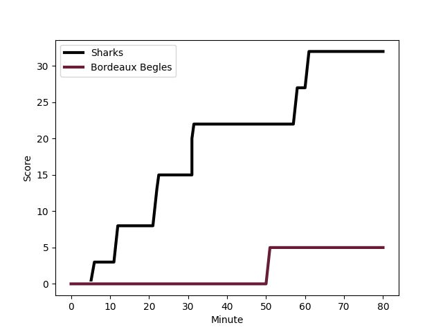
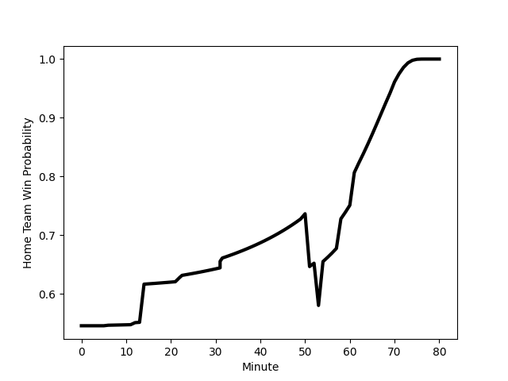

---  
layout: page  
title: Bordeaux Begles at Sharks; 3-32  
date: 2023-01-14 16:15:00 18:00:00 -0500  
categories: match review  
---
# Bordeaux Begles (1564.43) at Sharks (1643.97); 3-32

# Prediction: Sharks by 12.0

Sharks by 8.0 on a neutral field
## Scores over Time

## Win Probability over Time

# Pre-Match Prediction: Sharks by 14.7

Sharks by 10.7 on a neutral pitch

|   Away Minutes | Away Player                                                                      |   Away elo |   Away Percentile |   Number |   Home Percentile |   Home elo | Home Player                                                                   |   Home Minutes |
|---------------:|:---------------------------------------------------------------------------------|-----------:|------------------:|---------:|------------------:|-----------:|:------------------------------------------------------------------------------|---------------:|
|             53 | [Christopher Vaotoa](..//playerfiles//ChristopherVaotoa_cleaned.md)              |     104.93 |                75 |        1 |                29 |      89.59 | [Ox Nche](..//playerfiles//OxNche_cleaned.md)                                 |             54 |
|             70 | [Clement Maynadier](..//playerfiles//ClementMaynadier_cleaned.md)                |     101.72 |                69 |        2 |                91 |     117.93 | [Bongi Mbonambi](..//playerfiles//BongiMbonambi_cleaned.md)                   |              7 |
|             50 | [Vadim Cobilas](..//playerfiles//VadimCobilas_cleaned.md)                        |     120.73 |                95 |        3 |                90 |     114.66 | [Thomas du Toit](..//playerfiles//ThomasduToit_cleaned.md)                    |             67 |
|             53 | [Thomas Jolmes](..//playerfiles//ThomasJolmes_cleaned.md)                        |      84.92 |                21 |        4 |                97 |     131.97 | [Eben Etzebeth](..//playerfiles//EbenEtzebeth_cleaned.md)                     |             80 |
|             80 | [Alban Roussel](..//playerfiles//AlbanRoussel_cleaned.md)                        |      97.97 |                59 |        5 |                42 |      92.86 | [Gerbrandt Grobler](..//playerfiles//GerbrandtGrobler_cleaned.md)             |             51 |
|             80 | [Renato Giammarioli](..//playerfiles//RenatoGiammarioli_cleaned.md)              |     108.76 |                78 |        6 |                77 |     107.36 | [Siya Kolisi](..//playerfiles//SiyaKolisi_cleaned.md)                         |             80 |
|             80 | [Corentin Coularis](..//playerfiles//CorentinCoularis_cleaned.md)                |      95    |               nan |        7 |                95 |     127.75 | [Vincent Tshituka](..//playerfiles//VincentTshituka_cleaned.md)               |             80 |
|             53 | [Caleb Timu](..//playerfiles//CalebTimu_cleaned.md)                              |     109.34 |                78 |        8 |                82 |     111.38 | [Sikhumbuzo Notshe](..//playerfiles//SikhumbuzoNotshe_cleaned.md)             |             51 |
|             70 | [Maxime Lucu](..//playerfiles//MaximeLucu_cleaned.md)                            |     145.82 |                99 |        9 |                63 |     101.87 | [Jaden Hendrikse](..//playerfiles//JadenHendrikse_cleaned.md)                 |             80 |
|             62 | [Mateo Garcia](..//playerfiles//MateoGarcia_cleaned.md)                          |      84.19 |                17 |       10 |                81 |     113.4  | [Curwin Bosch](..//playerfiles//CurwinBosch_cleaned.md)                       |             62 |
|             80 | [Madosh Tambwe](..//playerfiles//MadoshTambwe_cleaned.md)                        |     108.73 |                80 |       11 |                96 |     129.81 | [Makazole Mapimpi](..//playerfiles//MakazoleMapimpi_cleaned.md)               |             80 |
|             80 | [Yoram Moefana](..//playerfiles//YoramMoefana_cleaned.md)                        |      83.9  |                20 |       12 |                78 |     109.78 | [Ben Tapuai](..//playerfiles//BenTapuai_cleaned.md)                           |             51 |
|             80 | [Tani Vili](..//playerfiles//TaniVili_cleaned.md)                                |      99.16 |                62 |       13 |                86 |     114.34 | [Lukhanyo Am](..//playerfiles//LukhanyoAm_cleaned.md)                         |             80 |
|             14 | [Geoffrey Cros](..//playerfiles//GeoffreyCros_cleaned.md)                        |      85.52 |                19 |       14 |                65 |     101.17 | [Marnus Potgieter](..//playerfiles//MarnusPotgieter_cleaned.md)               |             80 |
|             80 | [Nans Ducuing](..//playerfiles//NansDucuing_cleaned.md)                          |     118.79 |                87 |       15 |                68 |     104.45 | [Boeta Chamberlain](..//playerfiles//BoetaChamberlain_cleaned.md)             |             51 |
|             30 | [Sipili Falatea](..//playerfiles//SipiliFalatea_cleaned.md)                      |     106.01 |                80 |       16 |                65 |     100.2  | [Ntuthuko Mchunu](..//playerfiles//NtuthukoMchunu_cleaned.md)                 |             26 |
|             10 | [Connor Sa](..//playerfiles//ConnorSa_cleaned.md)                                |      94.51 |                49 |       17 |                49 |      95.31 | [Carlu Sadie](..//playerfiles//CarluSadie_cleaned.md)                         |             13 |
|             27 | [Ugo Boniface](..//playerfiles//UgoBoniface_cleaned.md)                          |      98.94 |                65 |       18 |                14 |      85.98 | [Kerron van Vuuren](..//playerfiles//KerronvanVuuren_cleaned.md)              |             73 |
|             27 | [Cyril Cazeaux](..//playerfiles//CyrilCazeaux_cleaned.md)                        |     114.44 |                86 |       19 |                32 |      90.52 | [Hyron Andrews](..//playerfiles//HyronAndrews_cleaned.md)                     |             29 |
|             27 | [Bastien Vergnes Taillefer](..//playerfiles//BastienVergnesTaillefer_cleaned.md) |     103.44 |                63 |       20 |                83 |     113.1  | [Phepsi Buthelezi](..//playerfiles//PhepsiButhelezi_cleaned.md)               |             29 |
|             10 | [Zack Holmes](..//playerfiles//ZackHolmes_cleaned.md)                            |     113.27 |                81 |       21 |                92 |     121.95 | [Rohan Janse van Rensburg](..//playerfiles//RohanJansevanRensburg_cleaned.md) |             29 |
|             18 | [Jules Gimbert](..//playerfiles//JulesGimbert_cleaned.md)                        |      78.77 |                 9 |       22 |                97 |     137.63 | [Aphelele Fassi](..//playerfiles//ApheleleFassi_cleaned.md)                   |             18 |
|             66 | [Pablo Uberti](..//playerfiles//PabloUberti_cleaned.md)                          |     110.64 |                80 |       23 |                32 |      90.29 | [Cameron Wright](..//playerfiles//CameronWright_cleaned.md)                   |             29 |

