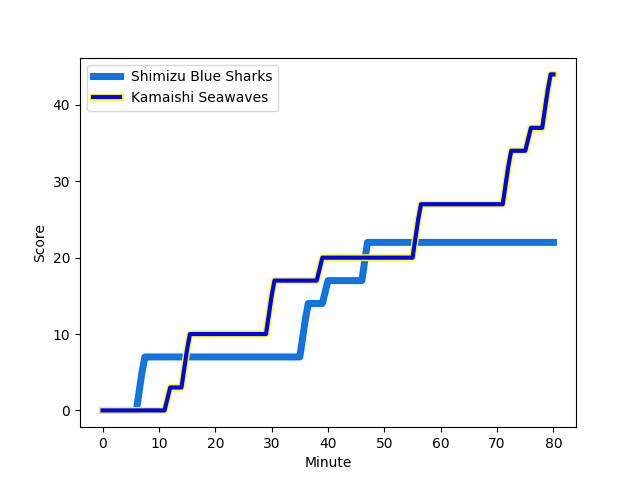
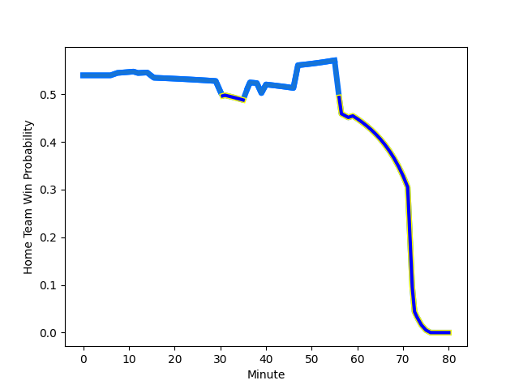

---  
layout: page  
title: Kamaishi Seawaves at Shimizu Blue Sharks; 44-22  
date: 2023-01-14 00:00:00 18:00:00 -0500  
categories: match review  
---
# Kamaishi Seawaves (1260.32) at Shimizu Blue Sharks (1329.44); 44-22

# Prediction: Shimizu Blue Sharks by 10.9

Shimizu Blue Sharks by 6.9 on a neutral field
## Scores over Time

## Win Probability over Time

# Pre-Match Prediction: Shimizu Blue Sharks by 16.4

Shimizu Blue Sharks by 12.4 on a neutral pitch

|   Away Minutes | Away Player                                                        |   Away elo |   Away Percentile |   Number |   Home Percentile |   Home elo | Home Player                                                          |   Home Minutes |
|---------------:|:-------------------------------------------------------------------|-----------:|------------------:|---------:|------------------:|-----------:|:---------------------------------------------------------------------|---------------:|
|             80 | [Takuya Takahashi](..//playerfiles//TakuyaTakahashi_cleaned.md)    |      73.46 |                 8 |        1 |                53 |      96.21 | [Daiki Shimura](..//playerfiles//DaikiShimura_cleaned.md)            |             54 |
|             79 | [Daiki Ito](..//playerfiles//DaikiIto_cleaned.md)                  |      74.55 |                 4 |        2 |                48 |      92.4  | [Naomichi Tatekawa](..//playerfiles//NaomichiTatekawa_cleaned.md)    |             54 |
|             80 | [Taiki Noguchi](..//playerfiles//TaikiNoguchi_cleaned.md)          |      96.35 |                53 |        3 |                22 |      87.11 | [Ryota Saitou](..//playerfiles//RyotaSaitou_cleaned.md)              |             60 |
|             40 | [Sergio Moreira](..//playerfiles//SergioMoreira_cleaned.md)        |      90.93 |                35 |        4 |               nan |      91.41 | [Thomas Nowlan](..//playerfiles//ThomasNowlan_cleaned.md)            |             31 |
|             80 | [Ben Nee Nee](..//playerfiles//BenNeeNee_cleaned.md)               |      76.68 |                10 |        5 |                 4 |      65.85 | [Yutaro Shirako](..//playerfiles//YutaroShirako_cleaned.md)          |             80 |
|             76 | [Naoki Ono](..//playerfiles//NaokiOno_cleaned.md)                  |     101.04 |                64 |        6 |                32 |      89.36 | [Ryo Sato](..//playerfiles//RyoSato_cleaned.md)                      |             74 |
|             80 | [Ryota Kano](..//playerfiles//RyotaKano_cleaned.md)                |      80.02 |                15 |        7 |                55 |      97.87 | [Ginjiro Hase](..//playerfiles//GinjiroHase_cleaned.md)              |             80 |
|             80 | [Sam Henwood](..//playerfiles//SamHenwood_cleaned.md)              |     103.07 |                62 |        8 |                25 |      86.58 | [Murphy Taramai](..//playerfiles//MurphyTaramai_cleaned.md)          |             80 |
|             59 | [Youhei Murakami](..//playerfiles//YouheiMurakami_cleaned.md)      |      77.22 |                 8 |        9 |               nan |      88.08 | [Kayne Hammington](..//playerfiles//KayneHammington_cleaned.md)      |             74 |
|             80 | [Ryoma Nakamura](..//playerfiles//RyomaNakamura_cleaned.md)        |      55.89 |                 1 |       10 |                 7 |      73.94 | [Orbyn Leger](..//playerfiles//OrbynLeger_cleaned.md)                |             80 |
|             80 | [Kodai Ono](..//playerfiles//KodaiOno_cleaned.md)                  |      64.79 |                 2 |       11 |                 2 |      62.18 | [Naoki Moriya](..//playerfiles//NaokiMoriya_cleaned.md)              |             80 |
|             80 | [Joshua Stander](..//playerfiles//JoshuaStander_cleaned.md)        |     102.94 |                64 |       12 |                52 |      98.96 | [Soichiro Kuwata](..//playerfiles//SoichiroKuwata_cleaned.md)        |             49 |
|             80 | [Osuka Lloyd Murata](..//playerfiles//OsukaLloydMurata_cleaned.md) |      83.05 |                18 |       13 |                52 |      97.06 | [Michael Va'a Toloke](..//playerfiles//MichaelVa'aToloke_cleaned.md) |             80 |
|             80 | [Ryuji Abe](..//playerfiles//RyujiAbe_cleaned.md)                  |      93.97 |                44 |       14 |                75 |     106.13 | [Ryota Noda](..//playerfiles//RyotaNoda_cleaned.md)                  |             78 |
|             40 | [Ryo Kataoka](..//playerfiles//RyoKataoka_cleaned.md)              |      91.52 |                40 |       15 |                31 |      88    | [Coenie van Wyk](..//playerfiles//CoenievanWyk_cleaned.md)           |             80 |
|             40 | [Toshihiro Nishii](..//playerfiles//ToshihiroNishii_cleaned.md)    |      92.25 |                34 |       16 |               nan |      95    | [Hiroto Watanabe](..//playerfiles//HirotoWatanabe_cleaned.md)        |             49 |
|             40 | [Cam Bailey](..//playerfiles//CamBailey_cleaned.md)                |      78.64 |                15 |       17 |                84 |     116.55 | [Sergeal Petersen](..//playerfiles//SergealPetersen_cleaned.md)      |             31 |
|             21 | [Atsushi Minami](..//playerfiles//AtsushiMinami_cleaned.md)        |      81.97 |                20 |       18 |                42 |      92.53 | [Kaito Tamori](..//playerfiles//KaitoTamori_cleaned.md)              |             26 |
|              4 | [Shoji Misaki](..//playerfiles//ShojiMisaki_cleaned.md)            |      81.32 |                14 |       19 |                15 |      81.48 | [Takatoshi Sugawara](..//playerfiles//TakatoshiSugawara_cleaned.md)  |             26 |
|              1 | [Kota Kumamoto](..//playerfiles//KotaKumamoto_cleaned.md)          |     102.57 |                74 |       20 |                75 |     103.75 | [Kazuki Kanazawa](..//playerfiles//KazukiKanazawa_cleaned.md)        |             20 |
|            nan | nan                                                                |     nan    |               nan |       21 |                37 |      92.21 | [Taishi Sakurai](..//playerfiles//TaishiSakurai_cleaned.md)          |              6 |
|            nan | nan                                                                |     nan    |               nan |       22 |                35 |      90.45 | [Haruki Matsudo](..//playerfiles//HarukiMatsudo_cleaned.md)          |              6 |
|            nan | nan                                                                |     nan    |               nan |       23 |                18 |      84.86 | [Tatsuhiro Ozaki](..//playerfiles//TatsuhiroOzaki_cleaned.md)        |              2 |

