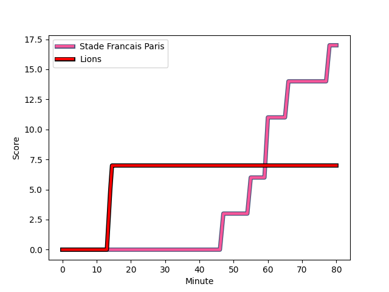
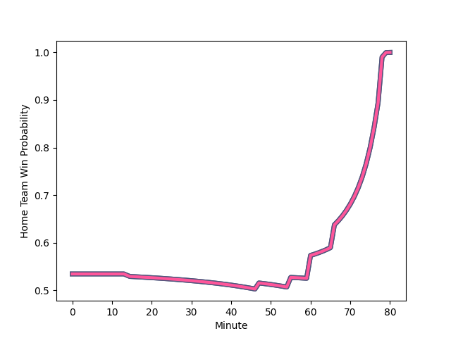

---  
layout: page  
title: Lions at Stade Francais Paris; 7-17  
date: 2023-01-14 14:00:00 18:00:00 -0500  
categories: match review  
---
# Lions (1471.66) at Stade Francais Paris (1531.5); 7-17

# Prediction: Stade Francais Paris by 10.0

Stade Francais Paris by 6.0 on a neutral field
## Scores over Time

## Win Probability over Time

# Pre-Match Prediction: Stade Francais Paris by 18.3

Stade Francais Paris by 14.3 on a neutral pitch

|   Away Minutes | Away Player                                                                 |   Away elo |   Away Percentile |   Number |   Home Percentile |   Home elo | Home Player                                                             |   Home Minutes |
|---------------:|:----------------------------------------------------------------------------|-----------:|------------------:|---------:|------------------:|-----------:|:------------------------------------------------------------------------|---------------:|
|             71 | [Jean-Pierre Smith](..//playerfiles//Jean-PierreSmith_cleaned.md)           |      90.08 |                31 |        1 |                72 |     103.8  | [Moses Alo-Emile](..//playerfiles//MosesAlo-Emile_cleaned.md)           |             53 |
|             71 | [PJ Botha](..//playerfiles//PJBotha_cleaned.md)                             |      84.1  |                18 |        2 |                82 |     107.36 | [Lucas Peyresblanques](..//playerfiles//LucasPeyresblanques_cleaned.md) |             53 |
|             71 | [Asenathi Ntlabakanye](..//playerfiles//AsenathiNtlabakanye_cleaned.md)     |      73.35 |                 5 |        3 |                12 |      81.05 | [Vincent Koch](..//playerfiles//VincentKoch_cleaned.md)                 |             52 |
|             80 | [Willem Alberts](..//playerfiles//WillemAlberts_cleaned.md)                 |     105.1  |                74 |        4 |                38 |      91.89 | [Nathan Huguen](..//playerfiles//NathanHuguen_cleaned.md)               |             80 |
|             80 | [Darrien-Lane Landsberg](..//playerfiles//Darrien-LaneLandsberg_cleaned.md) |      94.03 |                45 |        5 |                89 |     117.48 | [Sitaleki Timani](..//playerfiles//SitalekiTimani_cleaned.md)           |             52 |
|             74 | [Jaco Kriel](..//playerfiles//JacoKriel_cleaned.md)                         |     125.84 |                94 |        6 |                48 |      95.24 | [Julien Ory](..//playerfiles//JulienOry_cleaned.md)                     |             54 |
|             67 | [Emile van Heerden](..//playerfiles//EmilevanHeerden_cleaned.md)            |      85.06 |                20 |        7 |                 8 |      78.76 | [Mathieu Hirigoyen](..//playerfiles//MathieuHirigoyen_cleaned.md)       |             80 |
|             80 | [Emmanuel Tshituka](..//playerfiles//EmmanuelTshituka_cleaned.md)           |      72.68 |                 6 |        8 |                 5 |      68.61 | [Ryan Chapuis](..//playerfiles//RyanChapuis_cleaned.md)                 |             80 |
|             80 | [Morne Van den Berg](..//playerfiles//MorneVandenBerg_cleaned.md)           |      80.49 |                11 |        9 |                96 |     130    | [James Hall](..//playerfiles//JamesHall_cleaned.md)                     |             80 |
|             80 | [Gianni Dean Lombard](..//playerfiles//GianniDeanLombard_cleaned.md)        |      99.89 |                62 |       10 |                98 |     143.21 | [Joris Segonds](..//playerfiles//JorisSegonds_cleaned.md)               |             63 |
|             80 | [Edwill van der Merwe](..//playerfiles//EdwillvanderMerwe_cleaned.md)       |     110.25 |                81 |       11 |                98 |     141.89 | [Stéphane Ahmed](..//playerfiles//StéphaneAhmed_cleaned.md)             |             80 |
|             80 | [Marius Louw](..//playerfiles//MariusLouw_cleaned.md)                       |     115.83 |                87 |       12 |                20 |      82.46 | [Alex Arrate](..//playerfiles//AlexArrate_cleaned.md)                   |             80 |
|             80 | [Henco van Wyk](..//playerfiles//HencovanWyk_cleaned.md)                    |     110.45 |                80 |       13 |                69 |     104.27 | [Theo Dachary](..//playerfiles//TheoDachary_cleaned.md)                 |             33 |
|             80 | [Quan Horn](..//playerfiles//QuanHorn_cleaned.md)                           |     113.21 |                81 |       14 |                56 |      97.89 | [Nadir Megdoud](..//playerfiles//NadirMegdoud_cleaned.md)               |             63 |
|             80 | [Andries Coetzee](..//playerfiles//AndriesCoetzee_cleaned.md)               |     105.79 |                70 |       15 |                91 |     122.23 | [Kylan Hamdaoui](..//playerfiles//KylanHamdaoui_cleaned.md)             |             80 |
|              9 | [Michael van Vuuren](..//playerfiles//MichaelvanVuuren_cleaned.md)          |      88.97 |               nan |       16 |                14 |      82.75 | [Vasil Kakovin](..//playerfiles//VasilKakovin_cleaned.md)               |             27 |
|              9 | [Rhynardt Rijnsburger](..//playerfiles//RhynardtRijnsburger_cleaned.md)     |      95    |               nan |       17 |                14 |      85.09 | [Laurent Panis](..//playerfiles//LaurentPanis_cleaned.md)               |             27 |
|              9 | [Ruan Smith](..//playerfiles//RuanSmith_cleaned.md)                         |     110.81 |                86 |       18 |                44 |      92.91 | [Paul Alo-Emile](..//playerfiles//PaulAlo-Emile_cleaned.md)             |             28 |
|              6 | [Johannes JC Pretorius](..//playerfiles//JohannesJCPretorius_cleaned.md)    |      95    |               nan |       19 |                39 |      92.82 | [Juan Martin Scelzo](..//playerfiles//JuanMartinScelzo_cleaned.md)      |             26 |
|             13 | [Ruhan Straeuli](..//playerfiles//RuhanStraeuli_cleaned.md)                 |     100.4  |                63 |       20 |                46 |      94.28 | [Marcos Kremer](..//playerfiles//MarcosKremer_cleaned.md)               |             28 |
|            nan | nan                                                                         |     nan    |               nan |       21 |                30 |      86.71 | [Arthur Coville](..//playerfiles//ArthurCoville_cleaned.md)             |             17 |
|            nan | nan                                                                         |     nan    |               nan |       22 |                62 |      99.77 | [Paolo Odogwu](..//playerfiles//PaoloOdogwu_cleaned.md)                 |             47 |
|            nan | nan                                                                         |     nan    |               nan |       23 |               nan |      95    | [Peniasi Dakuwaqa](..//playerfiles//PeniasiDakuwaqa_cleaned.md)         |             17 |

