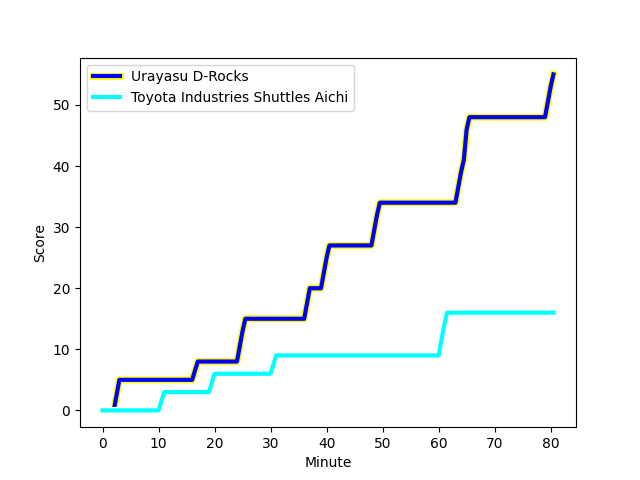
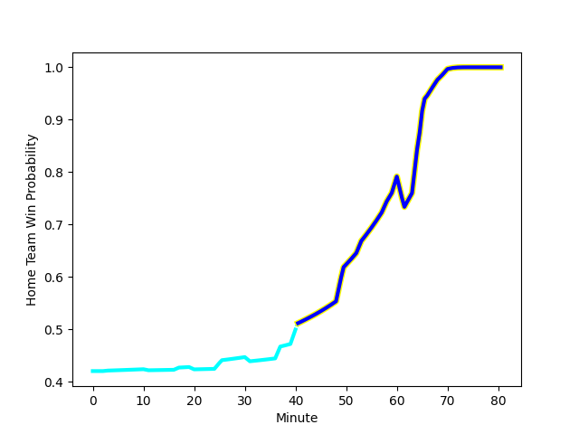

---  
layout: page  
title: Toyota Industries Shuttles Aichi at Urayasu D-Rocks; 16-55  
date: 2023-01-14 00:00:00 18:00:00 -0500  
categories: match review  
---
# Toyota Industries Shuttles Aichi (1531.1) at Urayasu D-Rocks (1391.74); 16-55

# Prediction: Toyota Industries Shuttles Aichi by 9.9

Toyota Industries Shuttles Aichi by 13.9 on a neutral field
## Scores over Time

## Win Probability over Time

# Pre-Match Prediction: Toyota Industries Shuttles Aichi by 7.9

Toyota Industries Shuttles Aichi by 11.9 on a neutral pitch

|   Away Minutes | Away Player                                                                 |   Away elo |   Away Percentile |   Number |   Home Percentile |   Home elo | Home Player                                                            |   Home Minutes |
|---------------:|:----------------------------------------------------------------------------|-----------:|------------------:|---------:|------------------:|-----------:|:-----------------------------------------------------------------------|---------------:|
|             58 | [Tomoki Yamaguchi](..//playerfiles//TomokiYamaguchi_cleaned.md)             |     123.63 |                96 |        1 |                 2 |      66.73 | [Kazuma Nishikawa](..//playerfiles//KazumaNishikawa_cleaned.md)        |             53 |
|             53 | [Akito Fujinami](..//playerfiles//AkitoFujinami_cleaned.md)                 |     103.93 |                73 |        2 |                52 |      95.91 | [Shokei Kin](..//playerfiles//ShokeiKin_cleaned.md)                    |             53 |
|             58 | [Ryota Fukamura](..//playerfiles//RyotaFukamura_cleaned.md)                 |      87.76 |                24 |        3 |                16 |      83.47 | [Syuhei Takeuchi](..//playerfiles//SyuheiTakeuchi_cleaned.md)          |             53 |
|             80 | [Taishi Nakamura](..//playerfiles//TaishiNakamura_cleaned.md)               |     102.27 |                66 |        4 |               nan |      94.81 | [Yuta Kojima](..//playerfiles//YutaKojima_cleaned.md)                  |             80 |
|             60 | [Ryuichiro Fukutsubo](..//playerfiles//RyuichiroFukutsubo_cleaned.md)       |     115.39 |                87 |        5 |               nan |      90.64 | [Lourens Erasmus](..//playerfiles//LourensErasmus_cleaned.md)          |             66 |
|             80 | [Talifolofola Tangipa](..//playerfiles//TalifolofolaTangipa_cleaned.md)     |     116.89 |                89 |        6 |                11 |      83.92 | [Shingo Nakashima](..//playerfiles//ShingoNakashima_cleaned.md)        |             80 |
|             80 | [Toshiki Fujii](..//playerfiles//ToshikiFujii_cleaned.md)                   |     105.09 |                73 |        7 |                16 |      83.51 | [Tetta Shigemitsu](..//playerfiles//TettaShigemitsu_cleaned.md)        |             80 |
|             80 | [Taumua Lui Sanft Naeata](..//playerfiles//TaumuaLuiSanftNaeata_cleaned.md) |     102.26 |                61 |        8 |                32 |      89.44 | [Jimmy Tupou](..//playerfiles//JimmyTupou_cleaned.md)                  |             66 |
|             60 | [Keita Fujiwara](..//playerfiles//KeitaFujiwara_cleaned.md)                 |     107.15 |                78 |        9 |                47 |      95.52 | [Ren Iinuma](..//playerfiles//RenIinuma_cleaned.md)                    |             62 |
|             80 | [Akihiro Shimizu](..//playerfiles//AkihiroShimizu_cleaned.md)               |     100.61 |                57 |       10 |                75 |     108.54 | [Otere Black](..//playerfiles//OtereBlack_cleaned.md)                  |             62 |
|             80 | [Go Nakano](..//playerfiles//GoNakano_cleaned.md)                           |     113.15 |                84 |       11 |                74 |     105.86 | [Takuhei Yasuda](..//playerfiles//TakuheiYasuda_cleaned.md)            |             80 |
|             80 | [Josh Matavesi](..//playerfiles//JoshMatavesi_cleaned.md)                   |     115.57 |                86 |       12 |                 7 |      73.47 | [Samisoni Ahokovi Tua](..//playerfiles//SamisoniAhokoviTua_cleaned.md) |             68 |
|             80 | [Hiroaki Saito](..//playerfiles//HiroakiSaito_cleaned.md)                   |      95.78 |                50 |       13 |                11 |      78.47 | [Shane Gates](..//playerfiles//ShaneGates_cleaned.md)                  |             80 |
|             65 | [Joe Kamana](..//playerfiles//JoeKamana_cleaned.md)                         |      61.82 |                 2 |       14 |                44 |      93.89 | [Larry Steven Sulunga](..//playerfiles//LarryStevenSulunga_cleaned.md) |             80 |
|             80 | [Tim Swiel](..//playerfiles//TimSwiel_cleaned.md)                           |      82.52 |                21 |       15 |                95 |     132.9  | [Israel Folau](..//playerfiles//IsraelFolau_cleaned.md)                |             80 |
|             27 | [Hiroshi Murakawa](..//playerfiles//HiroshiMurakawa_cleaned.md)             |     100.77 |                69 |       16 |                23 |      90.58 | [Ryuji Fujimura](..//playerfiles//RyujiFujimura_cleaned.md)            |             27 |
|             22 | [Hyosuke Watanabe](..//playerfiles//HyosukeWatanabe_cleaned.md)             |     107.51 |               nan |       17 |               nan |      98.03 | [Masahide Yanagikawa](..//playerfiles//MasahideYanagikawa_cleaned.md)  |             27 |
|             22 | [Harumoto Kodera](..//playerfiles//HarumotoKodera_cleaned.md)               |      89.82 |                31 |       18 |                12 |      78.86 | [Kim Ryom](..//playerfiles//KimRyom_cleaned.md)                        |             27 |
|             20 | [Shoma Makinouchi](..//playerfiles//ShomaMakinouchi_cleaned.md)             |      95.23 |                49 |       19 |                64 |     103.08 | [Greig Laidlaw](..//playerfiles//GreigLaidlaw_cleaned.md)              |             18 |
|             10 | [Atsushi Yumoto](..//playerfiles//AtsushiYumoto_cleaned.md)                 |      89.38 |                30 |       20 |                64 |     102.88 | [Hayden Cripps](..//playerfiles//HaydenCripps_cleaned.md)              |             18 |
|             15 | [Yuki Omichi](..//playerfiles//YukiOmichi_cleaned.md)                       |     120.64 |                91 |       21 |                 8 |      74.67 | [Ryeongji Kim](..//playerfiles//RyeongjiKim_cleaned.md)                |             14 |
|             10 | [Keita Ichikawa](..//playerfiles//KeitaIchikawa_cleaned.md)                 |      94.71 |               nan |       22 |                48 |      96.89 | [Liam Gill](..//playerfiles//LiamGill_cleaned.md)                      |             14 |
|            nan | nan                                                                         |     nan    |               nan |       23 |                94 |     130.37 | [Tone Tukufuka](..//playerfiles//ToneTukufuka_cleaned.md)              |             12 |

