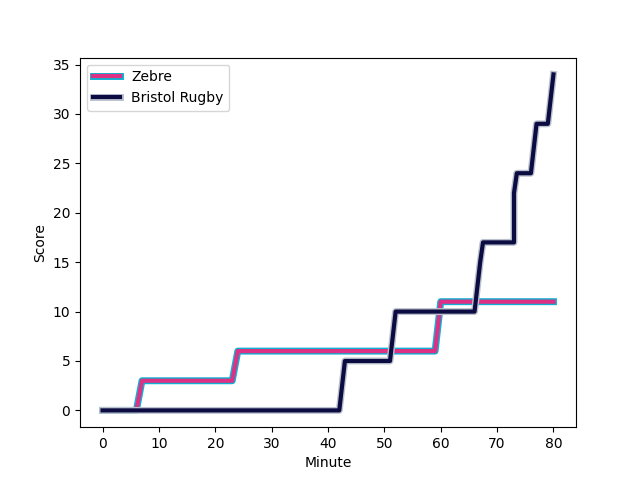
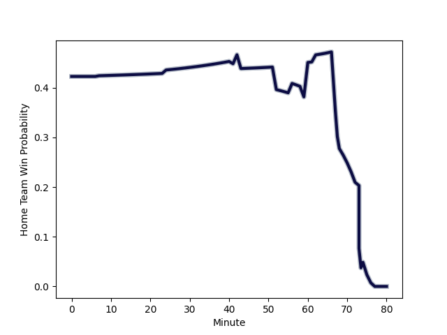

---  
layout: page  
title: Bristol Rugby at Zebre; 34-11  
date: 2023-01-14 21:00:00 18:00:00 -0500  
categories: match review  
---
# Bristol Rugby (1561.0) at Zebre (1425.49); 34-11

# Prediction: Bristol Rugby by 9.6

Bristol Rugby by 13.6 on a neutral field
## Scores over Time

## Win Probability over Time

# Pre-Match Prediction: Bristol Rugby by 10.2

Bristol Rugby by 14.2 on a neutral pitch

|   Away Minutes | Away Player                                                   |   Away elo |   Away Percentile |   Number |   Home Percentile |   Home elo | Home Player                                                                 |   Home Minutes |
|---------------:|:--------------------------------------------------------------|-----------:|------------------:|---------:|------------------:|-----------:|:----------------------------------------------------------------------------|---------------:|
|             76 | [Ellis Genge](..//playerfiles//EllisGenge_cleaned.md)         |      91.65 |                36 |        1 |                68 |     101.29 | [Paolo Buonfiglio](..//playerfiles//PaoloBuonfiglio_cleaned.md)             |             68 |
|             77 | [Harry Thacker](..//playerfiles//HarryThacker_cleaned.md)     |     105.19 |                76 |        2 |                21 |      85.57 | [Luca Bigi](..//playerfiles//LucaBigi_cleaned.md)                           |             59 |
|             62 | [Kyle Sinckler](..//playerfiles//KyleSinckler_cleaned.md)     |     110.33 |                86 |        3 |                61 |      98.99 | [Matteo Nocera](..//playerfiles//MatteoNocera_cleaned.md)                   |             68 |
|             72 | [Joe Joyce](..//playerfiles//JoeJoyce_cleaned.md)             |     143.38 |                98 |        4 |                94 |     122.67 | [Josh Furno](..//playerfiles//JoshFurno_cleaned.md)                         |             65 |
|             80 | [Chris Vui](..//playerfiles//ChrisVui_cleaned.md)             |     109.07 |                80 |        5 |                25 |      86.84 | [Andrea Zambonin](..//playerfiles//AndreaZambonin_cleaned.md)               |             80 |
|             80 | [Magnus Bradbury](..//playerfiles//MagnusBradbury_cleaned.md) |      92.5  |                37 |        6 |                20 |      82.61 | [Guido Volpi](..//playerfiles//GuidoVolpi_cleaned.md)                       |             80 |
|             56 | [Jake Heenan](..//playerfiles//JakeHeenan_cleaned.md)         |      92.34 |                40 |        7 |                51 |      98.61 | [Matt Kvesic](..//playerfiles//MattKvesic_cleaned.md)                       |             80 |
|             80 | [Fitz Harding](..//playerfiles//FitzHarding_cleaned.md)       |     109.8  |                80 |        8 |                60 |      99.8  | [Davide Ruggeri](..//playerfiles//DavideRuggeri_cleaned.md)                 |             68 |
|             74 | [Harry Randall](..//playerfiles//HarryRandall_cleaned.md)     |     108.45 |                80 |        9 |                22 |      86.67 | [Alessandro Fusco](..//playerfiles//AlessandroFusco_cleaned.md)             |             73 |
|             80 | [Callum Sheedy](..//playerfiles//CallumSheedy_cleaned.md)     |     136.14 |                96 |       10 |                52 |      98.76 | [Tiff Eden](..//playerfiles//TiffEden_cleaned.md)                           |             80 |
|             80 | [Ratu Naulago](..//playerfiles//RatuNaulago_cleaned.md)       |      92.53 |                39 |       11 |                27 |      88.21 | [Simone Gesi](..//playerfiles//SimoneGesi_cleaned.md)                       |             80 |
|             80 | [Ioan Lloyd](..//playerfiles//IoanLloyd_cleaned.md)           |      81.52 |                15 |       12 |                97 |     134.08 | [Enrico Lucchin](..//playerfiles//EnricoLucchin_cleaned.md)                 |             80 |
|             42 | [Semi Radradra](..//playerfiles//SemiRadradra_cleaned.md)     |     118.96 |                89 |       13 |                 5 |      71.03 | [Tommaso Boni](..//playerfiles//TommasoBoni_cleaned.md)                     |             59 |
|             41 | [Toby Fricker](..//playerfiles//TobyFricker_cleaned.md)       |      68.62 |                 4 |       14 |                65 |     101.32 | [Pierre Bruno](..//playerfiles//PierreBruno_cleaned.md)                     |             80 |
|             80 | [Henry Purdy](..//playerfiles//HenryPurdy_cleaned.md)         |     111.9  |                83 |       15 |                 5 |      66.84 | [Jacopo Trulla](..//playerfiles//JacopoTrulla_cleaned.md)                   |             56 |
|              4 | [Yann Thomas](..//playerfiles//YannThomas_cleaned.md)         |      91.82 |                34 |       16 |                 5 |      74.54 | [Luca Rizzoli](..//playerfiles//LucaRizzoli_cleaned.md)                     |             12 |
|             18 | [Max Lahiff](..//playerfiles//MaxLahiff_cleaned.md)           |      84.97 |                17 |       17 |                 0 |      46.15 | [Marco Manfredi](..//playerfiles//MarcoManfredi_cleaned.md)                 |             21 |
|              3 | [Fred Davies](..//playerfiles//FredDavies_cleaned.md)         |      95    |               nan |       18 |                30 |      89.39 | [Gabriele Venditti](..//playerfiles//GabrieleVenditti_cleaned.md)           |             15 |
|              8 | [Daniel Thomas](..//playerfiles//DanielThomas_cleaned.md)     |     114.67 |                80 |       19 |                54 |      96.96 | [Muhamed Hasa](..//playerfiles//MuhamedHasa_cleaned.md)                     |             12 |
|             24 | [Joe Batley](..//playerfiles//JoeBatley_cleaned.md)           |     120.1  |                91 |       20 |                75 |     107.81 | [Giovanni Licata](..//playerfiles//GiovanniLicata_cleaned.md)               |             12 |
|              6 | [Andy Uren](..//playerfiles//AndyUren_cleaned.md)             |      87.68 |                25 |       21 |                34 |      86.35 | [Ratko Jelic](..//playerfiles//RatkoJelic_cleaned.md)                       |              7 |
|             38 | [Jack Bates](..//playerfiles//JackBates_cleaned.md)           |      87.39 |                16 |       22 |                 7 |      74.55 | [Erich Cronje](..//playerfiles//ErichCronje_cleaned.md)                     |             21 |
|             39 | [James Williams](..//playerfiles//JamesWilliams_cleaned.md)   |      80.51 |                14 |       23 |                96 |     136.85 | [Geronimo Prisciantelli](..//playerfiles//GeronimoPrisciantelli_cleaned.md) |             24 |

