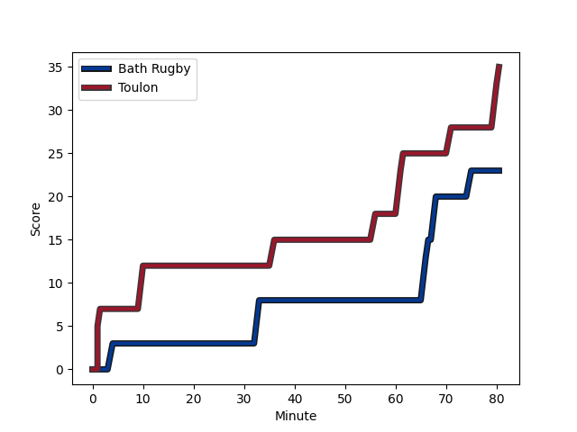
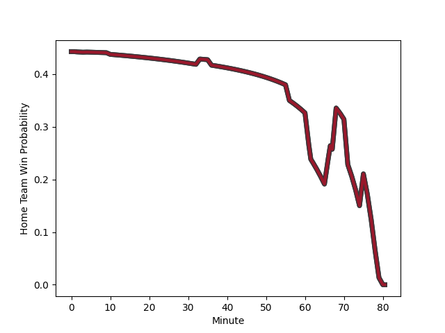

---  
layout: page  
title: Toulon at Bath Rugby; 35-23  
date: 2023-01-15 16:15:00 18:00:00 -0500  
categories: match review  
---
# Toulon (1636.56) at Bath Rugby (1536.89); 35-23

# Prediction: Toulon by 6.0

Toulon by 10.0 on a neutral field
## Scores over Time

## Win Probability over Time

# Pre-Match Prediction: Toulon by 7.5

Toulon by 11.5 on a neutral pitch

|   Away Minutes | Away Player                                                       |   Away elo |   Away Percentile |   Number |   Home Percentile |   Home elo | Home Player                                                           |   Home Minutes |
|---------------:|:------------------------------------------------------------------|-----------:|------------------:|---------:|------------------:|-----------:|:----------------------------------------------------------------------|---------------:|
|             52 | [Dany Priso](..//playerfiles//DanyPriso_cleaned.md)               |      95.48 |                50 |        1 |                33 |      89.8  | [Valery Morozov](..//playerfiles//ValeryMorozov_cleaned.md)           |             69 |
|             52 | [Teddy Baubigny](..//playerfiles//TeddyBaubigny_cleaned.md)       |      79.97 |                 9 |        2 |                92 |     118.1  | [Tom Dunn](..//playerfiles//TomDunn_cleaned.md)                       |             69 |
|             52 | [Beka Gigashvili](..//playerfiles//BekaGigashvili_cleaned.md)     |     107.22 |                82 |        3 |                 2 |      66.04 | [D'Arcy Rae](..//playerfiles//D'ArcyRae_cleaned.md)                   |             69 |
|             50 | [Matthias Halagahu](..//playerfiles//MatthiasHalagahu_cleaned.md) |      91.13 |                36 |        4 |                85 |     112.68 | [Dave Attwood](..//playerfiles//DaveAttwood_cleaned.md)               |             69 |
|             80 | [Brian Alainu'uese](..//playerfiles//BrianAlainu'uese_cleaned.md) |     108.84 |                80 |        5 |                20 |      84.41 | [Fergus Lee-Warner](..//playerfiles//FergusLee-Warner_cleaned.md)     |             73 |
|             80 | [Raphael Lakafia](..//playerfiles//RaphaelLakafia_cleaned.md)     |     113.85 |                85 |        6 |                54 |      97.39 | [Ted Hill](..//playerfiles//TedHill_cleaned.md)                       |             80 |
|             80 | [Charles Ollivon](..//playerfiles//CharlesOllivon_cleaned.md)     |     138.61 |                98 |        7 |                48 |      95.49 | [Sam Underhill](..//playerfiles//SamUnderhill_cleaned.md)             |             37 |
|             68 | [Jules Coulon](..//playerfiles//JulesCoulon_cleaned.md)           |     101.35 |                65 |        8 |                46 |      95.8  | [Josh Bayliss](..//playerfiles//JoshBayliss_cleaned.md)               |             80 |
|             33 | [Baptiste Serin](..//playerfiles//BaptisteSerin_cleaned.md)       |      96.77 |                52 |        9 |                61 |     100.41 | [Ben Spencer](..//playerfiles//BenSpencer_cleaned.md)                 |             73 |
|             80 | [Dan Biggar](..//playerfiles//DanBiggar_cleaned.md)               |     147.02 |                99 |       10 |                 5 |      74.13 | [Orlando Bailey](..//playerfiles//OrlandoBailey_cleaned.md)           |             54 |
|             56 | [Aymeric Luc](..//playerfiles//AymericLuc_cleaned.md)             |     107.92 |                74 |       11 |                91 |     120.73 | [Ruaridh McConnochie](..//playerfiles//RuaridhMcConnochie_cleaned.md) |             80 |
|             77 | [Maëlan Rabut](..//playerfiles//MaëlanRabut_cleaned.md)           |      95.11 |                48 |       12 |                82 |     112.24 | [Cameron Redpath](..//playerfiles//CameronRedpath_cleaned.md)         |             80 |
|             80 | [Duncan Paia'aua](..//playerfiles//DuncanPaia'aua_cleaned.md)     |     112.96 |                84 |       13 |                31 |      88.74 | [Ollie Lawrence](..//playerfiles//OllieLawrence_cleaned.md)           |             80 |
|             80 | [Cheslin Kolbe](..//playerfiles//CheslinKolbe_cleaned.md)         |     150.15 |                99 |       14 |                86 |     115.54 | [Joe Cokanasiga](..//playerfiles//JoeCokanasiga_cleaned.md)           |             80 |
|             80 | [Thomas Salles](..//playerfiles//ThomasSalles_cleaned.md)         |     100.04 |                58 |       15 |                96 |     137.55 | [Matt Gallagher](..//playerfiles//MattGallagher_cleaned.md)           |             80 |
|             28 | [Bruce Devaux](..//playerfiles//BruceDevaux_cleaned.md)           |      90.2  |                38 |       16 |                 3 |      69.24 | [Lewis Boyce](..//playerfiles//LewisBoyce_cleaned.md)                 |             11 |
|             28 | [Anthony Etrillard](..//playerfiles//AnthonyEtrillard_cleaned.md) |     105.99 |                77 |       17 |                28 |      88.02 | [Niall Annett](..//playerfiles//NiallAnnett_cleaned.md)               |             11 |
|             28 | [Kieran Brookes](..//playerfiles//KieranBrookes_cleaned.md)       |      73.95 |                 5 |       18 |               nan |      88.72 | [Johannes Jonker](..//playerfiles//JohannesJonker_cleaned.md)         |             11 |
|             30 | [Swan Rebbadj](..//playerfiles//SwanRebbadj_cleaned.md)           |      76.03 |                 8 |       19 |                38 |      91.26 | [Will Spencer](..//playerfiles//WillSpencer_cleaned.md)               |             11 |
|             12 | [Adrien Warion](..//playerfiles//AdrienWarion_cleaned.md)         |      92.52 |                38 |       20 |                 8 |      76.53 | [Tom Ellis](..//playerfiles//TomEllis_cleaned.md)                     |              7 |
|             47 | [Jules Danglot](..//playerfiles//JulesDanglot_cleaned.md)         |     103.62 |                67 |       21 |                79 |     108.2  | [Louis Schreuder](..//playerfiles//LouisSchreuder_cleaned.md)         |              7 |
|             24 | [Jiuta Wainiqolo](..//playerfiles//JiutaWainiqolo_cleaned.md)     |      97.56 |                54 |       22 |                86 |     117.15 | [Piers Francis](..//playerfiles//PiersFrancis_cleaned.md)             |             26 |
|              3 | [Ihaia West](..//playerfiles//IhaiaWest_cleaned.md)               |     111.14 |                78 |       23 |                98 |     133.92 | [Chris Cloete](..//playerfiles//ChrisCloete_cleaned.md)               |             43 |

