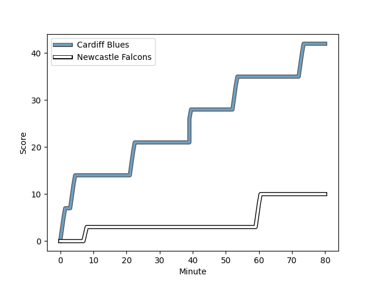
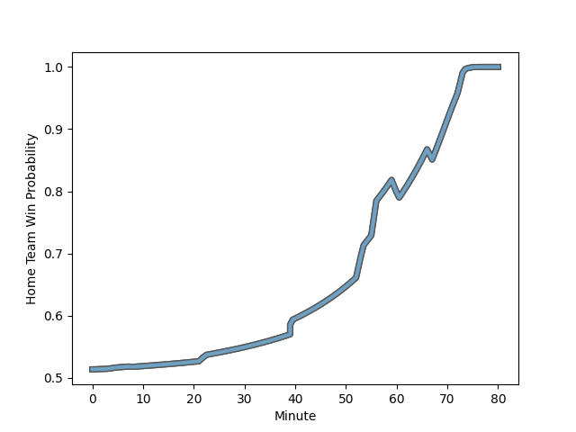

---  
layout: page  
title: Newcastle Falcons at Cardiff Blues; 10-42  
date: 2023-01-15 14:00:00 18:00:00 -0500  
categories: match review  
---
# Newcastle Falcons (1436.52) at Cardiff Blues (1459.91); 10-42

# Prediction: Cardiff Blues by 6.3

Cardiff Blues by 2.3 on a neutral field
## Scores over Time

## Win Probability over Time

# Pre-Match Prediction: Cardiff Blues by 5.7

Cardiff Blues by 1.7 on a neutral pitch

|   Away Minutes | Away Player                                                         |   Away elo |   Away Percentile |   Number |   Home Percentile |   Home elo | Home Player                                                           |   Home Minutes |
|---------------:|:--------------------------------------------------------------------|-----------:|------------------:|---------:|------------------:|-----------:|:----------------------------------------------------------------------|---------------:|
|             56 | [Adam Brocklebank](..//playerfiles//AdamBrocklebank_cleaned.md)     |     108.59 |                83 |        1 |                25 |      85.73 | [Corey Domachowski](..//playerfiles//CoreyDomachowski_cleaned.md)     |             34 |
|             56 | [Charlie Maddison](..//playerfiles//CharlieMaddison_cleaned.md)     |      89.07 |               nan |        2 |                27 |      87.66 | [Kirby Myhill](..//playerfiles//KirbyMyhill_cleaned.md)               |             55 |
|             56 | [Richard Palframan](..//playerfiles//RichardPalframan_cleaned.md)   |      95.06 |                48 |        3 |               nan |      97.27 | [Keiron Assiratti](..//playerfiles//KeironAssiratti_cleaned.md)       |             55 |
|             80 | [Greg Peterson](..//playerfiles//GregPeterson_cleaned.md)           |      93.48 |                43 |        4 |                27 |      87.81 | [Seb Davies](..//playerfiles//SebDavies_cleaned.md)                   |             80 |
|             50 | [Josh Peters](..//playerfiles//JoshPeters_cleaned.md)               |     106.12 |                77 |        5 |               nan |     101.16 | [Teddy Williams](..//playerfiles//TeddyWilliams_cleaned.md)           |             80 |
|             80 | [Gary Graham](..//playerfiles//GaryGraham_cleaned.md)               |      86.78 |                24 |        6 |                20 |      85.19 | [Josh Turnbull](..//playerfiles//JoshTurnbull_cleaned.md)             |             80 |
|             80 | [Tom Marshall](..//playerfiles//TomMarshall_cleaned.md)             |      78.84 |               nan |        7 |                85 |     113.96 | [Ellis Jenkins](..//playerfiles//EllisJenkins_cleaned.md)             |             80 |
|             50 | [Carl Fearns](..//playerfiles//CarlFearns_cleaned.md)               |     131.57 |                96 |        8 |                42 |      94.8  | [Taulupe Faletau](..//playerfiles//TaulupeFaletau_cleaned.md)         |             56 |
|             50 | [Sam Stuart](..//playerfiles//SamStuart_cleaned.md)                 |      57.9  |                 0 |        9 |                87 |     113.84 | [Lloyd Williams](..//playerfiles//LloydWilliams_cleaned.md)           |             56 |
|             67 | [Tian Schoeman](..//playerfiles//TianSchoeman_cleaned.md)           |     104.36 |                67 |       10 |                21 |      87.31 | [Rhys Priestland](..//playerfiles//RhysPriestland_cleaned.md)         |             80 |
|             80 | [Ben Stevenson](..//playerfiles//BenStevenson_cleaned.md)           |      97.14 |                53 |       11 |                99 |     147.95 | [Jason Harries](..//playerfiles//JasonHarries_cleaned.md)             |             47 |
|             62 | [Pete Lucock](..//playerfiles//PeteLucock_cleaned.md)               |      82.58 |                17 |       12 |                68 |     103.44 | [Ben Thomas](..//playerfiles//BenThomas_cleaned.md)                   |             80 |
|             80 | [Matias Orlando](..//playerfiles//MatiasOrlando_cleaned.md)         |      81.95 |                16 |       13 |                16 |      90.03 | [Mason Grady](..//playerfiles//MasonGrady_cleaned.md)                 |             80 |
|             80 | [Adam Radwan](..//playerfiles//AdamRadwan_cleaned.md)               |     136.71 |                98 |       14 |                 7 |      73.49 | [Owen Lane](..//playerfiles//OwenLane_cleaned.md)                     |             80 |
|             80 | [Elliot Obatoyinbo](..//playerfiles//ElliotObatoyinbo_cleaned.md)   |      83.94 |                23 |       15 |                71 |     104.12 | [Josh Adams](..//playerfiles//JoshAdams_cleaned.md)                   |             56 |
|             24 | [Alun Walker](..//playerfiles//AlunWalker_cleaned.md)               |     112.29 |                83 |       16 |                43 |      93.35 | [Rhys Carré](..//playerfiles//RhysCarré_cleaned.md)                   |             46 |
|             24 | [Logovi'i Mulipola](..//playerfiles//Logovi'iMulipola_cleaned.md)   |     105.18 |                75 |       17 |                56 |      97.31 | [William Davies-King](..//playerfiles//WilliamDavies-King_cleaned.md) |             25 |
|             24 | [Mark Tampin](..//playerfiles//MarkTampin_cleaned.md)               |      88.83 |                27 |       18 |               nan |      95.25 | [Efan Daniel](..//playerfiles//EfanDaniel_cleaned.md)                 |             25 |
|             30 | [Philip van der Walt](..//playerfiles//PhilipvanderWalt_cleaned.md) |      76.5  |                10 |       19 |                72 |     106.71 | [James Botham](..//playerfiles//JamesBotham_cleaned.md)               |             24 |
|             30 | [Pedro Rubiolo](..//playerfiles//PedroRubiolo_cleaned.md)           |      92.14 |                39 |       20 |               nan |      95.7  | [Ellis Bevan](..//playerfiles//EllisBevan_cleaned.md)                 |             24 |
|             13 | [Josh Thomas](..//playerfiles//JoshThomas_cleaned.md)               |      74.66 |                 5 |       21 |               nan |      95.43 | [Harri Millard](..//playerfiles//HarriMillard_cleaned.md)             |             33 |
|             30 | [Michael Young](..//playerfiles//MichaelYoung_cleaned.md)           |     126.19 |                95 |       22 |                82 |     113.85 | [Jarrod Evans](..//playerfiles//JarrodEvans_cleaned.md)               |             24 |
|             18 | [Iwan Stephens](..//playerfiles//IwanStephens_cleaned.md)           |      97.95 |               nan |       23 |               nan |     nan    | nan                                                                   |            nan |

