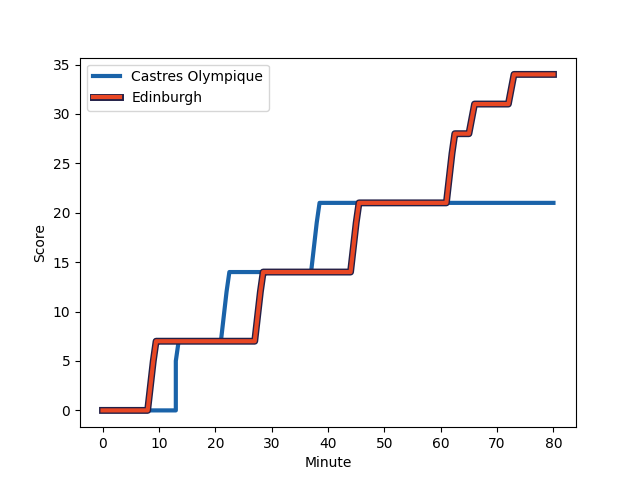
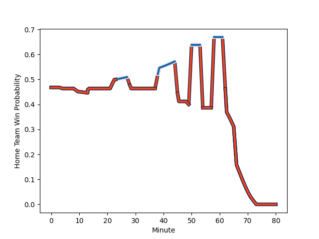

---  
layout: page  
title: Edinburgh at Castres Olympique; 34-21  
date: 2023-01-15 14:00:00 18:00:00 -0500  
categories: match review  
---
# Edinburgh (1617.75) at Castres Olympique (1561.72); 34-21

# Prediction: Edinburgh by 1.6

Edinburgh by 5.6 on a neutral field
## Scores over Time

## Win Probability over Time

# Pre-Match Prediction: Edinburgh by 4.1

Castres Olympique by 0.1 on a neutral pitch

|   Away Minutes | Away Player                                                       |   Away elo |   Away Percentile |   Number |   Home Percentile |   Home elo | Home Player                                                             |   Home Minutes |
|---------------:|:------------------------------------------------------------------|-----------:|------------------:|---------:|------------------:|-----------:|:------------------------------------------------------------------------|---------------:|
|             73 | [Pierre Schoeman](..//playerfiles//PierreSchoeman_cleaned.md)     |      88    |                26 |        1 |                75 |     103.62 | [Quentin Walcker](..//playerfiles//QuentinWalcker_cleaned.md)           |             45 |
|             64 | [Dave Cherry](..//playerfiles//DaveCherry_cleaned.md)             |     103.1  |                71 |        2 |                98 |     130.92 | [Gaetan Barlot](..//playerfiles//GaetanBarlot_cleaned.md)               |             59 |
|             73 | [WP Nel](..//playerfiles//WPNel_cleaned.md)                       |     134.9  |                98 |        3 |                84 |     108.73 | [Wilfrid Hounkpatin](..//playerfiles//WilfridHounkpatin_cleaned.md)     |             39 |
|             58 | [Marshall Sykes](..//playerfiles//MarshallSykes_cleaned.md)       |      86.61 |                26 |        4 |                86 |     113.79 | [Leone Nakarawa](..//playerfiles//LeoneNakarawa_cleaned.md)             |             49 |
|             80 | [Grant Gilchrist](..//playerfiles//GrantGilchrist_cleaned.md)     |     130.06 |                96 |        5 |                29 |      88.69 | [Theo Hannoyer](..//playerfiles//TheoHannoyer_cleaned.md)               |             80 |
|             80 | [Sam Skinner](..//playerfiles//SamSkinner_cleaned.md)             |     116.31 |                88 |        6 |               nan |     101.76 | [Baptiste Cope](..//playerfiles//BaptisteCope_cleaned.md)               |             80 |
|             80 | [Jamie Ritchie](..//playerfiles//JamieRitchie_cleaned.md)         |     150.15 |                99 |        7 |                70 |     103.93 | [Josaia Raisuqe](..//playerfiles//JosaiaRaisuqe_cleaned.md)             |             80 |
|             75 | [Viliame Mata](..//playerfiles//ViliameMata_cleaned.md)           |      56.41 |                 0 |        8 |                61 |     102.07 | [Teariki Ben-Nicholas](..//playerfiles//TearikiBen-Nicholas_cleaned.md) |             80 |
|             50 | [Charlie Shiel](..//playerfiles//CharlieShiel_cleaned.md)         |     103.01 |                68 |        9 |                78 |     107.45 | [Gauthier Doubrere](..//playerfiles//GauthierDoubrere_cleaned.md)       |             60 |
|             80 | [Charlie Savala](..//playerfiles//CharlieSavala_cleaned.md)       |      88.14 |                24 |       10 |                80 |     112.45 | [Benjamin Urdapilleta](..//playerfiles//BenjaminUrdapilleta_cleaned.md) |             80 |
|             80 | [Blair Kinghorn](..//playerfiles//BlairKinghorn_cleaned.md)       |     148.16 |                99 |       11 |                94 |     126.65 | [Geoffrey Palis](..//playerfiles//GeoffreyPalis_cleaned.md)             |             80 |
|             75 | [Cameron Hutchison](..//playerfiles//CameronHutchison_cleaned.md) |      99.04 |                57 |       12 |                64 |     101.92 | [Adrien Seguret](..//playerfiles//AdrienSeguret_cleaned.md)             |             80 |
|             80 | [Mark Bennett](..//playerfiles//MarkBennett_cleaned.md)           |     114.22 |                86 |       13 |                29 |      88    | [Vilimoni Botitu](..//playerfiles//VilimoniBotitu_cleaned.md)           |             54 |
|             80 | [Jack Blain](..//playerfiles//JackBlain_cleaned.md)               |      97.71 |                55 |       14 |                61 |      99.67 | [Martin Laveau](..//playerfiles//MartinLaveau_cleaned.md)               |              4 |
|             80 | [Henry Immelman](..//playerfiles//HenryImmelman_cleaned.md)       |     101.43 |                62 |       15 |                58 |     102.91 | [Thomas Larregain](..//playerfiles//ThomasLarregain_cleaned.md)         |             80 |
|             16 | [Tom Cruse](..//playerfiles//TomCruse_cleaned.md)                 |      82.48 |                14 |       16 |                71 |     104.31 | [Antoine Tichit](..//playerfiles//AntoineTichit_cleaned.md)             |             35 |
|              7 | [Lee-Roy Atalifo](..//playerfiles//Lee-RoyAtalifo_cleaned.md)     |      74.27 |                 7 |       17 |                54 |      98.53 | [Pierre Colonna](..//playerfiles//PierreColonna_cleaned.md)             |             21 |
|              7 | [Nick Auterac](..//playerfiles//NickAuterac_cleaned.md)           |     104.43 |               nan |       18 |                 1 |      63.51 | [Aurélien Azar](..//playerfiles//AurélienAzar_cleaned.md)               |             41 |
|             22 | [Jamie Hodgson](..//playerfiles//JamieHodgson_cleaned.md)         |      96.85 |                53 |       19 |                17 |      82.57 | [Ryno Pieterse](..//playerfiles//RynoPieterse_cleaned.md)               |             21 |
|              5 | [Nick Haining](..//playerfiles//NickHaining_cleaned.md)           |     116.55 |                87 |       20 |                65 |     101.93 | [Santiago Arata](..//playerfiles//SantiagoArata_cleaned.md)             |             20 |
|             30 | [Ben Vellacott](..//playerfiles//BenVellacott_cleaned.md)         |     108.3  |                81 |       21 |                97 |     135.6  | [Adrea Cocagi](..//playerfiles//AdreaCocagi_cleaned.md)                 |             26 |
|              5 | [Cameron Scott](..//playerfiles//CameronScott_cleaned.md)         |      98.07 |               nan |       22 |                47 |      96.45 | [Kevin Kornath](..//playerfiles//KevinKornath_cleaned.md)               |             76 |
|            nan | nan                                                               |     nan    |               nan |       23 |                50 |      95.41 | [Tom Staniforth](..//playerfiles//TomStaniforth_cleaned.md)             |             10 |

