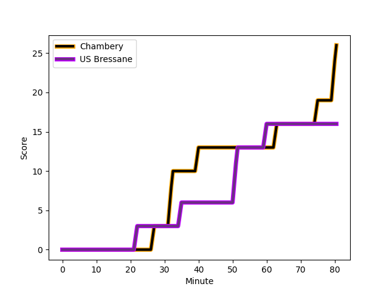
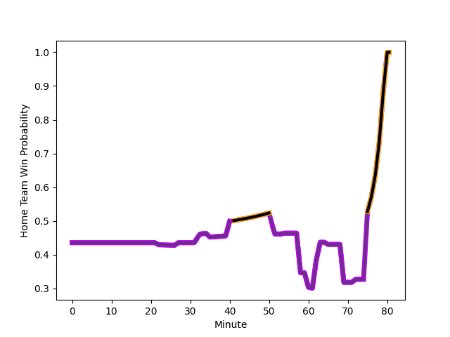

---  
layout: page  
title: US Bressane at Chambery; 16-26  
date: 2023-01-15 15:00:00 18:00:00 -0500  
categories: match review  
---
# US Bressane (1442.35) at Chambery (1329.93); 16-26

# Prediction: US Bressane by 7.2

US Bressane by 11.2 on a neutral field
## Scores over Time

## Win Probability over Time

# Pre-Match Prediction: US Bressane by 7.3

US Bressane by 11.3 on a neutral pitch

|   Away Minutes | Away Player                                                                       |   Away elo |   Away Percentile |   Number |   Home Percentile |   Home elo | Home Player                                                                           |   Home Minutes |
|---------------:|:----------------------------------------------------------------------------------|-----------:|------------------:|---------:|------------------:|-----------:|:--------------------------------------------------------------------------------------|---------------:|
|             54 | [Vazha Kapanadze](..//playerfiles//VazhaKapanadze_cleaned.md)                     |      88.64 |                35 |        1 |                38 |      91.98 | [Géraud Clermont](..//playerfiles//GéraudClermont_cleaned.md)                         |             80 |
|             54 | [Clement Jullien](..//playerfiles//ClementJullien_cleaned.md)                     |      93.78 |                47 |        2 |                33 |      89.2  | [Gauthier Brute de Remur](..//playerfiles//GauthierBrutedeRemur_cleaned.md)           |             56 |
|             54 | [Willem Johannes Harmse](..//playerfiles//WillemJohannesHarmse_cleaned.md)        |      89.49 |                37 |        3 |                52 |      95.88 | [Lautaro Caro Saisi](..//playerfiles//LautaroCaroSaisi_cleaned.md)                    |             56 |
|             80 | [Marius Antonescu](..//playerfiles//MariusAntonescu_cleaned.md)                   |     119.67 |                91 |        4 |                43 |      93.25 | [Steevy Cerqueira](..//playerfiles//SteevyCerqueira_cleaned.md)                       |             72 |
|             40 | [Cyril Veyret](..//playerfiles//CyrilVeyret_cleaned.md)                           |     139.07 |                98 |        5 |                 2 |      61.19 | [Romain Guyot](..//playerfiles//RomainGuyot_cleaned.md)                               |             80 |
|             80 | [Wael May](..//playerfiles//WaelMay_cleaned.md)                                   |     101.35 |                62 |        6 |                47 |      95.06 | [Matheo Triki](..//playerfiles//MatheoTriki_cleaned.md)                               |             80 |
|             62 | [Romain Falcoz](..//playerfiles//RomainFalcoz_cleaned.md)                         |      93.61 |                43 |        7 |                76 |     108.55 | [Jean-Baptiste Grenod](..//playerfiles//Jean-BaptisteGrenod_cleaned.md)               |             80 |
|             80 | [Loic Baradel](..//playerfiles//LoicBaradel_cleaned.md)                           |      90.19 |                34 |        8 |                70 |     105.85 | [Thomas Coignat](..//playerfiles//ThomasCoignat_cleaned.md)                           |             58 |
|             80 | [Nicolas Faure](..//playerfiles//NicolasFaure_cleaned.md)                         |     124.51 |                95 |        9 |                81 |     108.87 | [Thibault Dufau](..//playerfiles//ThibaultDufau_cleaned.md)                           |             80 |
|             80 | [Christian Lacombe](..//playerfiles//ChristianLacombe_cleaned.md)                 |      65.4  |                 3 |       10 |                56 |      99.88 | [Jean-Luc Alewyn Cilliers](..//playerfiles//Jean-LucAlewynCilliers_cleaned.md)        |             56 |
|             80 | [Alexandre Badet](..//playerfiles//AlexandreBadet_cleaned.md)                     |      86.39 |                26 |       11 |                31 |      89.16 | [Paul Baptiste Florent Altier](..//playerfiles//PaulBaptisteFlorentAltier_cleaned.md) |             69 |
|             65 | [Maile Mamao](..//playerfiles//MaileMamao_cleaned.md)                             |      87.29 |                27 |       12 |                18 |      84.95 | [Mattéo Faucher](..//playerfiles//MattéoFaucher_cleaned.md)                           |             80 |
|             80 | [Benjamin Doy](..//playerfiles//BenjaminDoy_cleaned.md)                           |      90.75 |                42 |       13 |                 0 |      41.53 | [Vereniki Goneva](..//playerfiles//VerenikiGoneva_cleaned.md)                         |             80 |
|             80 | [Audric Sanlaville](..//playerfiles//AudricSanlaville_cleaned.md)                 |      95.37 |                47 |       14 |                35 |      90.87 | [Arthur Nennig](..//playerfiles//ArthurNennig_cleaned.md)                             |             80 |
|             80 | [Thibaut Perrette](..//playerfiles//ThibautPerrette_cleaned.md)                   |      90.53 |                38 |       15 |                21 |      82.62 | [Jules Dorrival](..//playerfiles//JulesDorrival_cleaned.md)                           |             80 |
|             40 | [Monty Leverstein](..//playerfiles//MontyLeverstein_cleaned.md)                   |      91.86 |                38 |       16 |               nan |      83.7  | [Mickael Blanc](..//playerfiles//MickaelBlanc_cleaned.md)                             |             24 |
|             26 | [Teo Bordenave](..//playerfiles//TeoBordenave_cleaned.md)                         |      91.52 |                36 |       17 |                54 |      97.01 | [Julien Primault](..//playerfiles//JulienPrimault_cleaned.md)                         |             24 |
|             26 | [Zauri Tevdorashvili](..//playerfiles//ZauriTevdorashvili_cleaned.md)             |      82.34 |                14 |       18 |                36 |      92.35 | [Giorgi Pertaia](..//playerfiles//GiorgiPertaia_cleaned.md)                           |             24 |
|             26 | [Sione Anga'aelangi](..//playerfiles//SioneAnga'aelangi_cleaned.md)               |     102.28 |                72 |       19 |                12 |      77.37 | [Martin Bertrand](..//playerfiles//MartinBertrand_cleaned.md)                         |             22 |
|             18 | [Nail Ait Naceur](..//playerfiles//NailAitNaceur_cleaned.md)                      |      99.06 |                59 |       20 |                82 |     111.32 | [Theo Velten](..//playerfiles//TheoVelten_cleaned.md)                                 |             11 |
|             15 | [Parataiso Silafai-Lea'ana](..//playerfiles//ParataisoSilafai-Lea'ana_cleaned.md) |     126.32 |                94 |       21 |                34 |      87.79 | [Fabien Witz](..//playerfiles//FabienWitz_cleaned.md)                                 |              8 |

