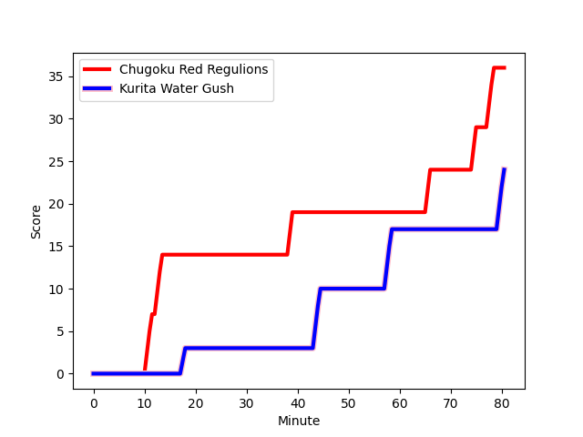
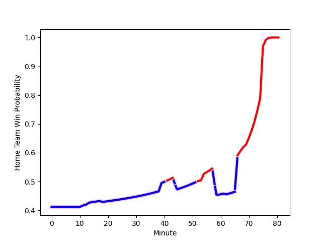

---  
layout: page  
title: Kurita Water Gush at Chugoku Red Regulions; 24-36  
date: 2023-01-15 00:00:00 18:00:00 -0500  
categories: match review  
---
# Kurita Water Gush (1250.47) at Chugoku Red Regulions (1095.7); 24-36

# Prediction: Kurita Water Gush by 11.5

Kurita Water Gush by 15.5 on a neutral field
## Scores over Time

## Win Probability over Time

# Pre-Match Prediction: Kurita Water Gush by 11.6

Kurita Water Gush by 15.6 on a neutral pitch

|   Away Minutes | Away Player                                                               |   Away elo |   Away Percentile |   Number |   Home Percentile |   Home elo | Home Player                                                       |   Home Minutes |
|---------------:|:--------------------------------------------------------------------------|-----------:|------------------:|---------:|------------------:|-----------:|:------------------------------------------------------------------|---------------:|
|             54 | [Kei Shibuya](..//playerfiles//KeiShibuya_cleaned.md)                     |      93.72 |               nan |        1 |                 9 |      78.86 | [Kojiro Arito](..//playerfiles//KojiroArito_cleaned.md)           |             59 |
|             68 | [Ryota Kuribara](..//playerfiles//RyotaKuribara_cleaned.md)               |      74.5  |                 4 |        2 |                 6 |      76.38 | [Kentaro Iwanaga](..//playerfiles//KentaroIwanaga_cleaned.md)     |             80 |
|             54 | [Kuriyama Rui](..//playerfiles//KuriyamaRui_cleaned.md)                   |      75.96 |                 7 |        3 |                 8 |      79.02 | [Saiya Kitajima](..//playerfiles//SaiyaKitajima_cleaned.md)       |             54 |
|             53 | [Kota Nakamura](..//playerfiles//KotaNakamura_cleaned.md)                 |      81.1  |                14 |        4 |                 0 |      46.36 | [Taro Nishikawa](..//playerfiles//TaroNishikawa_cleaned.md)       |             80 |
|             80 | [Daymon Leasuasu](..//playerfiles//DaymonLeasuasu_cleaned.md)             |      83.39 |                18 |        5 |                 0 |      50.09 | [Kouta Moriyama](..//playerfiles//KoutaMoriyama_cleaned.md)       |             76 |
|             68 | [Kengo Nakamura](..//playerfiles//KengoNakamura_cleaned.md)               |      79.03 |                10 |        6 |                46 |      94.43 | [Shintaro Matsuda](..//playerfiles//ShintaroMatsuda_cleaned.md)   |             69 |
|             80 | [Yosuke Ishii](..//playerfiles//YosukeIshii_cleaned.md)                   |      85.32 |                20 |        7 |                 6 |      73.55 | [Kohei Matsunaga](..//playerfiles//KoheiMatsunaga_cleaned.md)     |             80 |
|             80 | [Feinga Kihe Lotu Fakai](..//playerfiles//FeingaKiheLotuFakai_cleaned.md) |      88.77 |                30 |        8 |                 0 |      35.4  | [Ed Quirk](..//playerfiles//EdQuirk_cleaned.md)                   |             80 |
|             53 | [Ryo Omasa](..//playerfiles//RyoOmasa_cleaned.md)                         |      85.27 |                19 |        9 |                 6 |      75.18 | [Rintaro Kawashima](..//playerfiles//RintaroKawashima_cleaned.md) |             80 |
|             80 | [Andrew Deegan](..//playerfiles//AndrewDeegan_cleaned.md)                 |      93.02 |                46 |       10 |                 4 |      73.2  | [Hashizo Yoshida](..//playerfiles//HashizoYoshida_cleaned.md)     |             53 |
|             69 | [Keigo Hamazoe](..//playerfiles//KeigoHamazoe_cleaned.md)                 |      69.2  |                 4 |       11 |                23 |      83.55 | [Keigo Hatanaka](..//playerfiles//KeigoHatanaka_cleaned.md)       |             68 |
|             54 | [Jamie Vakalahi](..//playerfiles//JamieVakalahi_cleaned.md)               |      88.76 |                31 |       12 |                38 |      91.53 | [Shinya Hirayama](..//playerfiles//ShinyaHirayama_cleaned.md)     |             80 |
|             80 | [Tom English](..//playerfiles//TomEnglish_cleaned.md)                     |     109.26 |                82 |       13 |                 6 |      71.91 | [Masaaki Morita](..//playerfiles//MasaakiMorita_cleaned.md)       |             80 |
|             80 | [Ayato Sakamoto](..//playerfiles//AyatoSakamoto_cleaned.md)               |      80.71 |                12 |       14 |                43 |      93.57 | [Kentaro Fujii](..//playerfiles//KentaroFujii_cleaned.md)         |             80 |
|             80 | [Kentaro Sugimori](..//playerfiles//KentaroSugimori_cleaned.md)           |      60.44 |                 2 |       15 |                 6 |      67.38 | [Masahiro Nakano](..//playerfiles//MasahiroNakano_cleaned.md)     |             80 |
|             27 | [Tebita Oto](..//playerfiles//TebitaOto_cleaned.md)                       |      97.7  |                60 |       16 |               nan |      87.69 | [Ippei Yamada](..//playerfiles//IppeiYamada_cleaned.md)           |             27 |
|             27 | [Sho Nakamura](..//playerfiles//ShoNakamura_cleaned.md)                   |      88.76 |                25 |       17 |                45 |      94.13 | [Daiki Ishida](..//playerfiles//DaikiIshida_cleaned.md)           |              8 |
|             26 | [Masachi Debuchi](..//playerfiles//MasachiDebuchi_cleaned.md)             |      84.24 |               nan |       18 |                 7 |      76.42 | [Toshiyuki Ooki](..//playerfiles//ToshiyukiOoki_cleaned.md)       |             21 |
|             26 | [Hyong Ji Kim](..//playerfiles//HyongJiKim_cleaned.md)                    |      67.58 |                 3 |       19 |                23 |      85.62 | [Kento Miyata](..//playerfiles//KentoMiyata_cleaned.md)           |             18 |
|             26 | [Antonio Mikaele-Tu'u](..//playerfiles//AntonioMikaele-Tu'u_cleaned.md)   |      91.55 |                39 |       20 |                 4 |      68.63 | [Shun Kawaguchi](..//playerfiles//ShunKawaguchi_cleaned.md)       |             12 |
|             12 | [Kota Hojo](..//playerfiles//KotaHojo_cleaned.md)                         |      87.81 |                40 |       21 |                22 |      85.44 | [Noriyuki Kureyama](..//playerfiles//NoriyukiKureyama_cleaned.md) |             11 |
|             12 | [Mitsuo Nakao](..//playerfiles//MitsuoNakao_cleaned.md)                   |      57.65 |                 1 |       22 |                14 |      80.3  | [Hironori Shojima](..//playerfiles//HironoriShojima_cleaned.md)   |              4 |
|             11 | [Takuro Hayashida](..//playerfiles//TakuroHayashida_cleaned.md)           |      78.91 |                10 |       23 |               nan |     nan    | nan                                                               |            nan |

