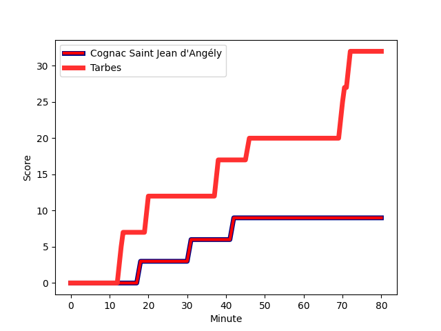
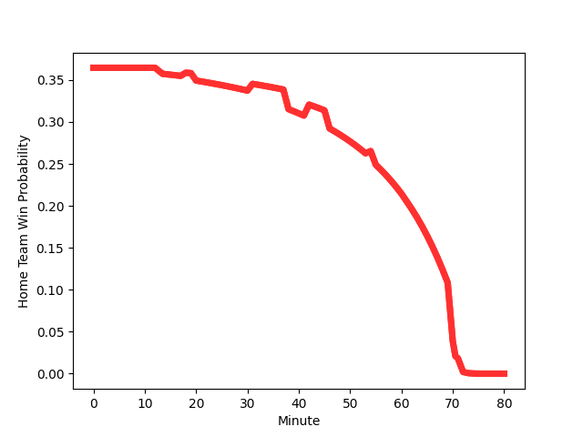

---  
layout: page  
title: Tarbes at Cognac Saint Jean d'Angély; 32-9  
date: 2023-01-15 15:00:00 18:00:00 -0500  
categories: match review  
---
# Tarbes (1409.28) at Cognac Saint Jean d'Angély (1168.12); 32-9

# Prediction: Tarbes by 20.1

Tarbes by 24.1 on a neutral field
## Scores over Time

## Win Probability over Time

# Pre-Match Prediction: Tarbes by 21.3

Tarbes by 25.3 on a neutral pitch

|   Away Minutes | Away Player                                                                      |   Away elo |   Away Percentile |   Number |   Home Percentile |   Home elo | Home Player                                                             |   Home Minutes |
|---------------:|:---------------------------------------------------------------------------------|-----------:|------------------:|---------:|------------------:|-----------:|:------------------------------------------------------------------------|---------------:|
|             55 | [Antoine Palisse](..//playerfiles//AntoinePalisse_cleaned.md)                    |      95.67 |                41 |        1 |                10 |      79.89 | [Kevin Tougne](..//playerfiles//KevinTougne_cleaned.md)                 |             61 |
|             55 | [Florian Lamothe](..//playerfiles//FlorianLamothe_cleaned.md)                    |      77.75 |                 5 |        2 |                10 |      78.57 | [Paul Sauzaret](..//playerfiles//PaulSauzaret_cleaned.md)               |             54 |
|             55 | [Aleksi Tchitchiashvili](..//playerfiles//AleksiTchitchiashvili_cleaned.md)      |      88.28 |                18 |        3 |               nan |      95    | [Martin Augeix](..//playerfiles//MartinAugeix_cleaned.md)               |             61 |
|             55 | [Antoine Bousquet](..//playerfiles//AntoineBousquet_cleaned.md)                  |      88.22 |                28 |        4 |                 1 |      55.66 | [Utu Maninoa](..//playerfiles//UtuManinoa_cleaned.md)                   |             54 |
|             80 | [Jone Trevor Seuvou](..//playerfiles//JoneTrevorSeuvou_cleaned.md)               |      80.1  |                14 |        5 |                 3 |      64.22 | [Clément Praud](..//playerfiles//ClémentPraud_cleaned.md)               |             80 |
|             80 | [Mattéo Coustalat](..//playerfiles//MattéoCoustalat_cleaned.md)                  |     101.31 |                65 |        6 |                 1 |      61.96 | [Lucas Gulizzi](..//playerfiles//LucasGulizzi_cleaned.md)               |             80 |
|             74 | [Aurelien Ricart](..//playerfiles//AurelienRicart_cleaned.md)                    |     118.25 |                90 |        7 |                88 |     115.98 | [Gio Sordia](..//playerfiles//GioSordia_cleaned.md)                     |             80 |
|             80 | [Len Massyn](..//playerfiles//LenMassyn_cleaned.md)                              |      58.65 |                 0 |        8 |                18 |      83.37 | [Filipe Manu](..//playerfiles//FilipeManu_cleaned.md)                   |             54 |
|             74 | [Thomas Lhusero](..//playerfiles//ThomasLhusero_cleaned.md)                      |     131.84 |                98 |        9 |                30 |      86.85 | [Mathieu Billou](..//playerfiles//MathieuBillou_cleaned.md)             |             71 |
|             80 | [Anthony Fuertes](..//playerfiles//AnthonyFuertes_cleaned.md)                    |      69.73 |                 3 |       10 |                 8 |      76.25 | [Serafin Bordoli](..//playerfiles//SerafinBordoli_cleaned.md)           |             80 |
|             80 | [Jonathan Duffau](..//playerfiles//JonathanDuffau_cleaned.md)                    |     121.7  |                91 |       11 |                 3 |      61.61 | [Nils Guyon](..//playerfiles//NilsGuyon_cleaned.md)                     |             80 |
|             80 | [Josaia Vakacegu](..//playerfiles//JosaiaVakacegu_cleaned.md)                    |     112.97 |                84 |       12 |                15 |      81.39 | [Eneri Lotawa](..//playerfiles//EneriLotawa_cleaned.md)                 |             80 |
|             74 | [William Pees](..//playerfiles//WilliamPees_cleaned.md)                          |      94.71 |                47 |       13 |                 0 |      55.83 | [Jone Tuva](..//playerfiles//JoneTuva_cleaned.md)                       |             71 |
|             80 | [Maxime Oltmann](..//playerfiles//MaximeOltmann_cleaned.md)                      |      67.93 |                 4 |       14 |                 6 |      71.54 | [Vincent Pageneau](..//playerfiles//VincentPageneau_cleaned.md)         |             80 |
|             74 | [Thibaut Trotta](..//playerfiles//ThibautTrotta_cleaned.md)                      |     101.68 |                62 |       15 |                36 |      91.45 | [Dany Antunes](..//playerfiles//DanyAntunes_cleaned.md)                 |             80 |
|             25 | [Johan Mees Erasmus](..//playerfiles//JohanMeesErasmus_cleaned.md)               |     106.72 |                79 |       16 |                23 |      84.98 | [Daniel Faleafa](..//playerfiles//DanielFaleafa_cleaned.md)             |             26 |
|             25 | [Paul Sajous](..//playerfiles//PaulSajous_cleaned.md)                            |      65.04 |                 4 |       17 |                16 |      83.75 | [Maxime Gau](..//playerfiles//MaximeGau_cleaned.md)                     |             26 |
|             25 | [Mariano Ezequiel Filomeno](..//playerfiles//MarianoEzequielFilomeno_cleaned.md) |      90.69 |                33 |       18 |                 3 |      66.52 | [Thomas Toevalu](..//playerfiles//ThomasToevalu_cleaned.md)             |             26 |
|             25 | [Enzo Mondon](..//playerfiles//EnzoMondon_cleaned.md)                            |     111.21 |                86 |       19 |                24 |      87.8  | [Giorgi Zakashvili](..//playerfiles//GiorgiZakashvili_cleaned.md)       |             19 |
|              6 | [Johan Paulet](..//playerfiles//JohanPaulet_cleaned.md)                          |      75.84 |                 8 |       20 |                19 |      85.72 | [Alico Kaikatsishvili](..//playerfiles//AlicoKaikatsishvili_cleaned.md) |             19 |
|              6 | [Pierre Descoubet](..//playerfiles//PierreDescoubet_cleaned.md)                  |     102.06 |                64 |       21 |                 6 |      74.81 | [Mathis Garnier](..//playerfiles//MathisGarnier_cleaned.md)             |              9 |
|              6 | [Loan Real](..//playerfiles//LoanReal_cleaned.md)                                |      87.45 |                27 |       22 |               nan |      95.75 | [Henry Tuilagi](..//playerfiles//HenryTuilagi_cleaned.md)               |              9 |
|              6 | [Thibaut Dulucq](..//playerfiles//ThibautDulucq_cleaned.md)                      |      88.78 |                19 |       23 |               nan |     nan    | nan                                                                     |            nan |

