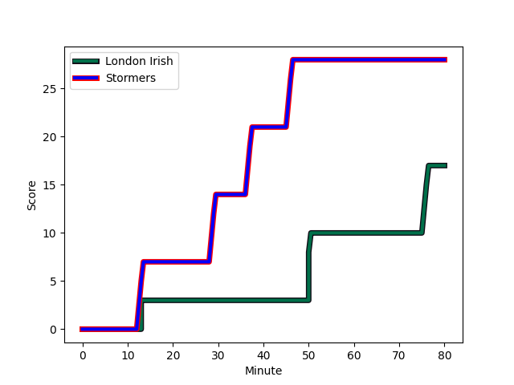
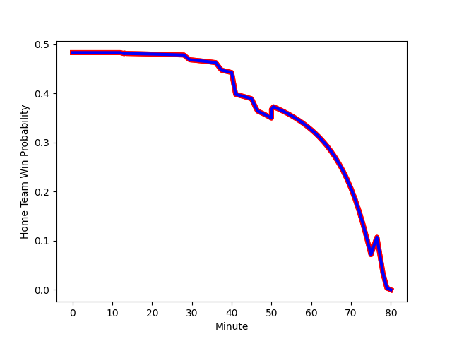

---  
layout: page  
title: Stormers at London Irish; 28-14  
date: 2023-01-15 14:00:00 18:00:00 -0500  
categories: match review  
---
# Stormers (1597.68) at London Irish (1614.18); 28-14

# Prediction: London Irish by 5.7

London Irish by 1.7 on a neutral field
## Scores over Time

## Win Probability over Time

# Pre-Match Prediction: London Irish by 2.3

Stormers by 1.7 on a neutral pitch

|   Away Minutes | Away Player                                                              |   Away elo |   Away Percentile |   Number |   Home Percentile |   Home elo | Home Player                                                                       |   Home Minutes |
|---------------:|:-------------------------------------------------------------------------|-----------:|------------------:|---------:|------------------:|-----------:|:----------------------------------------------------------------------------------|---------------:|
|             64 | [Steven Kitshoff](..//playerfiles//StevenKitshoff_cleaned.md)            |     119.05 |                94 |        1 |                84 |     109.27 | [Will Goodrick-Clarke](..//playerfiles//WillGoodrick-Clarke_cleaned.md)           |             43 |
|             51 | [Joseph Dweba](..//playerfiles//JosephDweba_cleaned.md)                  |     100.59 |                65 |        2 |                36 |      90.65 | [Mike Willemse](..//playerfiles//MikeWillemse_cleaned.md)                         |             53 |
|             63 | [Neethling Fouche](..//playerfiles//NeethlingFouche_cleaned.md)          |     108.49 |                83 |        3 |                43 |      93.5  | [Lovejoy Chawatama](..//playerfiles//LovejoyChawatama_cleaned.md)                 |             41 |
|             55 | [Connor Evans](..//playerfiles//ConnorEvans_cleaned.md)                  |      96.77 |                56 |        4 |                 9 |      75.29 | [Api Ratuniyarawa](..//playerfiles//ApiRatuniyarawa_cleaned.md)                   |             57 |
|             80 | [Marvin Orie](..//playerfiles//MarvinOrie_cleaned.md)                    |     104.75 |                72 |        5 |                97 |     132.25 | [Rob Simmons](..//playerfiles//RobSimmons_cleaned.md)                             |             80 |
|             52 | [Deon Fourie](..//playerfiles//DeonFourie_cleaned.md)                    |     137.89 |                98 |        6 |                72 |     104.65 | [Juan Martin Gonzalez](..//playerfiles//JuanMartinGonzalez_cleaned.md)            |             67 |
|             80 | [Junior Pokomela](..//playerfiles//JuniorPokomela_cleaned.md)            |      82.25 |                18 |        7 |                98 |     139.26 | [Tom Pearson](..//playerfiles//TomPearson_cleaned.md)                             |             80 |
|             72 | [Hacjivah Dayimani](..//playerfiles//HacjivahDayimani_cleaned.md)        |     122.69 |                92 |        8 |                82 |     111.72 | [Matt Rogerson](..//playerfiles//MattRogerson_cleaned.md)                         |             51 |
|             55 | [Albertus Paul de Wet](..//playerfiles//AlbertusPauldeWet_cleaned.md)    |      97.92 |                55 |        9 |                87 |     113.6  | [Ben White](..//playerfiles//BenWhite_cleaned.md)                                 |             70 |
|             17 | [Manie Libbok](..//playerfiles//ManieLibbok_cleaned.md)                  |     109.73 |                76 |       10 |                76 |     109.72 | [Rory Jennings](..//playerfiles//RoryJennings_cleaned.md)                         |             80 |
|             80 | [Angelo Davids](..//playerfiles//AngeloDavids_cleaned.md)                |     101.43 |                71 |       11 |                59 |      98.99 | [Ollie Hassell-Collins](..//playerfiles//OllieHassell-Collins_cleaned.md)         |             80 |
|             80 | [Daniel du Plessis](..//playerfiles//DanielduPlessis_cleaned.md)         |     115.34 |                87 |       12 |                36 |      90.53 | [Benhard Janse van Rensburg](..//playerfiles//BenhardJansevanRensburg_cleaned.md) |             67 |
|             80 | [Ruhan Nel](..//playerfiles//RuhanNel_cleaned.md)                        |     107.55 |                76 |       13 |                73 |     105.68 | [Luca Morisi](..//playerfiles//LucaMorisi_cleaned.md)                             |             80 |
|             80 | [Suleiman  Hartzenberg](..//playerfiles//SuleimanHartzenberg_cleaned.md) |      89.71 |                31 |       14 |                53 |      97.33 | [Lucio Cinti](..//playerfiles//LucioCinti_cleaned.md)                             |             80 |
|             80 | [Damian Willemse](..//playerfiles//DamianWillemse_cleaned.md)            |     129.45 |                95 |       15 |                93 |     128.58 | [Ben Loader](..//playerfiles//BenLoader_cleaned.md)                               |             80 |
|             16 | [Willie Engelbrecht](..//playerfiles//WillieEngelbrecht_cleaned.md)      |     104.96 |                72 |       16 |                24 |      89.79 | [Danilo Fischetti](..//playerfiles//DaniloFischetti_cleaned.md)                   |             37 |
|             29 | [Andre-Hugo Venter](..//playerfiles//Andre-HugoVenter_cleaned.md)        |     106.47 |                80 |       17 |                87 |     112.41 | [Ignacio Ruiz](..//playerfiles//IgnacioRuiz_cleaned.md)                           |             27 |
|             17 | [Brok Harris](..//playerfiles//BrokHarris_cleaned.md)                    |     135.58 |                99 |       18 |               nan |     110.24 | [Ciaran Parker](..//playerfiles//CiaranParker_cleaned.md)                         |             39 |
|             25 | [Ben-Jason Dixon](..//playerfiles//Ben-JasonDixon_cleaned.md)            |     103.17 |                69 |       19 |                94 |     125.09 | [Chunya Munga](..//playerfiles//ChunyaMunga_cleaned.md)                           |             23 |
|             28 | [Alistair Vermaak](..//playerfiles//AlistairVermaak_cleaned.md)          |     108.27 |                84 |       20 |                75 |     106.37 | [Josh Basham](..//playerfiles//JoshBasham_cleaned.md)                             |             13 |
|             25 | [Stefan Ungerer](..//playerfiles//StefanUngerer_cleaned.md)              |      75.7  |                 6 |       21 |                50 |      97.53 | [Chandler Cunningham-South](..//playerfiles//ChandlerCunningham-South_cleaned.md) |             29 |
|             63 | [Sacha Mngomezulu](..//playerfiles//SachaMngomezulu_cleaned.md)          |      95.13 |                48 |       22 |                19 |      85.49 | [Joe Powell](..//playerfiles//JoePowell_cleaned.md)                               |             10 |
|              8 | [Simon Miller](..//playerfiles//SimonMiller_cleaned.md)                  |      80.9  |                15 |       23 |               nan |      95    | [Michael Dykes](..//playerfiles//MichaelDykes_cleaned.md)                         |             13 |

