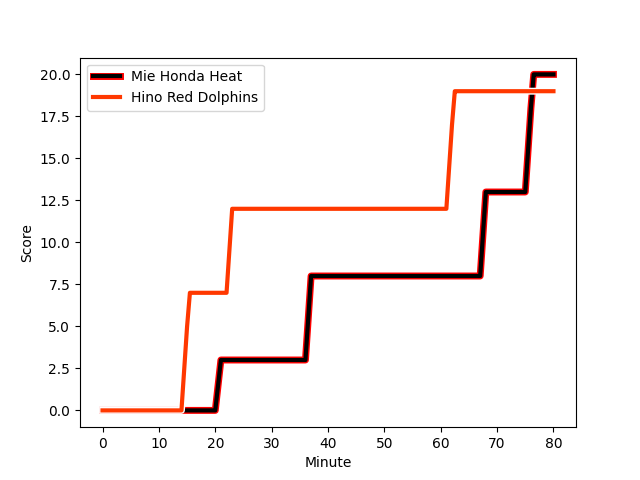
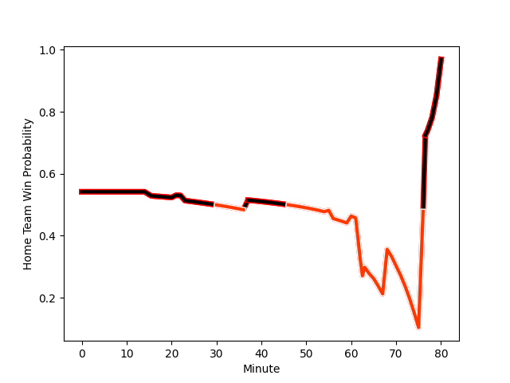

---  
layout: page  
title: Hino Red Dolphins at Mie Honda Heat; 19-20  
date: 2023-01-15 00:00:00 18:00:00 -0500  
categories: match review  
---
# Hino Red Dolphins (1515.69) at Mie Honda Heat (1588.25); 19-20

# Prediction: Mie Honda Heat by 11.3

Mie Honda Heat by 7.3 on a neutral field
## Scores over Time

## Win Probability over Time

# Pre-Match Prediction: Mie Honda Heat by 7.6

Mie Honda Heat by 3.6 on a neutral pitch

|   Away Minutes | Away Player                                                                   |   Away elo |   Away Percentile |   Number |   Home Percentile |   Home elo | Home Player                                                           |   Home Minutes |
|---------------:|:------------------------------------------------------------------------------|-----------:|------------------:|---------:|------------------:|-----------:|:----------------------------------------------------------------------|---------------:|
|             65 | [Yuto Tokuda](..//playerfiles//YutoTokuda_cleaned.md)                         |      95    |               nan |        1 |                19 |      85.84 | [Tatsuhiko Tsurukawa](..//playerfiles//TatsuhikoTsurukawa_cleaned.md) |             70 |
|             56 | [Yuki Go](..//playerfiles//YukiGo_cleaned.md)                                 |      85.94 |                22 |        2 |                13 |      81.5  | [Lee Seung Hyok](..//playerfiles//LeeSeungHyok_cleaned.md)            |             63 |
|             55 | [Shosuke Funaki](..//playerfiles//ShosukeFunaki_cleaned.md)                   |      85.09 |               nan |        3 |                40 |      92.76 | [Matthys Basson](..//playerfiles//MatthysBasson_cleaned.md)           |             63 |
|             55 | [Zephania Tuinona](..//playerfiles//ZephaniaTuinona_cleaned.md)               |     122.72 |                94 |        4 |                70 |     103.46 | [Tetuhi Roberts](..//playerfiles//TetuhiRoberts_cleaned.md)           |             80 |
|             78 | [Takehiro Kimura](..//playerfiles//TakehiroKimura_cleaned.md)                 |      91.7  |                38 |        5 |                99 |     144.83 | [Franco Mostert](..//playerfiles//FrancoMostert_cleaned.md)           |             80 |
|             80 | [Ash Parker](..//playerfiles//AshParker_cleaned.md)                           |      81.85 |                15 |        6 |                64 |     101.02 | [Atsuro Tsuji](..//playerfiles//AtsuroTsuji_cleaned.md)               |             60 |
|             80 | [Noah Tovio](..//playerfiles//NoahTovio_cleaned.md)                           |      92.87 |                41 |        7 |                72 |     104.98 | [Ryota Kobayashi](..//playerfiles//RyotaKobayashi_cleaned.md)         |             70 |
|             80 | [Kyosuke Horie](..//playerfiles//KyosukeHorie_cleaned.md)                     |     101.6  |                58 |        8 |                15 |      81.95 | [Ryo Furuta](..//playerfiles//RyoFuruta_cleaned.md)                   |             80 |
|             70 | [Augustine Pulu](..//playerfiles//AugustinePulu_cleaned.md)                   |     135.57 |                98 |        9 |                92 |     118.72 | [Kenta Yamaji](..//playerfiles//KentaYamaji_cleaned.md)               |             80 |
|             80 | [Riku Kitahara](..//playerfiles//RikuKitahara_cleaned.md)                     |     119.6  |                88 |       10 |                80 |     112.48 | [Kaleb Trask](..//playerfiles//KalebTrask_cleaned.md)                 |             70 |
|             80 | [Chance Peni](..//playerfiles//ChancePeni_cleaned.md)                         |      99.61 |                61 |       11 |                85 |     114.1  | [Naoki Motomura](..//playerfiles//NaokiMotomura_cleaned.md)           |             80 |
|             80 | [TJ Faiane](..//playerfiles//TJFaiane_cleaned.md)                             |     109.57 |                78 |       12 |                60 |     100.04 | [Fraser Quirk](..//playerfiles//FraserQuirk_cleaned.md)               |             80 |
|             80 | [Josefa Lilidamu](..//playerfiles//JosefaLilidamu_cleaned.md)                 |      96.04 |                50 |       13 |                40 |      91.97 | [Kanta Watanabe](..//playerfiles//KantaWatanabe_cleaned.md)           |             80 |
|             80 | [Ryo Kikkawa](..//playerfiles//RyoKikkawa_cleaned.md)                         |      91.14 |                37 |       14 |                65 |     101.14 | [Yoshizaku Fujita](..//playerfiles//YoshizakuFujita_cleaned.md)       |             80 |
|             70 | [Taroma Togo](..//playerfiles//TaromaTogo_cleaned.md)                         |     109.64 |                77 |       15 |                96 |     135.03 | [Tom Banks](..//playerfiles//TomBanks_cleaned.md)                     |             80 |
|             25 | [Dayan van der Westhuizen](..//playerfiles//DayanvanderWesthuizen_cleaned.md) |     108.85 |                81 |       16 |                97 |     135.88 | [Pablo Matera](..//playerfiles//PabloMatera_cleaned.md)               |             20 |
|             25 | [Sione Vuna](..//playerfiles//SioneVuna_cleaned.md)                           |      88.96 |                30 |       17 |               nan |     127.26 | [Tateo Kanai](..//playerfiles//TateoKanai_cleaned.md)                 |             17 |
|             24 | [Shunya Hamano](..//playerfiles//ShunyaHamano_cleaned.md)                     |     114.07 |                87 |       18 |                65 |     100.04 | [Taiki Yoshioka](..//playerfiles//TaikiYoshioka_cleaned.md)           |             17 |
|             15 | [Yuichi Hisatomi](..//playerfiles//YuichiHisatomi_cleaned.md)                 |      86.37 |                20 |       19 |                58 |     103.31 | [Paddy Butler](..//playerfiles//PaddyButler_cleaned.md)               |             10 |
|             10 | [Norifumi Hashimoto](..//playerfiles//NorifumiHashimoto_cleaned.md)           |      99.01 |                48 |       20 |               nan |      92.79 | [Takumi Fuji](..//playerfiles//TakumiFuji_cleaned.md)                 |             10 |
|             10 | [Simon Hickey](..//playerfiles//SimonHickey_cleaned.md)                       |      97.17 |                48 |       21 |                26 |      94.79 | [Gwangtee Oh](..//playerfiles//GwangteeOh_cleaned.md)                 |             10 |
|              2 | [Shun Nakashika](..//playerfiles//ShunNakashika_cleaned.md)                   |      98.92 |                52 |       22 |               nan |     nan    | nan                                                                   |            nan |

