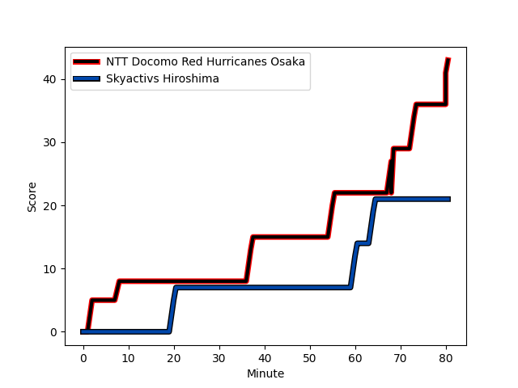
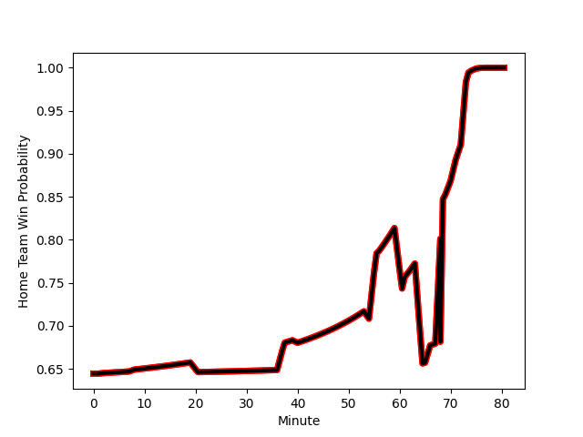

---  
layout: page  
title: Skyactivs Hiroshima at NTT Docomo Red Hurricanes Osaka; 21-43  
date: 2023-01-15 00:00:00 18:00:00 -0500  
categories: match review  
---
# Skyactivs Hiroshima (1174.0) at NTT Docomo Red Hurricanes Osaka (1432.4); 21-43

# Prediction: NTT Docomo Red Hurricanes Osaka by 29.8

NTT Docomo Red Hurricanes Osaka by 25.8 on a neutral field
## Scores over Time

## Win Probability over Time

# Pre-Match Prediction: NTT Docomo Red Hurricanes Osaka by 31.5

NTT Docomo Red Hurricanes Osaka by 27.5 on a neutral pitch

|   Away Minutes | Away Player                                                         |   Away elo |   Away Percentile |   Number |   Home Percentile |   Home elo | Home Player                                                                                 |   Home Minutes |
|---------------:|:--------------------------------------------------------------------|-----------:|------------------:|---------:|------------------:|-----------:|:--------------------------------------------------------------------------------------------|---------------:|
|             71 | [Tomonori Koyanagi](..//playerfiles//TomonoriKoyanagi_cleaned.md)   |     103.13 |                73 |        1 |                62 |      99.52 | [Shosuke Fukasawa](..//playerfiles//ShosukeFukasawa_cleaned.md)                             |             56 |
|             80 | [Yusuke Kitobayashi](..//playerfiles//YusukeKitobayashi_cleaned.md) |      56    |               nan |        2 |               nan |     114.83 | [Mitsumasa Harayama](..//playerfiles//MitsumasaHarayama_cleaned.md)                         |             40 |
|             74 | [Yuta Takami](..//playerfiles//YutaTakami_cleaned.md)               |      66.16 |                 1 |        3 |                70 |     102.03 | [Munekata Sashida](..//playerfiles//MunekataSashida_cleaned.md)                             |             40 |
|             78 | [Yutaro Tanaka](..//playerfiles//YutaroTanaka_cleaned.md)           |      87.5  |                27 |        4 |                39 |      92.13 | [Willie Britz](..//playerfiles//WillieBritz_cleaned.md)                                     |             80 |
|             80 | [Lachlan Osborne](..//playerfiles//LachlanOsborne_cleaned.md)       |      67.79 |                 5 |        5 |                33 |      90.38 | [Tatsunari Fujita](..//playerfiles//TatsunariFujita_cleaned.md)                             |             80 |
|             80 | [Tomoki Ashida](..//playerfiles//TomokiAshida_cleaned.md)           |      60.58 |                 0 |        6 |               nan |      92.74 | [Josh Fenner](..//playerfiles//JoshFenner_cleaned.md)                                       |             61 |
|             66 | [Tevin Ferris](..//playerfiles//TevinFerris_cleaned.md)             |     107.87 |                78 |        7 |                 2 |      66.94 | [Toru Sugishita](..//playerfiles//ToruSugishita_cleaned.md)                                 |             80 |
|             80 | [Iori Suzuki](..//playerfiles//IoriSuzuki_cleaned.md)               |      72.32 |                 5 |        8 |                44 |      95.44 | [Colin Bourke](..//playerfiles//ColinBourke_cleaned.md)                                     |             74 |
|             74 | [Tsubasa Kono](..//playerfiles//TsubasaKono_cleaned.md)             |      94.4  |               nan |        9 |                61 |     100.46 | [Tatsuya Hamano](..//playerfiles//TatsuyaHamano_cleaned.md)                                 |             69 |
|             80 | [Ginjiro Sakiguchi](..//playerfiles//GinjiroSakiguchi_cleaned.md)   |      51.54 |                 0 |       10 |                72 |     106.61 | [Ei Kawamuko](..//playerfiles//EiKawamuko_cleaned.md)                                       |             80 |
|             80 | [Tevita Tai](..//playerfiles//TevitaTai_cleaned.md)                 |      94.75 |                46 |       11 |                46 |      94.99 | [Masaki Kobayashi](..//playerfiles//MasakiKobayashi_cleaned.md)                             |             54 |
|             80 | [Sora Ohchi](..//playerfiles//SoraOhchi_cleaned.md)                 |      85.87 |                24 |       12 |                30 |      90.01 | [Tonisio Lafaele Fakamisia Vaihu](..//playerfiles//TonisioLafaeleFakamisiaVaihu_cleaned.md) |             54 |
|             80 | [Shuhei Lee](..//playerfiles//ShuheiLee_cleaned.md)                 |      52.28 |                 0 |       13 |                89 |     118.63 | [Benjamin Saunders](..//playerfiles//BenjaminSaunders_cleaned.md)                           |             80 |
|             80 | [Haruki Kitajima](..//playerfiles//HarukiKitajima_cleaned.md)       |      89.81 |                32 |       14 |                80 |     109.98 | [Ryo Tsuruda](..//playerfiles//RyoTsuruda_cleaned.md)                                       |             80 |
|             56 | [Kaito Sasaoka](..//playerfiles//KaitoSasaoka_cleaned.md)           |      92.85 |               nan |       15 |                 5 |      67.23 | [Kanta Yamamoto](..//playerfiles//KantaYamamoto_cleaned.md)                                 |             80 |
|             24 | [Seigo Kubo](..//playerfiles//SeigoKubo_cleaned.md)                 |      92.45 |                39 |       16 |                70 |     102.65 | [Hisamitsu Shimada](..//playerfiles//HisamitsuShimada_cleaned.md)                           |             40 |
|             12 | [Isi Manu](..//playerfiles//IsiManu_cleaned.md)                     |      72.39 |                 5 |       17 |               nan |     104.82 | [Yuichiro Hosono](..//playerfiles//YuichiroHosono_cleaned.md)                               |             40 |
|              9 | [Koshiro Shigenobu](..//playerfiles//KoshiroShigenobu_cleaned.md)   |      76.02 |               nan |       18 |                46 |      94.24 | [Daisuke Iba](..//playerfiles//DaisukeIba_cleaned.md)                                       |             26 |
|              6 | [Yuji Takahashi](..//playerfiles//YujiTakahashi_cleaned.md)         |      95    |               nan |       19 |                 4 |      64.64 | [Taichi Yoshizawa](..//playerfiles//TaichiYoshizawa_cleaned.md)                             |             26 |
|              6 | [Yuki Mori](..//playerfiles//YukiMori_cleaned.md)                   |      75.61 |               nan |       20 |               nan |      96.69 | [Wataru Furuya](..//playerfiles//WataruFuruya_cleaned.md)                                   |             24 |
|              2 | [Rame Sato](..//playerfiles//RameSato_cleaned.md)                   |      92.36 |                36 |       21 |               nan |     113.95 | [Taro Sato](..//playerfiles//TaroSato_cleaned.md)                                           |             19 |
|              2 | [Kouhei Kamei](..//playerfiles//KouheiKamei_cleaned.md)             |      57.91 |                 1 |       22 |               nan |      96.21 | [Toshihiro Yamamouchi](..//playerfiles//ToshihiroYamamouchi_cleaned.md)                     |             11 |
|            nan | nan                                                                 |     nan    |               nan |       23 |                46 |      96.25 | [Tsukasa Yasuda](..//playerfiles//TsukasaYasuda_cleaned.md)                                 |              6 |

