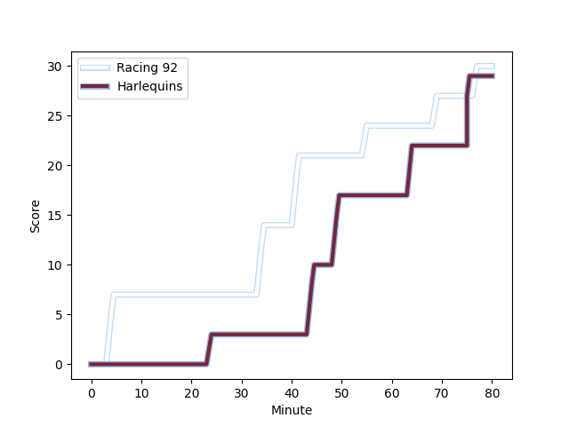
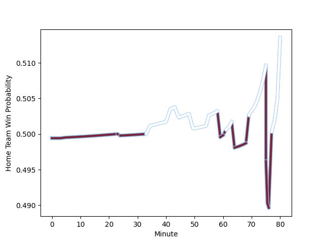

---  
layout: page  
title: Harlequins at Racing 92; 29-30  
date: 2023-01-15 16:15:00 18:00:00 -0500  
categories: match review  
---
# Harlequins (1569.97) at Racing 92 (1568.96); 29-30

# Prediction: Racing 92 by 3.9

Harlequins by 0.1 on a neutral field
## Scores over Time

## Win Probability over Time

# Pre-Match Prediction: Harlequins by 11.6

Racing 92 by 7.6 on a neutral pitch

|   Away Minutes | Away Player                                                       |   Away elo |   Away Percentile |   Number |   Home Percentile |   Home elo | Home Player                                                           |   Home Minutes |
|---------------:|:------------------------------------------------------------------|-----------:|------------------:|---------:|------------------:|-----------:|:----------------------------------------------------------------------|---------------:|
|             80 | [Joe Marler](..//playerfiles//JoeMarler_cleaned.md)               |      95.71 |                51 |        1 |                96 |     123.78 | [Guram Gogichashvili](..//playerfiles//GuramGogichashvili_cleaned.md) |             47 |
|             80 | [Jack Walker](..//playerfiles//JackWalker_cleaned.md)             |      78.1  |                 9 |        2 |                91 |     117.27 | [Camille Chat](..//playerfiles//CamilleChat_cleaned.md)               |             71 |
|             61 | [Wilco Louw](..//playerfiles//WilcoLouw_cleaned.md)               |     115.19 |                91 |        3 |                28 |      89.19 | [Cedate Gomes Sa](..//playerfiles//CedateGomesSa_cleaned.md)          |             23 |
|             59 | [Stephan Lewies](..//playerfiles//StephanLewies_cleaned.md)       |     125.35 |                94 |        4 |                 7 |      73.58 | [Cameron Woki](..//playerfiles//CameronWoki_cleaned.md)               |             80 |
|             80 | [Irne Herbst](..//playerfiles//IrneHerbst_cleaned.md)             |     113.25 |                85 |        5 |                80 |     108.71 | [Boris Palu](..//playerfiles//BorisPalu_cleaned.md)                   |             80 |
|             80 | [Luke Wallace](..//playerfiles//LukeWallace_cleaned.md)           |      69.74 |                 3 |        6 |                20 |      85.45 | [Ibrahim Diallo](..//playerfiles//IbrahimDiallo_cleaned.md)           |             23 |
|             80 | [Will Evans](..//playerfiles//WillEvans_cleaned.md)               |      89.04 |                30 |        7 |                 7 |      73.87 | [Baptiste Chouzenoux](..//playerfiles//BaptisteChouzenoux_cleaned.md) |             80 |
|             80 | [Alex Dombrandt](..//playerfiles//AlexDombrandt_cleaned.md)       |     141.74 |                98 |        8 |                29 |      88.67 | [Maxime Baudonne](..//playerfiles//MaximeBaudonne_cleaned.md)         |             80 |
|             80 | [Danny Care](..//playerfiles//DannyCare_cleaned.md)               |     113.96 |                88 |        9 |                45 |      94.99 | [Nolann Le Garrec](..//playerfiles//NolannLeGarrec_cleaned.md)        |             80 |
|             80 | [Marcus Smith](..//playerfiles//MarcusSmith_cleaned.md)           |     121.23 |                89 |       10 |                97 |     139.9  | [Finn Russell](..//playerfiles//FinnRussell_cleaned.md)               |             80 |
|             63 | [Aaron Morris](..//playerfiles//AaronMorris_cleaned.md)           |     134.55 |                98 |       11 |                97 |     134.63 | [Juan Imhoff](..//playerfiles//JuanImhoff_cleaned.md)                 |             80 |
|             80 | [Andre Esterhuizen](..//playerfiles//AndreEsterhuizen_cleaned.md) |     114.17 |                85 |       12 |                88 |     117.1  | [Gael Fickou](..//playerfiles//GaelFickou_cleaned.md)                 |             80 |
|             80 | [Joe Marchant](..//playerfiles//JoeMarchant_cleaned.md)           |      92.82 |                42 |       13 |                76 |     107.66 | [Francis Saili](..//playerfiles//FrancisSaili_cleaned.md)             |             78 |
|             80 | [Cadan Murley](..//playerfiles//CadanMurley_cleaned.md)           |      90.23 |                34 |       14 |                67 |     102.61 | [Donovan Taofifenua](..//playerfiles//DonovanTaofifenua_cleaned.md)   |             80 |
|             80 | [Nick David](..//playerfiles//NickDavid_cleaned.md)               |      97.17 |                50 |       15 |                73 |     107.71 | [Warrick Gelant](..//playerfiles//WarrickGelant_cleaned.md)           |             64 |
|             19 | [Simon Kerrod](..//playerfiles//SimonKerrod_cleaned.md)           |      92.08 |                34 |       16 |                81 |     106.42 | [Eddy Ben Arous](..//playerfiles//EddyBenArous_cleaned.md)            |             33 |
|             21 | [George Hammond](..//playerfiles//GeorgeHammond_cleaned.md)       |      77.51 |                11 |       17 |                62 |      99.24 | [Peniami Narisia](..//playerfiles//PeniamiNarisia_cleaned.md)         |              9 |
|             17 | [Oscar Beard](..//playerfiles//OscarBeard_cleaned.md)             |     114.58 |                86 |       18 |                79 |     105.39 | [Trevor Nyakane](..//playerfiles//TrevorNyakane_cleaned.md)           |             57 |
|            nan | nan                                                               |     nan    |               nan |       19 |                30 |      88.91 | [Kitione Kamikamica](..//playerfiles//KitioneKamikamica_cleaned.md)   |             57 |
|            nan | nan                                                               |     nan    |               nan |       20 |                86 |     113.41 | [Olivier Klemenczak](..//playerfiles//OlivierKlemenczak_cleaned.md)   |              2 |
|            nan | nan                                                               |     nan    |               nan |       21 |                37 |      90.33 | [Max Spring](..//playerfiles//MaxSpring_cleaned.md)                   |              3 |
|            nan | nan                                                               |     nan    |               nan |       22 |                69 |     104.81 | [Antoine Gibert](..//playerfiles//AntoineGibert_cleaned.md)           |             13 |

