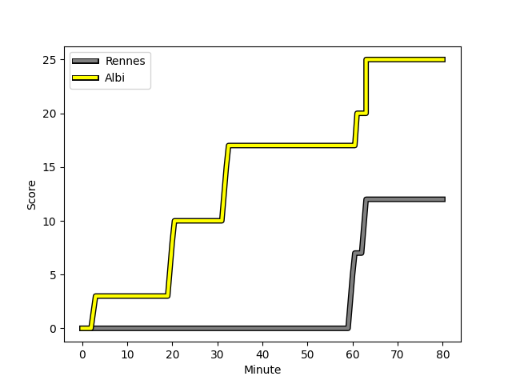
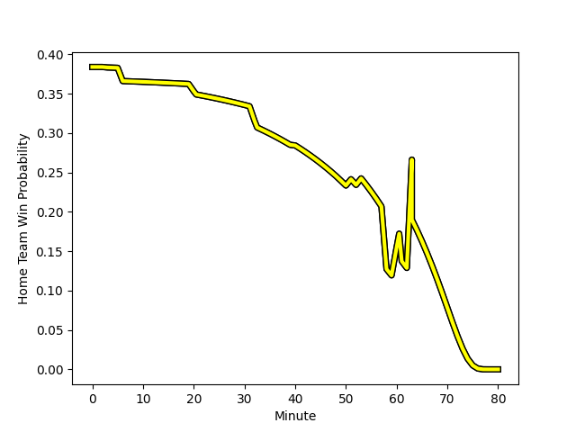

---  
layout: page  
title: Albi at Rennes; 25-12  
date: 2023-01-15 15:00:00 18:00:00 -0500  
categories: match review  
---
# Albi (1547.15) at Rennes (1342.06); 25-12

# Prediction: Albi by 16.5

Albi by 20.5 on a neutral field
## Scores over Time

## Win Probability over Time

# Pre-Match Prediction: Albi by 15.9

Albi by 19.9 on a neutral pitch

|   Away Minutes | Away Player                                                                 |   Away elo |   Away Percentile |   Number |   Home Percentile |   Home elo | Home Player                                                                |   Home Minutes |
|---------------:|:----------------------------------------------------------------------------|-----------:|------------------:|---------:|------------------:|-----------:|:---------------------------------------------------------------------------|---------------:|
|             53 | [Antoine Soave](..//playerfiles//AntoineSoave_cleaned.md)                   |     106.1  |                80 |        1 |                38 |      92.06 | [Baptiste Le Jallé](..//playerfiles//BaptisteLeJallé_cleaned.md)           |             49 |
|             53 | [Arthur Castant](..//playerfiles//ArthurCastant_cleaned.md)                 |     109.36 |                84 |        2 |                43 |      92.49 | [Alexandre Fau](..//playerfiles//AlexandreFau_cleaned.md)                  |             58 |
|             53 | [Jean Baptiste De Clercq](..//playerfiles//JeanBaptisteDeClercq_cleaned.md) |      91.92 |                37 |        3 |                40 |      92.71 | [Atonio Ulutuipalelei](..//playerfiles//AtonioUlutuipalelei_cleaned.md)    |             63 |
|             53 | [Charles Foures](..//playerfiles//CharlesFoures_cleaned.md)                 |     101.97 |                66 |        4 |                19 |      83.39 | [Victor Fromenteze](..//playerfiles//VictorFromenteze_cleaned.md)          |             80 |
|             80 | [Jacques Engelbrecht](..//playerfiles//JacquesEngelbrecht_cleaned.md)       |     101    |                65 |        5 |                38 |      92.05 | [Alexandre Gueroult](..//playerfiles//AlexandreGueroult_cleaned.md)        |             80 |
|             63 | [Hugo Boutin](..//playerfiles//HugoBoutin_cleaned.md)                       |      79.84 |                12 |        6 |                52 |      96.78 | [Vincent Wenger](..//playerfiles//VincentWenger_cleaned.md)                |             80 |
|             80 | [Lucas Guillaume](..//playerfiles//LucasGuillaume_cleaned.md)               |     116.93 |                89 |        7 |                21 |      87.15 | [Luca Di Salvatore](..//playerfiles//LucaDiSalvatore_cleaned.md)           |             40 |
|             80 | [Sandrick Maciotta](..//playerfiles//SandrickMaciotta_cleaned.md)           |     115.1  |                85 |        8 |                 8 |      75.66 | [Gaétan Béraud](..//playerfiles//GaétanBéraud_cleaned.md)                  |             80 |
|             63 | [Gilen Queheille](..//playerfiles//GilenQueheille_cleaned.md)               |     100.6  |                61 |        9 |                45 |      95.1  | [Matéo Jeune-Joly](..//playerfiles//MatéoJeune-Joly_cleaned.md)            |             40 |
|             51 | [Benjamin Pehau](..//playerfiles//BenjaminPehau_cleaned.md)                 |     115.47 |                84 |       10 |                72 |     106.19 | [Sam Leeming](..//playerfiles//SamLeeming_cleaned.md)                      |             80 |
|             80 | [Enzo Marzocca](..//playerfiles//EnzoMarzocca_cleaned.md)                   |     109.65 |                76 |       11 |                 9 |      75.91 | [Alexandre Nicoue](..//playerfiles//AlexandreNicoue_cleaned.md)            |             80 |
|             63 | [Simon Andreu](..//playerfiles//SimonAndreu_cleaned.md)                     |      90.73 |                36 |       12 |                19 |      83.65 | [Gonzalo Lopez Bontempo](..//playerfiles//GonzaloLopezBontempo_cleaned.md) |             80 |
|             80 | [Baptiste Couchinave](..//playerfiles//BaptisteCouchinave_cleaned.md)       |     123.3  |                93 |       13 |                40 |      92.01 | [Alexis François](..//playerfiles//AlexisFrançois_cleaned.md)              |             80 |
|             80 | [Charly Trussardi](..//playerfiles//CharlyTrussardi_cleaned.md)             |      90.09 |                33 |       14 |                80 |     109.62 | [Enzo Salvai](..//playerfiles//EnzoSalvai_cleaned.md)                      |              6 |
|             80 | [Téo Dospital](..//playerfiles//TéoDospital_cleaned.md)                     |     114.02 |                81 |       15 |                25 |      88.08 | [Pedro Soto](..//playerfiles//PedroSoto_cleaned.md)                        |             80 |
|             29 | [Théo Vidal](..//playerfiles//ThéoVidal_cleaned.md)                         |      82.99 |                14 |       16 |                10 |      79.45 | [Ryan Dubois](..//playerfiles//RyanDubois_cleaned.md)                      |             74 |
|             27 | [Dimitri Tchapnga](..//playerfiles//DimitriTchapnga_cleaned.md)             |      97.58 |                47 |       17 |                28 |      91.78 | [Gabriel Quesmel](..//playerfiles//GabrielQuesmel_cleaned.md)              |             14 |
|             27 | [Mohsen Essid](..//playerfiles//MohsenEssid_cleaned.md)                     |     104.26 |                69 |       18 |                27 |      89.66 | [Lucas Ollion](..//playerfiles//LucasOllion_cleaned.md)                    |             40 |
|             27 | [Maxime Escur](..//playerfiles//MaximeEscur_cleaned.md)                     |      84.81 |                15 |       19 |               nan |      99.01 | [Clément Fontaine](..//playerfiles//ClémentFontaine_cleaned.md)            |             40 |
|             27 | [Romain Maurice](..//playerfiles//RomainMaurice_cleaned.md)                 |      99.85 |               nan |       20 |                52 |      95.9  | [Pierre Strippoli](..//playerfiles//PierreStrippoli_cleaned.md)            |             22 |
|             17 | [Titouan Pouzoullic](..//playerfiles//TitouanPouzoullic_cleaned.md)         |      77.71 |                 7 |       21 |                65 |     100.86 | [Guillaume Cazette](..//playerfiles//GuillaumeCazette_cleaned.md)          |             17 |
|             17 | [François Fontaine](..//playerfiles//FrançoisFontaine_cleaned.md)           |      97.57 |                52 |       22 |                63 |      98.11 | [Carlos Muzzio](..//playerfiles//CarlosMuzzio_cleaned.md)                  |             17 |
|             17 | [Gael Ekpe](..//playerfiles//GaelEkpe_cleaned.md)                           |      98.49 |                55 |       23 |               nan |     nan    | nan                                                                        |            nan |

