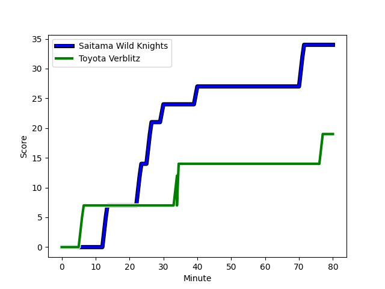
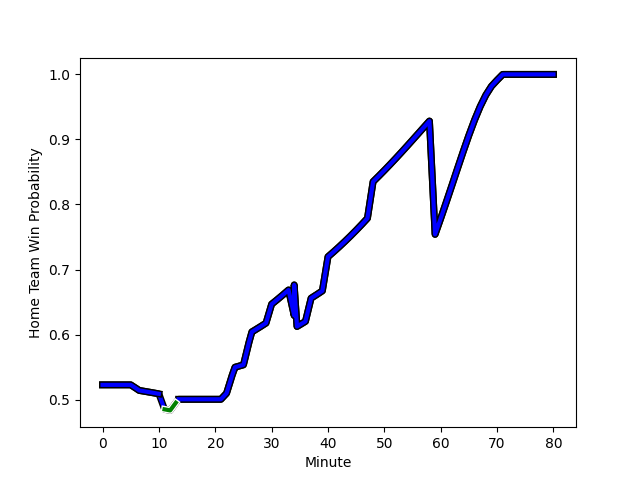

---  
layout: page  
title: Toyota Verblitz at Saitama Wild Knights; 19-34  
date: 2023-01-15 00:00:00 18:00:00 -0500  
categories: match review  
---
# Toyota Verblitz (1566.95) at Saitama Wild Knights (1606.34); 19-34

# Prediction: Saitama Wild Knights by 7.9

Saitama Wild Knights by 3.9 on a neutral field
## Scores over Time

## Win Probability over Time

# Pre-Match Prediction: Saitama Wild Knights by 6.9

Saitama Wild Knights by 2.9 on a neutral pitch

|   Away Minutes | Away Player                                                                            |   Away elo |   Away Percentile |   Number |   Home Percentile |   Home elo | Home Player                                                     |   Home Minutes |
|---------------:|:---------------------------------------------------------------------------------------|-----------:|------------------:|---------:|------------------:|-----------:|:----------------------------------------------------------------|---------------:|
|             52 | [Shogo Miura](..//playerfiles//ShogoMiura_cleaned.md)                                  |      99.82 |                68 |        1 |                93 |     118.46 | [Keita Inagaki](..//playerfiles//KeitaInagaki_cleaned.md)       |             48 |
|             37 | [Yoshikatsu Hikosaka](..//playerfiles//YoshikatsuHikosaka_cleaned.md)                  |     113.47 |                91 |        2 |                75 |     105.13 | [Atsushi Sakate](..//playerfiles//AtsushiSakate_cleaned.md)     |             48 |
|             40 | [Yusuke Kizu](..//playerfiles//YusukeKizu_cleaned.md)                                  |     105.27 |                78 |        3 |                27 |      91.01 | [Taiki Fujii](..//playerfiles//TaikiFujii_cleaned.md)           |             48 |
|             64 | [Ryoma Nishimura](..//playerfiles//RyomaNishimura_cleaned.md)                          |     117.14 |                89 |        4 |                12 |      78.44 | [Liam Mitchell](..//playerfiles//LiamMitchell_cleaned.md)       |             59 |
|             80 | [Daichi Akiyama](..//playerfiles//DaichiAkiyama_cleaned.md)                            |      90.55 |                34 |        5 |                39 |      91.99 | [Lood de Jager](..//playerfiles//LooddeJager_cleaned.md)        |             80 |
|             80 | [Pieter-Steph du Toit](..//playerfiles//Pieter-StephduToit_cleaned.md)                 |      86.45 |                23 |        6 |                87 |     115.7  | [Ben Gunter](..//playerfiles//BenGunter_cleaned.md)             |             11 |
|             22 | [Kazuki Himeno](..//playerfiles//KazukiHimeno_cleaned.md)                              |     103.97 |                65 |        7 |                40 |      92.47 | [Itsuki Onishi](..//playerfiles//ItsukiOnishi_cleaned.md)       |             69 |
|             80 | [Lautaimi Fetuani](..//playerfiles//LautaimiFetuani_cleaned.md)                        |     104.17 |                73 |        8 |                88 |     117.65 | [Jack Cornelsen](..//playerfiles//JackCornelsen_cleaned.md)     |             80 |
|             59 | [Kenta Fukuda](..//playerfiles//KentaFukuda_cleaned.md)                                |      99.68 |                68 |        9 |                92 |     121.07 | [Taiki Koyama](..//playerfiles//TaikiKoyama_cleaned.md)         |             80 |
|             80 | [Tiaan Falcon](..//playerfiles//TiaanFalcon_cleaned.md)                                |     105.64 |                70 |       10 |                91 |     123.15 | [Takuya Yamasawa](..//playerfiles//TakuyaYamasawa_cleaned.md)   |             80 |
|             80 | [Vatiliai Tuidraki](..//playerfiles//VatiliaiTuidraki_cleaned.md)                      |     101.52 |                70 |       11 |                21 |      86.32 | [Marika Koroibete](..//playerfiles//MarikaKoroibete_cleaned.md) |             80 |
|             80 | [Charlie Lawrence](..//playerfiles//CharlieLawrence_cleaned.md)                        |     122.9  |                92 |       12 |                75 |     107.02 | [Vince Aso](..//playerfiles//VinceAso_cleaned.md)               |             63 |
|             48 | [Rob Thompson](..//playerfiles//RobThompson_cleaned.md)                                |     129.96 |                95 |       13 |                87 |     116.5  | [Dylan Riley](..//playerfiles//DylanRiley_cleaned.md)           |             80 |
|             48 | [Taichi Takahashi](..//playerfiles//TaichiTakahashi_cleaned.md)                        |      89.31 |                30 |       14 |                99 |     152.8  | [Koki Takeyama](..//playerfiles//KokiTakeyama_cleaned.md)       |             52 |
|             80 | [Willie le Roux](..//playerfiles//WillieleRoux_cleaned.md)                             |     134.84 |                96 |       15 |                65 |     103.12 | [Ryuji Noguchi](..//playerfiles//RyujiNoguchi_cleaned.md)       |             80 |
|             58 | [Masato Furukawa](..//playerfiles//MasatoFurukawa_cleaned.md)                          |      97.41 |                54 |       16 |                61 |      99.91 | [Shota Fukui](..//playerfiles//ShotaFukui_cleaned.md)           |             69 |
|             43 | [Ryusei Kato](..//playerfiles//RyuseiKato_cleaned.md)                                  |      90.53 |                36 |       17 |                64 |      97.46 | [Craig Millar](..//playerfiles//CraigMillar_cleaned.md)         |             32 |
|             40 | [Shunsuke Asaoka](..//playerfiles//ShunsukeAsaoka_cleaned.md)                          |      96.74 |                55 |       18 |                99 |     139.02 | [Shota Horie](..//playerfiles//ShotaHorie_cleaned.md)           |             32 |
|             32 | [Jone Turaganivalu Nabetelevu](..//playerfiles//JoneTuraganivaluNabetelevu_cleaned.md) |      88    |                28 |       19 |                94 |     118.51 | [Asaeli Ai Valu](..//playerfiles//AsaeliAiValu_cleaned.md)      |             32 |
|             32 | [Viliame Tuidraki](..//playerfiles//ViliameTuidraki_cleaned.md)                        |      95    |               nan |       20 |                46 |      96.33 | [Rikiya Matsuda](..//playerfiles//RikiyaMatsuda_cleaned.md)     |             28 |
|             28 | [Yuji Takei](..//playerfiles//YujiTakei_cleaned.md)                                    |      95    |               nan |       21 |                53 |      97.36 | [Lachlan Boshier](..//playerfiles//LachlanBoshier_cleaned.md)   |             21 |
|             21 | [Ryang Jong Chu](..//playerfiles//RyangJongChu_cleaned.md)                             |      98.36 |               nan |       22 |                25 |      87.61 | [Semisi Ofa Tupou](..//playerfiles//SemisiOfaTupou_cleaned.md)  |             17 |
|             16 | [Kyo Yoshida](..//playerfiles//KyoYoshida_cleaned.md)                                  |     117.88 |                91 |       23 |                76 |     106.27 | [Keisuke Uchida](..//playerfiles//KeisukeUchida_cleaned.md)     |             11 |

