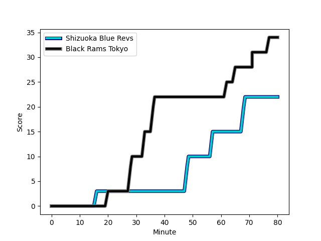
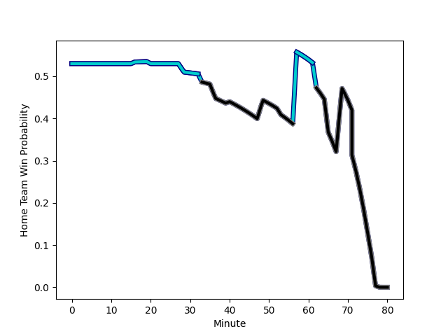

---  
layout: page  
title: Black Rams Tokyo at Shizuoka Blue Revs; 34-22  
date: 2023-01-15 00:00:00 18:00:00 -0500  
categories: match review  
---
# Black Rams Tokyo (1467.61) at Shizuoka Blue Revs (1519.72); 34-22

# Prediction: Shizuoka Blue Revs by 9.2

Shizuoka Blue Revs by 5.2 on a neutral field
## Scores over Time

## Win Probability over Time

# Pre-Match Prediction: Shizuoka Blue Revs by 9.1

Shizuoka Blue Revs by 5.1 on a neutral pitch

|   Away Minutes | Away Player                                                         |   Away elo |   Away Percentile |   Number |   Home Percentile |   Home elo | Home Player                                                         |   Home Minutes |
|---------------:|:--------------------------------------------------------------------|-----------:|------------------:|---------:|------------------:|-----------:|:--------------------------------------------------------------------|---------------:|
|             60 | [Yuichiro Taniguchi](..//playerfiles//YuichiroTaniguchi_cleaned.md) |     104.2  |                75 |        1 |                60 |      98.66 | [Kazuhiro Kawata](..//playerfiles//KazuhiroKawata_cleaned.md)       |             64 |
|             60 | [Masaaki Onishi](..//playerfiles//MasaakiOnishi_cleaned.md)         |      80.59 |                15 |        2 |                62 |      99.61 | [Takeshi Hino](..//playerfiles//TakeshiHino_cleaned.md)             |             76 |
|             53 | [Daigo Sasagawa](..//playerfiles//DaigoSasagawa_cleaned.md)         |      95.65 |                51 |        3 |                60 |      98.88 | [Heiichiro Ito](..//playerfiles//HeiichiroIto_cleaned.md)           |             62 |
|             80 | [Josh Goodhue](..//playerfiles//JoshGoodhue_cleaned.md)             |      90.55 |                34 |        4 |                82 |     110.79 | [Yuya Odo](..//playerfiles//YuyaOdo_cleaned.md)                     |             80 |
|             69 | [Pohiva Lotoahea](..//playerfiles//PohivaLotoahea_cleaned.md)       |     114.82 |                87 |        5 |                78 |     107.98 | [Eishin Kuwano](..//playerfiles//EishinKuwano_cleaned.md)           |             57 |
|             57 | [Mike Stolberg](..//playerfiles//MikeStolberg_cleaned.md)           |      69.09 |                 3 |        6 |                41 |      92.77 | [Riki Sugihara](..//playerfiles//RikiSugihara_cleaned.md)           |             80 |
|             80 | [Shuhei Matsuhashi](..//playerfiles//ShuheiMatsuhashi_cleaned.md)   |      93.24 |                43 |        7 |                34 |      90.19 | [Richard Goh Jones](..//playerfiles//RichardGohJones_cleaned.md)    |             62 |
|             80 | [Talau Fakatava](..//playerfiles//TalauFakatava_cleaned.md)         |      89.8  |                32 |        8 |                93 |     125.61 | [Kwagga Smith](..//playerfiles//KwaggaSmith_cleaned.md)             |             80 |
|             63 | [Syota Yamamoto](..//playerfiles//SyotaYamamoto_cleaned.md)         |     115.5  |                89 |        9 |                75 |     106.14 | [Minoru Tanoue](..//playerfiles//MinoruTanoue_cleaned.md)           |             40 |
|             57 | [Kohei Horigome](..//playerfiles//KoheiHorigome_cleaned.md)         |      89.29 |                27 |       10 |               nan |      97.17 | [Clinton Swart](..//playerfiles//ClintonSwart_cleaned.md)           |             40 |
|             80 | [Netani Vakayalia](..//playerfiles//NetaniVakayalia_cleaned.md)     |      94.6  |                45 |       11 |                24 |      87.32 | [Hironori Yatomi](..//playerfiles//HironoriYatomi_cleaned.md)       |             53 |
|             69 | [Hadleigh Parkes](..//playerfiles//HadleighParkes_cleaned.md)       |     105.37 |                72 |       12 |                36 |      90.19 | [Viliami Tahitu'a](..//playerfiles//ViliamiTahitu'a_cleaned.md)     |             80 |
|             80 | [Ryohei Isoda](..//playerfiles//RyoheiIsoda_cleaned.md)             |     113.89 |                85 |       13 |                79 |     109.87 | [Malo Tuitama](..//playerfiles//MaloTuitama_cleaned.md)             |             80 |
|             80 | [Main Taira](..//playerfiles//MainTaira_cleaned.md)                 |      85.02 |                19 |       14 |               nan |      95    | [Tomokazu Kira](..//playerfiles//TomokazuKira_cleaned.md)           |             80 |
|             80 | [Matt McGahan](..//playerfiles//MattMcGahan_cleaned.md)             |     118.23 |                87 |       15 |                71 |     106.02 | [Keagan Faria](..//playerfiles//KeaganFaria_cleaned.md)             |             80 |
|             27 | [Taichi Chiba](..//playerfiles//TaichiChiba_cleaned.md)             |      91.95 |                37 |       16 |                94 |     121.43 | [Bryn Hall](..//playerfiles//BrynHall_cleaned.md)                   |             40 |
|             23 | [Isaac Lucas](..//playerfiles//IsaacLucas_cleaned.md)               |      92.52 |                31 |       17 |                 2 |      66.58 | [Sho Kiyohara](..//playerfiles//ShoKiyohara_cleaned.md)             |             40 |
|             23 | [Brodi McCurran](..//playerfiles//BrodiMcCurran_cleaned.md)         |     121.05 |                91 |       18 |                96 |     130.43 | [Kenta Shikao](..//playerfiles//KentaShikao_cleaned.md)             |             27 |
|             20 | [Kazuhiro Koike](..//playerfiles//KazuhiroKoike_cleaned.md)         |      92.24 |               nan |       19 |                12 |      77.38 | [Samuela Anise](..//playerfiles//SamuelaAnise_cleaned.md)           |             23 |
|             20 | [Kazuma Nishi](..//playerfiles//KazumaNishi_cleaned.md)             |      85.23 |                14 |       20 |                94 |     126.63 | [Ryosuke Funahashi](..//playerfiles//RyosukeFunahashi_cleaned.md)   |             18 |
|             17 | [Toshiya Takahashi](..//playerfiles//ToshiyaTakahashi_cleaned.md)   |      92.77 |                32 |       21 |               nan |      92.55 | [Shintaro Okamoto](..//playerfiles//ShintaroOkamoto_cleaned.md)     |             16 |
|             11 | [Yuki Ikeda](..//playerfiles//YukiIkeda_cleaned.md)                 |     103.01 |                59 |       22 |                41 |      93.14 | [Takayoshi Mohara](..//playerfiles//TakayoshiMohara_cleaned.md)     |             18 |
|             11 | [Nathan Hughes](..//playerfiles//NathanHughes_cleaned.md)           |     115.82 |                86 |       23 |               nan |      94.14 | [Richmond Tongatama](..//playerfiles//RichmondTongatama_cleaned.md) |              4 |

