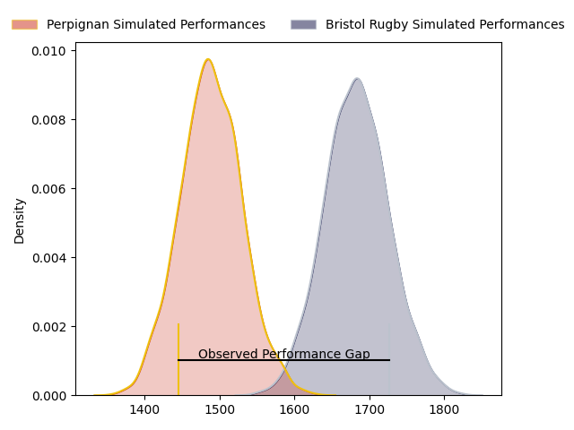
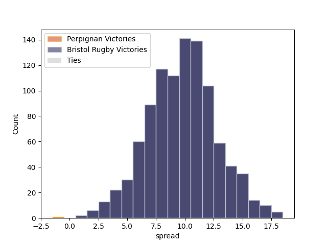
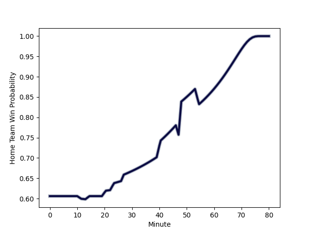

---  
layout: page  
title: Perpignan at Bristol Rugby; 19-33  
date: 2023-01-20 21:00:00 18:00:00 -0500  
categories: match review  
---
# Perpignan at Bristol Rugby; 19-33

# Club Level Predictions

The first set of predictions treats a club as the smallest object, as the club develops its members, organizes a gameplan, and deploys its players as needed for each match. This club model has a prediction of 0.754, which translates to predicting Bristol Rugby to win by 9.8.

Each club has a rating and a rating deviation (simiar to a Glicko system), and expected performances can be generated. This allows for simulated matches and spreads like the ones below.
## Projected Performances

## Projected Spreads

# Player Level Predictions

Treating teams instead as an entity made up of the currently active players, I have ratings for each player in an altogether different system. These can be combined to form team ratings once teamsheets are announced, weighting starters a bit higher than the reserves. After the match is played, players can be weighted by their minutes on the field, allowing for an accurate measure of the team's composition. With these compiled team ratings, we can make predictions, measure inaccuracy, and update the individual player ratings.
## Prediction with Player Minutes: Bristol Rugby by 20.6

Bristol Rugby by 16.6 on a neutral field
## Scores over Time

## Win Probability over Time

## Prediction without Player Minutes: Bristol Rugby by 19.5

Bristol Rugby by 15.5 on a neutral pitch

|   Away Minutes | Away Player                                                               |   Away elo |   Away Percentile |   Number |   Home Percentile |   Home elo | Home Player                                                   |   Home Minutes |
|---------------:|:--------------------------------------------------------------------------|-----------:|------------------:|---------:|------------------:|-----------:|:--------------------------------------------------------------|---------------:|
|             51 | [Samir Bououda](..//playerfiles//SamirBououda_cleaned.md)                 |      95    |               nan |        1 |                37 |      91.72 | [Ellis Genge](..//playerfiles//EllisGenge_cleaned.md)         |             72 |
|             55 | [Mike Tadjer Barbosa](..//playerfiles//MikeTadjerBarbosa_cleaned.md)      |      92.49 |                43 |        2 |                75 |     104.84 | [Harry Thacker](..//playerfiles//HarryThacker_cleaned.md)     |             76 |
|             55 | [Akato Fakatika](..//playerfiles//AkatoFakatika_cleaned.md)               |      88.35 |                25 |        3 |                86 |     110.3  | [Kyle Sinckler](..//playerfiles//KyleSinckler_cleaned.md)     |             70 |
|             55 | [Bastien Chinarro](..//playerfiles//BastienChinarro_cleaned.md)           |      92.22 |                39 |        4 |                86 |     115.48 | [Joe Batley](..//playerfiles//JoeBatley_cleaned.md)           |             80 |
|             72 | [Andrei Mahu](..//playerfiles//AndreiMahu_cleaned.md)                     |      94.97 |                47 |        5 |                80 |     109.26 | [Chris Vui](..//playerfiles//ChrisVui_cleaned.md)             |             60 |
|             80 | [Taniela Ramasibana](..//playerfiles//TanielaRamasibana_cleaned.md)       |      85.9  |                22 |        6 |                40 |      92.44 | [Magnus Bradbury](..//playerfiles//MagnusBradbury_cleaned.md) |             80 |
|             80 | [Ewan Bertheau](..//playerfiles//EwanBertheau_cleaned.md)                 |      85.26 |                20 |        7 |                80 |     112.94 | [Daniel Thomas](..//playerfiles//DanielThomas_cleaned.md)     |             80 |
|             80 | [Valentin Moro](..//playerfiles//ValentinMoro_cleaned.md)                 |      90.79 |                34 |        8 |                87 |     115.89 | [Fitz Harding](..//playerfiles//FitzHarding_cleaned.md)       |             73 |
|             80 | [Matteo Rodor](..//playerfiles//MatteoRodor_cleaned.md)                   |      88.24 |                24 |        9 |                82 |     109.45 | [Harry Randall](..//playerfiles//HarryRandall_cleaned.md)     |             53 |
|             48 | [Alexandre Perez](..//playerfiles//AlexandrePerez_cleaned.md)             |      92.74 |               nan |       10 |                75 |     108.5  | [AJ MacGinty](..//playerfiles//AJMacGinty_cleaned.md)         |             63 |
|             80 | [Lucas Dubois](..//playerfiles//LucasDubois_cleaned.md)                   |      95.81 |                49 |       11 |                58 |      98.62 | [Ratu Naulago](..//playerfiles//RatuNaulago_cleaned.md)       |             80 |
|             80 | [Patricio Fernandez](..//playerfiles//PatricioFernandez_cleaned.md)       |     108.81 |                78 |       12 |                14 |      83.48 | [James Williams](..//playerfiles//JamesWilliams_cleaned.md)   |             80 |
|             80 | [Edward Sawailau](..//playerfiles//EdwardSawailau_cleaned.md)             |      77.6  |                11 |       13 |                89 |     118.39 | [Semi Radradra](..//playerfiles//SemiRadradra_cleaned.md)     |             80 |
|             61 | [Nino Seguela](..//playerfiles//NinoSeguela_cleaned.md)                   |      89.57 |                31 |       14 |                13 |      81.01 | [Deago Bailey](..//playerfiles//DeagoBailey_cleaned.md)       |             34 |
|             48 | [Ali Crossdale](..//playerfiles//AliCrossdale_cleaned.md)                 |     111.48 |                82 |       15 |                61 |     100.96 | [Richard Lane](..//playerfiles//RichardLane_cleaned.md)       |             80 |
|             29 | [Xavier Chiocci](..//playerfiles//XavierChiocci_cleaned.md)               |      81.01 |                12 |       16 |                87 |     111.86 | [Jake Woolmore](..//playerfiles//JakeWoolmore_cleaned.md)     |              8 |
|             25 | [Victor Montgaillard](..//playerfiles//VictorMontgaillard_cleaned.md)     |      87.99 |                28 |       17 |               nan |      95.23 | [Fred Davies](..//playerfiles//FredDavies_cleaned.md)         |              4 |
|             25 | [Vakhtang Jintcharadze](..//playerfiles//VakhtangJintcharadze_cleaned.md) |      85.72 |               nan |       18 |                17 |      84.88 | [Max Lahiff](..//playerfiles//MaxLahiff_cleaned.md)           |             10 |
|             25 | [Posolo Tuilagi](..//playerfiles//PosoloTuilagi_cleaned.md)               |      92.18 |               nan |       19 |                40 |      92.49 | [Jake Heenan](..//playerfiles//JakeHeenan_cleaned.md)         |              7 |
|              8 | [Victor Moreaux](..//playerfiles//VictorMoreaux_cleaned.md)               |      89.77 |                31 |       20 |                 8 |      76.65 | [John Hawkins](..//playerfiles//JohnHawkins_cleaned.md)       |             20 |
|             32 | [Lenny Viola](..//playerfiles//LennyViola_cleaned.md)                     |      95.94 |               nan |       21 |                12 |      81.69 | [Andy Uren](..//playerfiles//AndyUren_cleaned.md)             |             27 |
|             19 | [Keanu Desrues](..//playerfiles//KeanuDesrues_cleaned.md)                 |      94.36 |               nan |       22 |                96 |     137.1  | [Callum Sheedy](..//playerfiles//CallumSheedy_cleaned.md)     |             17 |
|             32 | [Lilian Pichon](..//playerfiles//LilianPichon_cleaned.md)                 |      92.74 |               nan |       23 |                16 |      87.46 | [Jack Bates](..//playerfiles//JackBates_cleaned.md)           |             46 |

