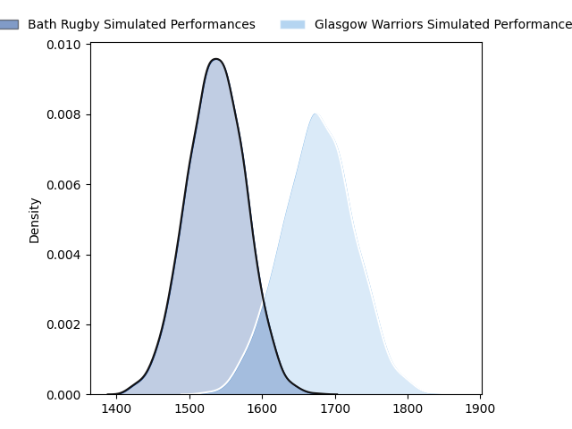
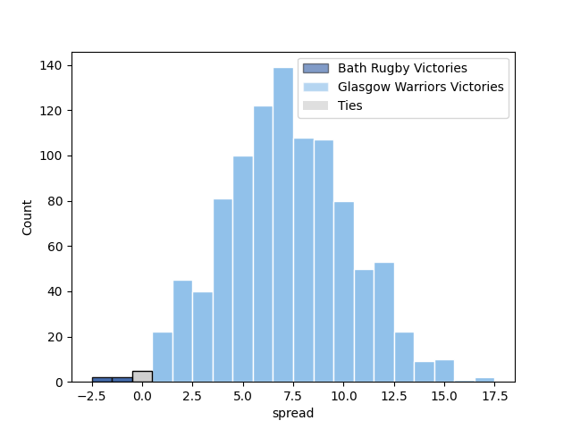

---  
layout: page  
title: Bath Rugby at Glasgow Warriors; 19-19  
date: 2023-01-20 21:00:00 18:00:00 -0500  
categories: match review  
---
# Bath Rugby at Glasgow Warriors; 19-19

# Club Level Predictions

The first set of predictions treats a club as the smallest object, as the club develops its members, organizes a gameplan, and deploys its players as needed for each match. This club model has a prediction of 0.692, which translates to predicting Glasgow Warriors to win by 7.1.

Each club has a rating and a rating deviation (simiar to a Glicko system), and expected performances can be generated. This allows for simulated matches and spreads like the ones below.
## Projected Performances

## Projected Spreads

# Player Level Predictions

Treating teams instead as an entity made up of the currently active players, I have ratings for each player in an altogether different system. These can be combined to form team ratings once teamsheets are announced, weighting starters a bit higher than the reserves. After the match is played, players can be weighted by their minutes on the field, allowing for an accurate measure of the team's composition. With these compiled team ratings, we can make predictions, measure inaccuracy, and update the individual player ratings.
## Prediction with Player Minutes: Glasgow Warriors by 11.3

Glasgow Warriors by 7.3 on a neutral field
## Scores over Time

## Win Probability over Time

## Prediction without Player Minutes: Glasgow Warriors by 11.2

Glasgow Warriors by 7.2 on a neutral pitch

|   Away Minutes | Away Player                                                              |   Away elo |   Away Percentile |   Number |   Home Percentile |   Home elo | Home Player                                                               |   Home Minutes |
|---------------:|:-------------------------------------------------------------------------|-----------:|------------------:|---------:|------------------:|-----------:|:--------------------------------------------------------------------------|---------------:|
|             52 | [Juan Schoeman](..//playerfiles//JuanSchoeman_cleaned.md)                |      95.15 |                48 |        1 |                94 |     118.54 | [Jamie Bhatti](..//playerfiles//JamieBhatti_cleaned.md)                   |             52 |
|             63 | [Tom Dunn](..//playerfiles//TomDunn_cleaned.md)                          |     117.4  |                91 |        2 |                70 |     102.81 | [Johnny Matthews](..//playerfiles//JohnnyMatthews_cleaned.md)             |             52 |
|             52 | [Johannes Jonker](..//playerfiles//JohannesJonker_cleaned.md)            |      88.34 |               nan |        3 |                84 |     108.99 | [Lucio Sordoni](..//playerfiles//LucioSordoni_cleaned.md)                 |             52 |
|             65 | [Will Spencer](..//playerfiles//WillSpencer_cleaned.md)                  |      90.63 |                38 |        4 |                78 |     108.58 | [Alex Samuel](..//playerfiles//AlexSamuel_cleaned.md)                     |             41 |
|             80 | [Fergus Lee-Warner](..//playerfiles//FergusLee-Warner_cleaned.md)        |      81.89 |                15 |        5 |                89 |     117.43 | [Richie Gray](..//playerfiles//RichieGray_cleaned.md)                     |             67 |
|             80 | [Ted Hill](..//playerfiles//TedHill_cleaned.md)                          |      96.58 |                51 |        6 |                79 |     109.05 | [Euan Ferrie](..//playerfiles//EuanFerrie_cleaned.md)                     |             80 |
|             80 | [Chris Cloete](..//playerfiles//ChrisCloete_cleaned.md)                  |     132.43 |                98 |        7 |                38 |      91.6  | [Sione Vailanu](..//playerfiles//SioneVailanu_cleaned.md)                 |             77 |
|             75 | [Miles Reid](..//playerfiles//MilesReid_cleaned.md)                      |     124.48 |                94 |        8 |                88 |     115.73 | [Matt Fagerson](..//playerfiles//MattFagerson_cleaned.md)                 |             80 |
|             61 | [Louis Schreuder](..//playerfiles//LouisSchreuder_cleaned.md)            |     108.12 |                80 |        9 |                72 |     104.54 | [Ali Price](..//playerfiles//AliPrice_cleaned.md)                         |             52 |
|             53 | [Piers Francis](..//playerfiles//PiersFrancis_cleaned.md)                |     116.89 |                86 |       10 |                50 |      97.86 | [Tom Jordan](..//playerfiles//TomJordan_cleaned.md)                       |             67 |
|             80 | [Joe Cokanasiga](..//playerfiles//JoeCokanasiga_cleaned.md)              |     114.72 |                86 |       11 |                81 |     110.31 | [Kyle Steyn](..//playerfiles//KyleSteyn_cleaned.md)                       |             80 |
|             70 | [Cameron Redpath](..//playerfiles//CameronRedpath_cleaned.md)            |     111.43 |                81 |       12 |                19 |      83.49 | [Huw Jones](..//playerfiles//HuwJones_cleaned.md)                         |             80 |
|             80 | [Ollie Lawrence](..//playerfiles//OllieLawrence_cleaned.md)              |      87.92 |                29 |       13 |                34 |      89.92 | [Sione Tuipulotu](..//playerfiles//SioneTuipulotu_cleaned.md)             |             80 |
|             80 | [Max Ojomoh](..//playerfiles//MaxOjomoh_cleaned.md)                      |      67.18 |                 3 |       14 |                79 |     109.1  | [Sebastian Cancelliere](..//playerfiles//SebastianCancelliere_cleaned.md) |             80 |
|             80 | [Orlando Bailey](..//playerfiles//OrlandoBailey_cleaned.md)              |      71.02 |                 3 |       15 |                39 |      91.16 | [Josh McKay](..//playerfiles//JoshMcKay_cleaned.md)                       |             80 |
|             28 | [Valery Morozov](..//playerfiles//ValeryMorozov_cleaned.md)              |      89.1  |                28 |       16 |                51 |      95.84 | [Nathan McBeth](..//playerfiles//NathanMcBeth_cleaned.md)                 |             28 |
|             17 | [Niall Annett](..//playerfiles//NiallAnnett_cleaned.md)                  |      87.39 |                28 |       17 |                98 |     131.71 | [George Turner](..//playerfiles//GeorgeTurner_cleaned.md)                 |             28 |
|             28 | [D'Arcy Rae](..//playerfiles//D'ArcyRae_cleaned.md)                      |      62.06 |                 1 |       18 |                73 |     107.15 | [Lewis Bean](..//playerfiles//LewisBean_cleaned.md)                       |             39 |
|             15 | [Tom Ellis](..//playerfiles//TomEllis_cleaned.md)                        |      76.13 |                 8 |       19 |                45 |      94.06 | [JP du Preez](..//playerfiles//JPduPreez_cleaned.md)                      |             13 |
|              5 | [Richard de Carpentier](..//playerfiles//RicharddeCarpentier_cleaned.md) |     103.64 |                65 |       20 |                93 |     125.46 | [Tom Gordon](..//playerfiles//TomGordon_cleaned.md)                       |              3 |
|             19 | [Ben Spencer](..//playerfiles//BenSpencer_cleaned.md)                    |      99.66 |                59 |       21 |                97 |     130.25 | [George Horne](..//playerfiles//GeorgeHorne_cleaned.md)                   |             28 |
|             27 | [Matt Gallagher](..//playerfiles//MattGallagher_cleaned.md)              |     132.94 |                95 |       22 |                25 |      89.52 | [Duncan Weir](..//playerfiles//DuncanWeir_cleaned.md)                     |             13 |
|             10 | [Jonathan Joseph](..//playerfiles//JonathanJoseph_cleaned.md)            |     114.43 |                85 |       23 |                33 |      91.8  | [Simon Berghan](..//playerfiles//SimonBerghan_cleaned.md)                 |             28 |

