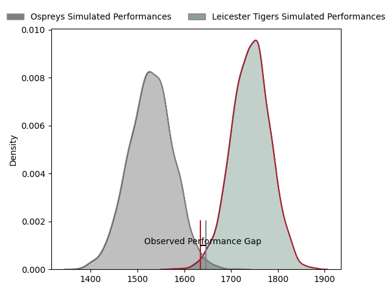
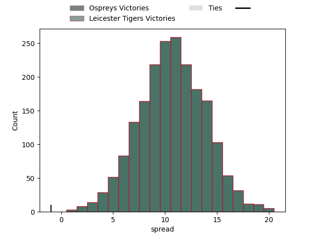
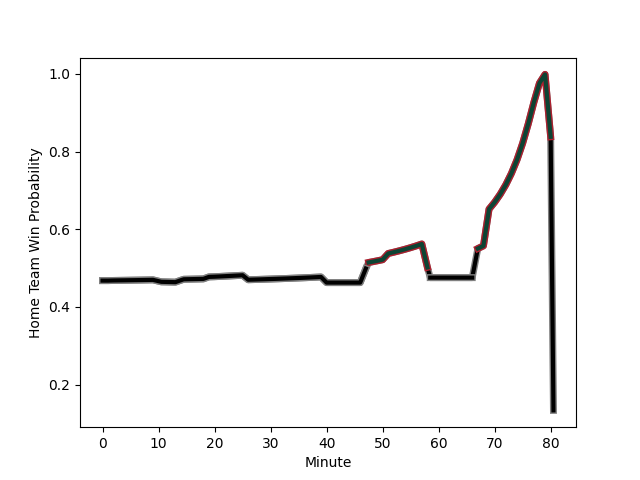

---  
layout: page  
title: Ospreys at Leicester Tigers; 27-26  
date: 2023-01-20 21:00:00 18:00:00 -0500  
categories: match review  
---
# Ospreys at Leicester Tigers; 27-26

# Club Level Predictions

The first set of predictions treats a club as the smallest object, as the club develops its members, organizes a gameplan, and deploys its players as needed for each match. This club model has a prediction of 0.771, which translates to predicting Leicester Tigers to win by 10.7.

Each club has a rating and a rating deviation (simiar to a Glicko system), and expected performances can be generated. This allows for simulated matches and spreads like the ones below.
## Projected Performances

## Projected Spreads

# Player Level Predictions

Treating teams instead as an entity made up of the currently active players, I have ratings for each player in an altogether different system. These can be combined to form team ratings once teamsheets are announced, weighting starters a bit higher than the reserves. After the match is played, players can be weighted by their minutes on the field, allowing for an accurate measure of the team's composition. With these compiled team ratings, we can make predictions, measure inaccuracy, and update the individual player ratings.
## Prediction with Player Minutes: Ospreys by 1.6

Ospreys by 5.6 on a neutral field
## Scores over Time

## Win Probability over Time

## Prediction without Player Minutes: Ospreys by 1.6

Ospreys by 2.4 on a neutral pitch

|   Away Minutes | Away Player                                                                 |   Away elo |   Away Percentile |   Number |   Home Percentile |   Home elo | Home Player                                                          |   Home Minutes |
|---------------:|:----------------------------------------------------------------------------|-----------:|------------------:|---------:|------------------:|-----------:|:---------------------------------------------------------------------|---------------:|
|             51 | [Nicky Smith](..//playerfiles//NickySmith_cleaned.md)                       |      85.91 |                19 |        1 |                56 |      97.62 | [James Whitcombe](..//playerfiles//JamesWhitcombe_cleaned.md)        |             77 |
|             26 | [Dewi Lake](..//playerfiles//DewiLake_cleaned.md)                           |      87.71 |                26 |        2 |                 9 |      78.51 | [Charlie Clare](..//playerfiles//CharlieClare_cleaned.md)            |             55 |
|             67 | [Tom Botha](..//playerfiles//TomBotha_cleaned.md)                           |      89.95 |                31 |        3 |                29 |      89.45 | [Dan Cole](..//playerfiles//DanCole_cleaned.md)                      |             59 |
|             80 | [Adam Beard](..//playerfiles//AdamBeard_cleaned.md)                         |      91.11 |                36 |        4 |                93 |     122.31 | [Ollie Chessum](..//playerfiles//OllieChessum_cleaned.md)            |             80 |
|             59 | [Alun Wyn Jones](..//playerfiles//AlunWynJones_cleaned.md)                  |     117.58 |                89 |        5 |                87 |     115.21 | [Cameron Henderson](..//playerfiles//CameronHenderson_cleaned.md)    |             65 |
|             80 | [Rhys Davies](..//playerfiles//RhysDavies_cleaned.md)                       |     117.12 |                89 |        6 |                87 |     116.22 | [Hanro Liebenberg](..//playerfiles//HanroLiebenberg_cleaned.md)      |             80 |
|             80 | [Justin Tipuric](..//playerfiles//JustinTipuric_cleaned.md)                 |     130.33 |                96 |        7 |                84 |     113.13 | [Tommy Reffell](..//playerfiles//TommyReffell_cleaned.md)            |             80 |
|             80 | [Jac Morgan](..//playerfiles//JacMorgan_cleaned.md)                         |     102.89 |                64 |        8 |                18 |      85.06 | [Olly Cracknell](..//playerfiles//OllyCracknell_cleaned.md)          |             67 |
|             80 | [Reuben Morgan-Williams](..//playerfiles//ReubenMorgan-Williams_cleaned.md) |     116.96 |                86 |        9 |                57 |      98.94 | [Jack van Poortvliet](..//playerfiles//JackvanPoortvliet_cleaned.md) |             69 |
|             80 | [Owen Williams](..//playerfiles//OwenWilliams_cleaned.md)                   |     131.75 |                94 |       10 |                93 |     130.14 | [Handre Pollard](..//playerfiles//HandrePollard_cleaned.md)          |             80 |
|             80 | [Keelan Giles](..//playerfiles//KeelanGiles_cleaned.md)                     |      86.91 |                23 |       11 |                83 |     112.25 | [Harry Simmons](..//playerfiles//HarrySimmons_cleaned.md)            |             64 |
|             59 | [Joe Hawkins](..//playerfiles//JoeHawkins_cleaned.md)                       |      85.7  |                24 |       12 |                82 |     112.2  | [Dan Kelly](..//playerfiles//DanKelly_cleaned.md)                    |             80 |
|             80 | [Michael Collins](..//playerfiles//MichaelCollins_cleaned.md)               |     127.33 |                94 |       13 |                12 |      79.34 | [Matt Scott](..//playerfiles//MattScott_cleaned.md)                  |             80 |
|             80 | [Alex Cuthbert](..//playerfiles//AlexCuthbert_cleaned.md)                   |     133.78 |                97 |       14 |                38 |      92.68 | [Harry Potter](..//playerfiles//HarryPotter_cleaned.md)              |             80 |
|             20 | [Cai Evans](..//playerfiles//CaiEvans_cleaned.md)                           |     105.26 |                69 |       15 |                73 |     105.57 | [Freddie Steward](..//playerfiles//FreddieSteward_cleaned.md)        |             80 |
|             29 | [Gareth Thomas](..//playerfiles//GarethThomas_cleaned.md)                   |      61.35 |                 1 |       16 |                48 |      95.08 | [Dan Richardson](..//playerfiles//DanRichardson_cleaned.md)          |              3 |
|             54 | [Scott Baldwin](..//playerfiles//ScottBaldwin_cleaned.md)                   |      97.22 |                56 |       17 |                49 |      94.49 | [Julian Montoya](..//playerfiles//JulianMontoya_cleaned.md)          |             25 |
|             21 | [Morgan Morris](..//playerfiles//MorganMorris_cleaned.md)                   |      92.21 |                35 |       18 |                25 |      91.12 | [Will Hurd](..//playerfiles//WillHurd_cleaned.md)                    |             21 |
|             13 | [Rhys Henry](..//playerfiles//RhysHenry_cleaned.md)                         |     107.83 |                82 |       19 |                99 |     155.48 | [Harry Wells](..//playerfiles//HarryWells_cleaned.md)                |             15 |
|             21 | [Keiran Williams](..//playerfiles//KeiranWilliams_cleaned.md)               |     121.64 |                92 |       20 |                31 |      88.95 | [Sean Jansen](..//playerfiles//SeanJansen_cleaned.md)                |             13 |
|             60 | [George North](..//playerfiles//GeorgeNorth_cleaned.md)                     |     105.59 |                72 |       21 |                44 |      94.53 | [Ben Youngs](..//playerfiles//BenYoungs_cleaned.md)                  |             11 |
|            nan | nan                                                                         |     nan    |               nan |       22 |                44 |      93.14 | [Charlie Atkinson](..//playerfiles//CharlieAtkinson_cleaned.md)      |             16 |

