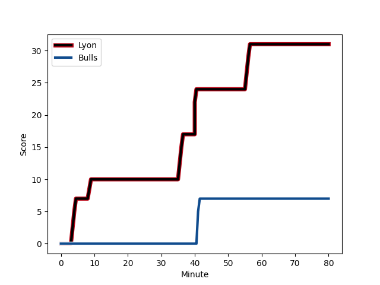
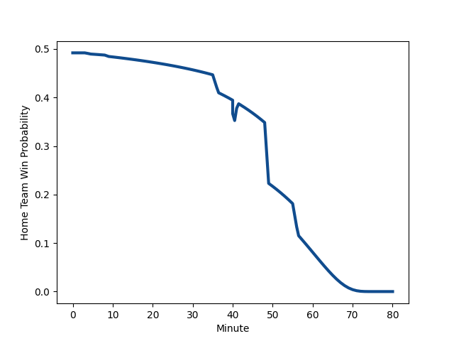

---  
layout: page  
title: Bulls at Lyon; 7-31  
date: 2023-01-20 21:00:00 18:00:00 -0500  
categories: match review  
---
# Bulls (1555.35) at Lyon (1541.57); 7-31

# Prediction: Lyon by 2.6

Bulls by 1.4 on a neutral field
## Scores over Time

## Win Probability over Time

# Pre-Match Prediction: Bulls by 6.5

Lyon by 2.5 on a neutral pitch

|   Away Minutes | Away Player                                                          |   Away elo |   Away Percentile |   Number |   Home Percentile |   Home elo | Home Player                                                                |   Home Minutes |
|---------------:|:---------------------------------------------------------------------|-----------:|------------------:|---------:|------------------:|-----------:|:---------------------------------------------------------------------------|---------------:|
|             49 | [Simphiwe Matanzima](..//playerfiles//SimphiweMatanzima_cleaned.md)  |     103.47 |                73 |        1 |                48 |      95.05 | [Sebastien Taofifenua](..//playerfiles//SebastienTaofifenua_cleaned.md)    |             54 |
|             49 | [Bismarck du Plessis](..//playerfiles//BismarckduPlessis_cleaned.md) |     112.34 |                86 |        2 |                 8 |      77.19 | [Guillaume Marchand](..//playerfiles//GuillaumeMarchand_cleaned.md)        |             54 |
|             49 | [Francois Klopper](..//playerfiles//FrancoisKlopper_cleaned.md)      |      90.29 |                28 |        3 |                90 |     114.33 | [Demba Bamba](..//playerfiles//DembaBamba_cleaned.md)                      |             54 |
|             80 | [Ruan Vermaak](..//playerfiles//RuanVermaak_cleaned.md)              |      89.03 |                30 |        4 |                96 |     130.52 | [Felix Lambey](..//playerfiles//FelixLambey_cleaned.md)                    |             36 |
|             52 | [Janko Swanepoel](..//playerfiles//JankoSwanepoel_cleaned.md)        |      93.98 |                46 |        5 |                79 |     108.49 | [Romain Taofifenua](..//playerfiles//RomainTaofifenua_cleaned.md)          |             65 |
|             80 | [Marco van Staden](..//playerfiles//MarcovanStaden_cleaned.md)       |      98.37 |                57 |        6 |                56 |      98.16 | [Dylan Cretin](..//playerfiles//DylanCretin_cleaned.md)                    |             80 |
|             62 | [Cyle Brink](..//playerfiles//CyleBrink_cleaned.md)                  |      97.23 |                53 |        7 |                69 |     103.6  | [Patrick Sobela](..//playerfiles//PatrickSobela_cleaned.md)                |             80 |
|             80 | [Nizaam Carr](..//playerfiles//NizaamCarr_cleaned.md)                |      80.46 |                12 |        8 |                93 |     125.36 | [Jordan Taufua](..//playerfiles//JordanTaufua_cleaned.md)                  |             64 |
|             80 | [Embrose Papier](..//playerfiles//EmbrosePapier_cleaned.md)          |     108.31 |                80 |        9 |                82 |     109.24 | [Jean-Marc Doussain](..//playerfiles//Jean-MarcDoussain_cleaned.md)        |             70 |
|             64 | [Johan Goosen](..//playerfiles//JohanGoosen_cleaned.md)              |      89.53 |                28 |       10 |                 4 |      73.51 | [Leo Berdeu](..//playerfiles//LeoBerdeu_cleaned.md)                        |             80 |
|             80 | [David Kriel](..//playerfiles//DavidKriel_cleaned.md)                |     127.43 |                95 |       11 |                48 |      95.48 | [Ethan Dumortier](..//playerfiles//EthanDumortier_cleaned.md)              |             80 |
|             80 | [Cornal Hendricks](..//playerfiles//CornalHendricks_cleaned.md)      |      98.73 |                55 |       12 |                83 |     112.65 | [Thibault Regard](..//playerfiles//ThibaultRegard_cleaned.md)              |             40 |
|             80 | [Wandisile Simelane](..//playerfiles//WandisileSimelane_cleaned.md)  |     102.08 |                64 |       13 |                 5 |      71.25 | [Josiah Maraku](..//playerfiles//JosiahMaraku_cleaned.md)                  |             80 |
|             80 | [Canan Moodie](..//playerfiles//CananMoodie_cleaned.md)              |     119.66 |                90 |       14 |                99 |     149.33 | [Josua Tuisova Ratulevu](..//playerfiles//JosuaTuisovaRatulevu_cleaned.md) |             80 |
|             58 | [Kurt-Lee Arendse](..//playerfiles//Kurt-LeeArendse_cleaned.md)      |     143.14 |                98 |       15 |                65 |     103.21 | [Toby Arnold](..//playerfiles//TobyArnold_cleaned.md)                      |             80 |
|             31 | [Jacques du Plessis](..//playerfiles//JacquesduPlessis_cleaned.md)   |     113.45 |                85 |       16 |                12 |      80.81 | [Hamza Kaabeche](..//playerfiles//HamzaKaabeche_cleaned.md)                |             26 |
|             31 | [Mornay Smith](..//playerfiles//MornaySmith_cleaned.md)              |      94.23 |                45 |       17 |                90 |     116.17 | [Liam Coltman](..//playerfiles//LiamColtman_cleaned.md)                    |             26 |
|             28 | [Ruan Nortje](..//playerfiles//RuanNortje_cleaned.md)                |      99.28 |                60 |       18 |                16 |      86.03 | [Paulo Tafili](..//playerfiles//PauloTafili_cleaned.md)                    |             26 |
|             18 | [Elrigh Louw](..//playerfiles//ElrighLouw_cleaned.md)                |      94.93 |                42 |       19 |                36 |      91.1  | [Temo Mayanavanua](..//playerfiles//TemoMayanavanua_cleaned.md)            |             44 |
|             16 | [Chris Smith](..//playerfiles//ChrisSmith_cleaned.md)                |     112.75 |                80 |       20 |                75 |     106.5  | [Mickael Guillard](..//playerfiles//MickaelGuillard_cleaned.md)            |             15 |
|             31 | [Gerhard Steenekamp](..//playerfiles//GerhardSteenekamp_cleaned.md)  |     106.62 |                80 |       21 |                43 |      93.14 | [Theo William](..//playerfiles//TheoWilliam_cleaned.md)                    |             16 |
|             22 | [Lionel Mapoe](..//playerfiles//LionelMapoe_cleaned.md)              |     114.54 |                86 |       22 |                93 |     123.92 | [Kyle Godwin](..//playerfiles//KyleGodwin_cleaned.md)                      |             40 |
|            nan | nan                                                                  |     nan    |               nan |       23 |               nan |      95    | [Liam Rimet](..//playerfiles//LiamRimet_cleaned.md)                        |             10 |

