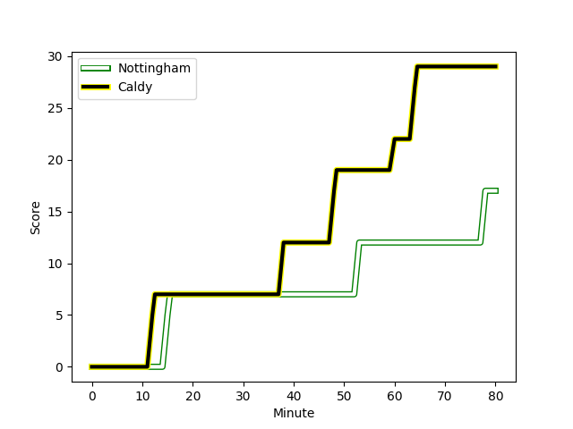
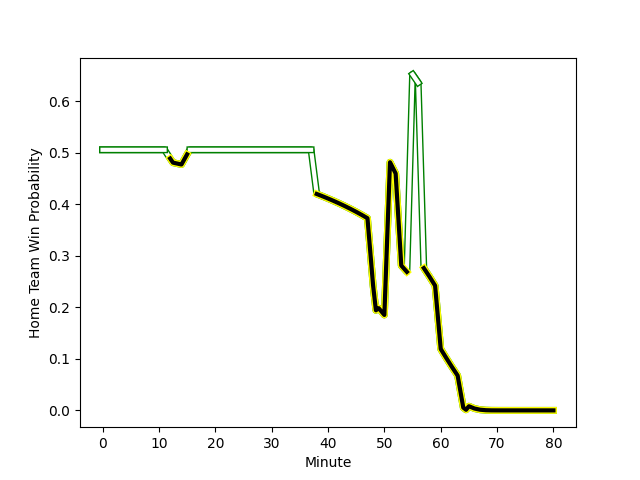

---  
layout: page  
title: Caldy at Nottingham; 29-17  
date: 2023-01-20 20:45:00 18:00:00 -0500  
categories: match review  
---
# Caldy (1461.68) at Nottingham (1471.32); 29-17

# Prediction: Nottingham by 5.0

Nottingham by 1.0 on a neutral field
## Scores over Time

## Win Probability over Time

# Pre-Match Prediction: Nottingham by 3.5

Caldy by 0.5 on a neutral pitch

|   Away Minutes | Away Player                                                     |   Away elo |   Away Percentile |   Number |   Home Percentile |   Home elo | Home Player                                                                     |   Home Minutes |
|---------------:|:----------------------------------------------------------------|-----------:|------------------:|---------:|------------------:|-----------:|:--------------------------------------------------------------------------------|---------------:|
|             70 | [Adam Aigbokhae](..//playerfiles//AdamAigbokhae_cleaned.md)     |      98.47 |                59 |        1 |                47 |      94.58 | [Aniseko Sio](..//playerfiles//AnisekoSio_cleaned.md)                           |             57 |
|             70 | [Oliver Hearn](..//playerfiles//OliverHearn_cleaned.md)         |     100.71 |                65 |        2 |                81 |     107.28 | [Jack Dickinson](..//playerfiles//JackDickinson_cleaned.md)                     |             53 |
|             51 | [Nathan Rushton](..//playerfiles//NathanRushton_cleaned.md)     |      96.04 |                52 |        3 |                61 |      98.93 | [Ben Betts](..//playerfiles//BenBetts_cleaned.md)                               |             77 |
|             72 | [Sam Dickinson](..//playerfiles//SamDickinson_cleaned.md)       |     109.49 |                79 |        4 |                82 |     111.1  | [Callum Allen](..//playerfiles//CallumAllen_cleaned.md)                         |             65 |
|             80 | [Thomas Sanders](..//playerfiles//ThomasSanders_cleaned.md)     |      93.42 |                43 |        5 |                88 |     116.42 | [Iosefa Danny Wayne Fiaola](..//playerfiles//IosefaDannyWayneFiaola_cleaned.md) |             80 |
|             60 | [Harrison Crowe](..//playerfiles//HarrisonCrowe_cleaned.md)     |      88.23 |                26 |        6 |                 5 |      72.28 | [Scott Hall](..//playerfiles//ScottHall_cleaned.md)                             |             53 |
|             80 | [Callum Ridgway](..//playerfiles//CallumRidgway_cleaned.md)     |      99.71 |                61 |        7 |                89 |     118.2  | [Nathan Tweedy](..//playerfiles//NathanTweedy_cleaned.md)                       |             80 |
|             80 | [Josiah Dickinson](..//playerfiles//JosiahDickinson_cleaned.md) |      88.46 |                28 |        8 |                65 |     103.71 | [Josh Poullet](..//playerfiles//JoshPoullet_cleaned.md)                         |             80 |
|             65 | [Chris Pilgrim](..//playerfiles//ChrisPilgrim_cleaned.md)       |      93.04 |                40 |        9 |                10 |      79.62 | [Liam Slatem](..//playerfiles//LiamSlatem_cleaned.md)                           |             49 |
|             80 | [Rhys Hayes](..//playerfiles//RhysHayes_cleaned.md)             |      94.13 |                40 |       10 |                15 |      83.81 | [John Joseph Neville](..//playerfiles//JohnJosephNeville_cleaned.md)            |             80 |
|             55 | [Louis Beer](..//playerfiles//LouisBeer_cleaned.md)             |     106.84 |                76 |       11 |                47 |      95.09 | [Ryan Olowofela](..//playerfiles//RyanOlowofela_cleaned.md)                     |             49 |
|             72 | [Michael Barlow](..//playerfiles//MichaelBarlow_cleaned.md)     |     105.24 |                72 |       12 |                 7 |      73.92 | [Phil Cokanasiga](..//playerfiles//PhilCokanasiga_cleaned.md)                   |             65 |
|             80 | [Dan Bibby](..//playerfiles//DanBibby_cleaned.md)               |      90.26 |                35 |       13 |                46 |      94.49 | [Marcus Alexander Ramage](..//playerfiles//MarcusAlexanderRamage_cleaned.md)    |             80 |
|             80 | [Nick Royle](..//playerfiles//NickRoyle_cleaned.md)             |      97.77 |                55 |       14 |                61 |      99.45 | [David Williams](..//playerfiles//DavidWilliams_cleaned.md)                     |             80 |
|             80 | [Elliott Gourlay](..//playerfiles//ElliottGourlay_cleaned.md)   |     103.09 |                64 |       15 |                87 |     118.9  | [Jordan Olowofela](..//playerfiles//JordanOlowofela_cleaned.md)                 |             80 |
|             29 | [Ryan Higginson](..//playerfiles//RyanHigginson_cleaned.md)     |     101.13 |                53 |       16 |                22 |      87.29 | [Morgan Bunting](..//playerfiles//MorganBunting_cleaned.md)                     |             31 |
|             25 | [Michael Cartmill](..//playerfiles//MichaelCartmill_cleaned.md) |      88.43 |                30 |       17 |                19 |      87.89 | [Micheal Stronge](..//playerfiles//MichealStronge_cleaned.md)                   |             31 |
|             20 | [Martin Gerrard](..//playerfiles//MartinGerrard_cleaned.md)     |     103.77 |                63 |       18 |                57 |     100.25 | [Harry Clayton](..//playerfiles//HarryClayton_cleaned.md)                       |             27 |
|             15 | [Joseph Murray](..//playerfiles//JosephMurray_cleaned.md)       |      92.98 |                38 |       19 |                67 |     106.93 | [George Cox](..//playerfiles//GeorgeCox_cleaned.md)                             |             27 |
|             10 | [Jack Parker](..//playerfiles//JackParker_cleaned.md)           |      97.82 |               nan |       20 |                 3 |      70.02 | [Toby Williams](..//playerfiles//TobyWilliams_cleaned.md)                       |             23 |
|             10 | [Thomas Clarke](..//playerfiles//ThomasClarke_cleaned.md)       |      93.05 |               nan |       21 |                46 |      95.51 | [Ross Bundy](..//playerfiles//RossBundy_cleaned.md)                             |             15 |
|              8 | [Lewis Barker](..//playerfiles//LewisBarker_cleaned.md)         |      98.06 |               nan |       22 |               nan |      96.21 | [Michael Green](..//playerfiles//MichaelGreen_cleaned.md)                       |             15 |
|              8 | [Nyle Davidson](..//playerfiles//NyleDavidson_cleaned.md)       |      95    |               nan |       23 |               nan |      95    | [Liam Bishop](..//playerfiles//LiamBishop_cleaned.md)                           |              3 |

