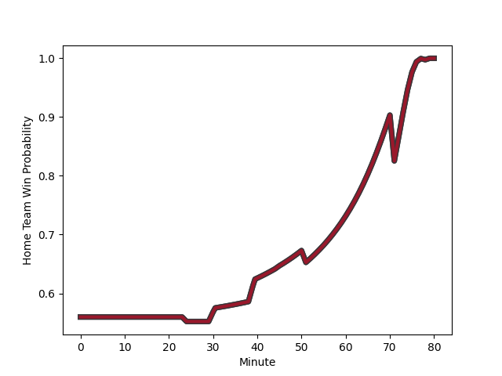

---  
layout: page  
title: Zebre at Toulon; 5-14  
date: 2023-01-20 21:00:00 18:00:00 -0500  
categories: match review  
---
# Zebre (1476.44) at Toulon (1582.52); 5-14

# Prediction: Toulon by 14.6

Toulon by 10.6 on a neutral field
## Scores over Time

## Win Probability over Time

# Pre-Match Prediction: Toulon by 16.6

Toulon by 12.6 on a neutral pitch

|   Away Minutes | Away Player                                                                 |   Away elo |   Away Percentile |   Number |   Home Percentile |   Home elo | Home Player                                                                                |   Home Minutes |
|---------------:|:----------------------------------------------------------------------------|-----------:|------------------:|---------:|------------------:|-----------:|:-------------------------------------------------------------------------------------------|---------------:|
|             55 | [Paolo Buonfiglio](..//playerfiles//PaoloBuonfiglio_cleaned.md)             |      96.11 |                52 |        1 |                52 |      96.01 | [Dany Priso](..//playerfiles//DanyPriso_cleaned.md)                                        |             54 |
|             51 | [Marco Manfredi](..//playerfiles//MarcoManfredi_cleaned.md)                 |      44.55 |                 0 |        2 |                15 |      82.96 | [Teddy Baubigny](..//playerfiles//TeddyBaubigny_cleaned.md)                                |             54 |
|             51 | [Muhamed Hasa](..//playerfiles//MuhamedHasa_cleaned.md)                     |      96.8  |                54 |        3 |                82 |     107.75 | [Beka Gigashvili](..//playerfiles//BekaGigashvili_cleaned.md)                              |             71 |
|             51 | [Jan Uys](..//playerfiles//JanUys_cleaned.md)                               |     108.13 |                79 |        4 |                 8 |      76.34 | [Swan Rebbadj](..//playerfiles//SwanRebbadj_cleaned.md)                                    |             80 |
|             64 | [Josh Furno](..//playerfiles//JoshFurno_cleaned.md)                         |     121.79 |                93 |        5 |                38 |      93.21 | [Adrien Warion](..//playerfiles//AdrienWarion_cleaned.md)                                  |             66 |
|             54 | [Guido Volpi](..//playerfiles//GuidoVolpi_cleaned.md)                       |      76.52 |                 8 |        6 |                53 |      97.79 | [Mattéo Le Corvec](..//playerfiles//MattéoLeCorvec_cleaned.md)                             |             66 |
|             80 | [Matt Kvesic](..//playerfiles//MattKvesic_cleaned.md)                       |      97.53 |                55 |        7 |                69 |     105.27 | [Jules Coulon](..//playerfiles//JulesCoulon_cleaned.md)                                    |             80 |
|             80 | [Taina Fox-Matamua](..//playerfiles//TainaFox-Matamua_cleaned.md)           |     111.4  |                81 |        8 |                93 |     126.35 | [Sergio Parisse](..//playerfiles//SergioParisse_cleaned.md)                                |             80 |
|             45 | [Alessandro Fusco](..//playerfiles//AlessandroFusco_cleaned.md)             |      85.69 |                20 |        9 |                52 |      97.11 | [Baptiste Serin](..//playerfiles//BaptisteSerin_cleaned.md)                                |             51 |
|             80 | [Tiff Eden](..//playerfiles//TiffEden_cleaned.md)                           |      92.67 |                36 |       10 |                78 |     111.17 | [Ihaia West](..//playerfiles//IhaiaWest_cleaned.md)                                        |             80 |
|             80 | [Jacopo Trulla](..//playerfiles//JacopoTrulla_cleaned.md)                   |      66.09 |                 4 |       11 |                54 |      97.81 | [Jiuta Wainiqolo](..//playerfiles//JiutaWainiqolo_cleaned.md)                              |             66 |
|             80 | [Enrico Lucchin](..//playerfiles//EnricoLucchin_cleaned.md)                 |     133    |                97 |       12 |                85 |     113.77 | [Duncan Paia'aua](..//playerfiles//DuncanPaia'aua_cleaned.md)                              |             80 |
|             24 | [Erich Cronje](..//playerfiles//ErichCronje_cleaned.md)                     |      73.59 |                 7 |       13 |                93 |     123.39 | [Waisea Nayacalevu Vuidravuwalu](..//playerfiles//WaiseaNayacalevuVuidravuwalu_cleaned.md) |             63 |
|             80 | [Jacobus van Wyk](..//playerfiles//JacobusvanWyk_cleaned.md)                |     124.14 |                93 |       14 |                99 |     150.96 | [Cheslin Kolbe](..//playerfiles//CheslinKolbe_cleaned.md)                                  |             80 |
|             80 | [Geronimo Prisciantelli](..//playerfiles//GeronimoPrisciantelli_cleaned.md) |     136.53 |                96 |       15 |               nan |      95    | [Marius Domon](..//playerfiles//MariusDomon_cleaned.md)                                    |             80 |
|             29 | [Ion Neculai](..//playerfiles//IonNeculai_cleaned.md)                       |      85.05 |                19 |       16 |                38 |      91.81 | [Bruce Devaux](..//playerfiles//BruceDevaux_cleaned.md)                                    |             26 |
|             25 | [Alessio Sanavia](..//playerfiles//AlessioSanavia_cleaned.md)               |      91.42 |               nan |       17 |                44 |      93.16 | [Christopher Tolofua](..//playerfiles//ChristopherTolofua_cleaned.md)                      |             26 |
|             29 | [Giampietro Ribaldi](..//playerfiles//GiampietroRibaldi_cleaned.md)         |     101.85 |                68 |       18 |                44 |      94.01 | [Matthias Halagahu](..//playerfiles//MatthiasHalagahu_cleaned.md)                          |             14 |
|             29 | [Leonard Krumov](..//playerfiles//LeonardKrumov_cleaned.md)                 |      72.12 |                 6 |       19 |               nan |      95    | [Davit Mchelidze](..//playerfiles//DavitMchelidze_cleaned.md)                              |              9 |
|             26 | [Giovanni Licata](..//playerfiles//GiovanniLicata_cleaned.md)               |     107.65 |                75 |       20 |                87 |     114.67 | [Raphael Lakafia](..//playerfiles//RaphaelLakafia_cleaned.md)                              |             14 |
|             16 | [Luca Andreani](..//playerfiles//LucaAndreani_cleaned.md)                   |      75.73 |                 9 |       21 |                34 |      90.62 | [Benoit Paillaugue](..//playerfiles//BenoitPaillaugue_cleaned.md)                          |             29 |
|             35 | [Chris Cook](..//playerfiles//ChrisCook_cleaned.md)                         |      83.97 |                17 |       22 |                70 |     104.6  | [Gervais Cordin](..//playerfiles//GervaisCordin_cleaned.md)                                |             14 |
|             56 | [Franco Smith](..//playerfiles//FrancoSmith_cleaned.md)                     |      87.51 |                25 |       23 |                99 |     147.83 | [Dan Biggar](..//playerfiles//DanBiggar_cleaned.md)                                        |             17 |

