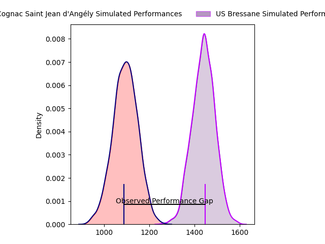
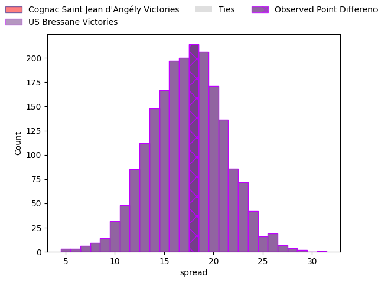
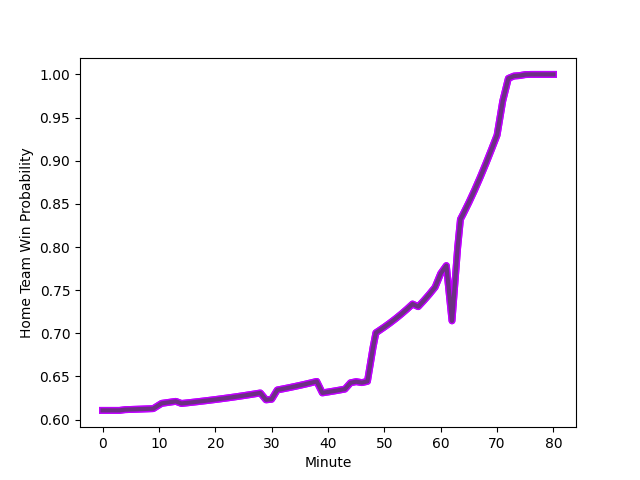

---  
layout: page  
title: Cognac Saint Jean d'Angély at US Bressane; 14-32  
date: 2023-01-20 19:30:00 18:00:00 -0500  
categories: match review  
---
# Cognac Saint Jean d'Angély at US Bressane; 14-32

# Club Level Predictions

The first set of predictions treats a club as the smallest object, as the club develops its members, organizes a gameplan, and deploys its players as needed for each match. This club model has a prediction of 0.876, which translates to predicting US Bressane to win by 17.2.

Each club has a rating and a rating deviation (simiar to a Glicko system), and expected performances can be generated. This allows for simulated matches and spreads like the ones below.
## Projected Performances

## Projected Spreads

# Player Level Predictions

Treating teams instead as an entity made up of the currently active players, I have ratings for each player in an altogether different system. These can be combined to form team ratings once teamsheets are announced, weighting starters a bit higher than the reserves. After the match is played, players can be weighted by their minutes on the field, allowing for an accurate measure of the team's composition. With these compiled team ratings, we can make predictions, measure inaccuracy, and update the individual player ratings.
## Prediction with Player Minutes: US Bressane by 23.6

US Bressane by 19.6 on a neutral field
## Scores over Time

## Win Probability over Time

## Prediction without Player Minutes: US Bressane by 19.7

US Bressane by 15.7 on a neutral pitch

|   Away Minutes | Away Player                                                             |   Away elo |   Away Percentile |   Number |   Home Percentile |   Home elo | Home Player                                                                |   Home Minutes |
|---------------:|:------------------------------------------------------------------------|-----------:|------------------:|---------:|------------------:|-----------:|:---------------------------------------------------------------------------|---------------:|
|             80 | [Kevin Tougne](..//playerfiles//KevinTougne_cleaned.md)                 |      77.54 |                 8 |        1 |                36 |      89.19 | [Teo Bordenave](..//playerfiles//TeoBordenave_cleaned.md)                  |             80 |
|             72 | [Maxime Gau](..//playerfiles//MaximeGau_cleaned.md)                     |      82.74 |                16 |        2 |                32 |      88.95 | [Clement Jullien](..//playerfiles//ClementJullien_cleaned.md)              |             60 |
|             65 | [Giorgi Sharashidze](..//playerfiles//GiorgiSharashidze_cleaned.md)     |      90.23 |                32 |        3 |                17 |      84.65 | [Willem Johannes Harmse](..//playerfiles//WillemJohannesHarmse_cleaned.md) |             46 |
|             56 | [Clément Praud](..//playerfiles//ClémentPraud_cleaned.md)               |      61.14 |                 2 |        4 |                 8 |      76.42 | [Louis Bruinsma](..//playerfiles//LouisBruinsma_cleaned.md)                |             80 |
|             80 | [Daniel Faleafa](..//playerfiles//DanielFaleafa_cleaned.md)             |      84.68 |                22 |        5 |                89 |     117.57 | [Marius Antonescu](..//playerfiles//MariusAntonescu_cleaned.md)            |             80 |
|             80 | [Matthieu Thomas](..//playerfiles//MatthieuThomas_cleaned.md)           |      60.99 |                 0 |        6 |                17 |      83.03 | [Loic Baradel](..//playerfiles//LoicBaradel_cleaned.md)                    |             80 |
|             80 | [Gio Sordia](..//playerfiles//GioSordia_cleaned.md)                     |     112.89 |                83 |        7 |                70 |     102.71 | [Thomas Déliance](..//playerfiles//ThomasDéliance_cleaned.md)              |             74 |
|             77 | [Thomas Toevalu](..//playerfiles//ThomasToevalu_cleaned.md)             |      65.52 |                 3 |        8 |                45 |      94.18 | [Wael May](..//playerfiles//WaelMay_cleaned.md)                            |             80 |
|             80 | [Mathis Garnier](..//playerfiles//MathisGarnier_cleaned.md)             |      74.46 |                 6 |        9 |                87 |     113.64 | [Jeremy Valencot](..//playerfiles//JeremyValencot_cleaned.md)              |             80 |
|             71 | [Serafin Bordoli](..//playerfiles//SerafinBordoli_cleaned.md)           |      73.16 |                 4 |       10 |                 1 |      58.23 | [Christian Lacombe](..//playerfiles//ChristianLacombe_cleaned.md)          |             80 |
|             80 | [Jone Tuva](..//playerfiles//JoneTuva_cleaned.md)                       |      53.09 |                 0 |       11 |                49 |      95.86 | [Kavekini Tabu](..//playerfiles//KavekiniTabu_cleaned.md)                  |             80 |
|             44 | [Henry Tuilagi](..//playerfiles//HenryTuilagi_cleaned.md)               |      95.4  |               nan |       12 |                15 |      81.47 | [Maile Mamao](..//playerfiles//MaileMamao_cleaned.md)                      |             80 |
|             80 | [Eneri Lotawa](..//playerfiles//EneriLotawa_cleaned.md)                 |      78.31 |                11 |       13 |                19 |      83.58 | [Benjamin Doy](..//playerfiles//BenjaminDoy_cleaned.md)                    |             80 |
|             80 | [Vincent Pageneau](..//playerfiles//VincentPageneau_cleaned.md)         |      68.45 |                 4 |       14 |                28 |      88.2  | [Audric Sanlaville](..//playerfiles//AudricSanlaville_cleaned.md)          |             80 |
|             80 | [Dany Antunes](..//playerfiles//DanyAntunes_cleaned.md)                 |      90.55 |                38 |       15 |                73 |     107.26 | [Pierre Berard](..//playerfiles//PierreBerard_cleaned.md)                  |             74 |
|             36 | [Mathieu Billou](..//playerfiles//MathieuBillou_cleaned.md)             |      84.11 |                17 |       16 |                14 |      80.01 | [Zauri Tevdorashvili](..//playerfiles//ZauriTevdorashvili_cleaned.md)      |             14 |
|             24 | [Filipe Manu](..//playerfiles//FilipeManu_cleaned.md)                   |      81.29 |                15 |       17 |               nan |      96.36 | [Louis Dasalmartini](..//playerfiles//LouisDasalmartini_cleaned.md)        |             20 |
|             15 | [Alico Kaikatsishvili](..//playerfiles//AlicoKaikatsishvili_cleaned.md) |      84.99 |                19 |       18 |                72 |     100.15 | [Erich de Jager](..//playerfiles//ErichdeJager_cleaned.md)                 |             20 |
|              9 | [Imad Bouhedjeur](..//playerfiles//ImadBouhedjeur_cleaned.md)           |      86    |                25 |       19 |                59 |      97.45 | [Nail Ait Naceur](..//playerfiles//NailAitNaceur_cleaned.md)               |              6 |
|              8 | [Bryan Bruno](..//playerfiles//BryanBruno_cleaned.md)                   |      87.51 |               nan |       20 |                23 |      83.37 | [Thibaut Perrette](..//playerfiles//ThibautPerrette_cleaned.md)            |              6 |
|              3 | [Lucas Sicard](..//playerfiles//LucasSicard_cleaned.md)                 |      94.21 |               nan |       21 |               nan |     nan    | nan                                                                        |            nan |

